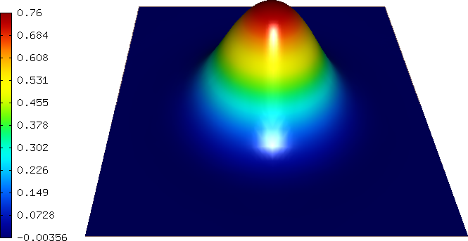

Gross-Pitaevski Equation (21)
-----------------------------

**Git reference:** Tutorial example `21-newton-timedep-gp 
<http://git.hpfem.org/hermes.git/tree/HEAD:/hermes2d/tutorial/21-newton-timedep-gp>`_.

In this example we use the Newton's method to solve the nonlinear complex-valued 
time-dependent Gross-Pitaevski equation. This equation describes the ground state of 
a quantum system of identical bosons using the Hartree–Fock approximation and the 
pseudopotential interaction model. For time-discretization one can use either
the first-order implicit Euler method or the second-order Crank-Nicolson
method. 

The computational domain is the square $(-1,1)^2$ and boundary conditions are zero Dirichlet. The equation has the form 

.. math::

    i\hbar \frac{\partial \psi}{\partial t} = -\frac{\hbar^2}{2m} \Delta \psi + g \psi |\psi|^2 + \frac{m}{2} \omega^2 (x^2 + y^2) \psi

where $\psi(x,y)$ is the unknown solution (wave function), $i$ the complex unit, 
$\hbar$ the Planck constant, $m$ the mass of the boson, 
$g$ the coupling constant (proportional to the scattering length of two interacting bosons) and 
$\omega$ the frequency.

From the implementation point of view, the only detail worth mentioning is the 
use of the complex version of Hermes in the file `CMakeLists.txt <http://git.hpfem.org/hermes.git/blob/HEAD:/hermes2d/tutorial/19-newton-timedep-gp/CMakeLists.txt>`_:

::

    # use the complex version of the library:
    set(HERMES ${HERMES_CPLX_BIN})

The weak forms can be found in the file `forms.cpp <http://git.hpfem.org/hermes.git/blob/HEAD:/hermes2d/tutorial/19-newton-timedep-gp/forms.cpp>`_:

::

    // Residuum for the implicit Euler time discretization
    template<typename Real, typename Scalar>
    Scalar F_euler(int n, double *wt, Func<Scalar> *u_ext[], Func<Real> *v, Geom<Real> *e, ExtData<Scalar> *ext)
    {
      scalar ii = cplx(0.0, 1.0);  // imaginary unit, ii^2 = -1

      Scalar result = 0;
      Func<Scalar>* psi_prev_newton = ext->fn[0];
      Func<Scalar>* psi_prev_time = ext->fn[1];
      for (int i = 0; i < n; i++)
        result += wt[i] * (ii * H * (psi_prev_newton->val[i] - psi_prev_time->val[i]) * v->val[i] / TAU
                - H*H/(2*M) * (psi_prev_newton->dx[i] * v->dx[i] + psi_prev_newton->dy[i] * v->dy[i])
                - G * psi_prev_newton->val[i] *  psi_prev_newton->val[i] * conj(psi_prev_newton->val[i]) * v->val[i]
                - .5*M*OMEGA*OMEGA * (e->x[i] * e->x[i] + e->y[i] * e->y[i]) * psi_prev_newton->val[i] * v->val[i]);

      return result;
    }

    // Jacobian for the implicit Euler time discretization
    template<typename Real, typename Scalar>
    Scalar J_euler(int n, double *wt, Func<Scalar> *u_ext[], Func<Real> *u, Func<Real> *v, Geom<Real> *e, ExtData<Scalar> *ext)
    {
      scalar ii = cplx(0.0, 1.0);  // imaginary unit, ii^2 = -1

      Scalar result = 0;
      Func<Scalar>* psi_prev_newton = ext->fn[0];
      for (int i = 0; i < n; i++)
        result += wt[i] * (ii * H * u->val[i] * v->val[i] / TAU
                         - H*H/(2*M) * (u->dx[i] * v->dx[i] + u->dy[i] * v->dy[i])
                         - 2* G * u->val[i] *  psi_prev_newton->val[i] * conj(psi_prev_newton->val[i]) * v->val[i]
                         - G * psi_prev_newton->val[i] * psi_prev_newton->val[i] * u->val[i] * v->val[i]
                         - .5*M*OMEGA*OMEGA * (e->x[i] * e->x[i] + e->y[i] * e->y[i]) * u->val[i] * v->val[i]);
      return result;
    }

    // Residuum for the Crank-Nicolson method
    template<typename Real, typename Scalar>
    Scalar F_cranic(int n, double *wt, Func<Scalar> *u_ext[], Func<Real> *v, Geom<Real> *e, ExtData<Scalar> *ext)
    {
      scalar ii = cplx(0.0, 1.0);  // imaginary unit, ii^2 = -1

      Scalar result = 0;
      Func<Scalar>* psi_prev_newton = ext->fn[0];
      Func<Scalar>* psi_prev_time = ext->fn[1];
      for (int i = 0; i < n; i++)
        result += wt[i] * (ii * H * (psi_prev_newton->val[i] - psi_prev_time->val[i]) * v->val[i] / TAU
                - 0.5*H*H/(2*M) * (psi_prev_newton->dx[i] * v->dx[i] + psi_prev_newton->dy[i] * v->dy[i])
                - 0.5*H*H/(2*M) * (psi_prev_time->dx[i] * v->dx[i] + psi_prev_time->dy[i] * v->dy[i])
                - 0.5*G * psi_prev_newton->val[i] *  psi_prev_newton->val[i] * conj(psi_prev_newton->val[i]) * v->val[i]
                - 0.5*G * psi_prev_time->val[i] *  psi_prev_time->val[i] * conj(psi_prev_time->val[i]) * v->val[i]
                - 0.5*0.5*M*OMEGA*OMEGA * (e->x[i] * e->x[i] + e->y[i] * e->y[i]) * (psi_prev_newton->val[i] + psi_prev_time->val[i]) * v->val[i]);

      return result;
    }

    // Jacobian for the Crank-Nicolson method
    template<typename Real, typename Scalar>
    Scalar J_cranic(int n, double *wt, Func<Scalar> *u_ext[], Func<Real> *u, Func<Real> *v, Geom<Real> *e, ExtData<Scalar> *ext)
    {
      scalar ii = cplx(0.0, 1.0);  // imaginary unit, ii^2 = -1

      Scalar result = 0;
      Func<Scalar>* psi_prev_newton = ext->fn[0];
      for (int i = 0; i < n; i++)
        result += wt[i] * (ii * H * u->val[i] * v->val[i] / TAU
                         - 0.5*H*H/(2*M) * (u->dx[i] * v->dx[i] + u->dy[i] * v->dy[i])
                         - 0.5*2* G * u->val[i] *  psi_prev_newton->val[i] * conj(psi_prev_newton->val[i]) * v->val[i]
                         - 0.5*G * psi_prev_newton->val[i] *  psi_prev_newton->val[i] * u->val[i] * v->val[i]
                         - 0.5*.5*M*OMEGA*OMEGA * (e->x[i] * e->x[i] + e->y[i] * e->y[i]) * u->val[i] * v->val[i]);
      return result; 
    }

The way the weak forms are registered is standard::

    // Initialize the weak formulation.
    WeakForm wf;
    if(TIME_DISCR == 1) {
      wf.add_matrix_form(callback(jacobian_euler), HERMES_UNSYM, H2D_ANY, &Psi_prev_newton);
      wf.add_vector_form(callback(residual_euler), H2D_ANY, Tuple<MeshFunction*>(&Psi_prev_newton, &Psi_prev_time));
    }
    else {
      wf.add_matrix_form(callback(jacobian_cranic), HERMES_UNSYM, H2D_ANY, &Psi_prev_newton);
      wf.add_vector_form(callback(residual_cranic), H2D_ANY, Tuple<MeshFunction*>(&Psi_prev_newton, &Psi_prev_time));
    }

Also the time stepping loop and the call to the Newton's method 
will not surprize a reader who made it this far in the tutorial::

    // Time stepping loop:
    int nstep = (int)(T_FINAL/TAU + 0.5);
    for(int ts = 1; ts <= nstep; ts++)
    {

      info("---- Time step %d:", ts);

      // Newton's method.
      info("Performing Newton's method.");
      bool verbose = true; // Default is false.
      if (!nls.solve_newton(&Psi_prev_newton, NEWTON_TOL, NEWTON_MAX_ITER, verbose)) 
        error("Newton's method did not converge.");

      // Copy result of the Newton's iteration into Psi_prev_time.
      Psi_prev_time.copy(&Psi_prev_newton);
    }

Sample results
~~~~~~~~~~~~~~

Snapshot 1:

Snapshot 2:

.. image:: 21/sol_2.png
   :align: center
   :width: 600
   :alt: solution

Snapshot 3:

.. image:: 21/sol_3.png
   :align: center
   :width: 600
   :alt: solution

