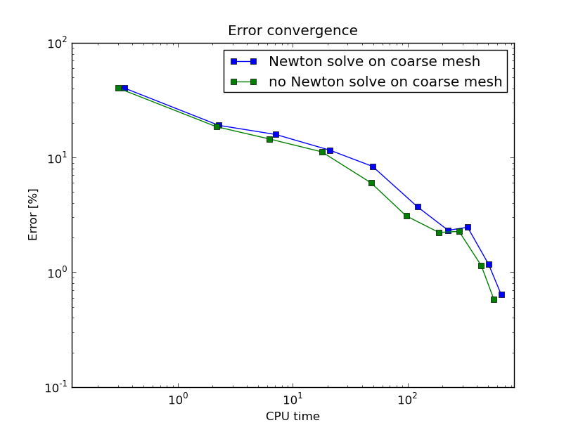
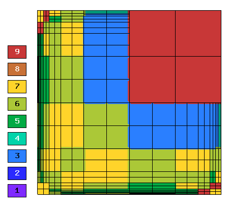

Newton's Method and Adaptivity (17)
-----------------------------------

**Git reference:** Tutorial example `17-newton-elliptic-adapt 
<http://git.hpfem.org/hermes.git/tree/HEAD:/hermes2d/tutorial/17-newton-elliptic-adapt>`_.

We will still keep the simple model problem

.. math::

    -\nabla \cdot (\lambda(u)\nabla u) - f(x,y) = 0 \ \ \ \mbox{in } \Omega = (-10,10)^2,

equipped with nonhomogeneous Dirichlet boundary conditions 

.. math::

    u(x, y) = (x+10)(y+10)/100 \ \ \ \mbox{on } \partial \Omega,

but this time it will be solved using automatic adaptivity. As usual in Hermes, adaptivity
will be guided by the difference between a coarse and fine mesh approximations. At the beginning,
the initial condition is projected on the coarse mesh:

::

    // Project the function init_cond() on the FE space
    // to obtain initial coefficient vector for the Newton's method.
    info("Projecting initial condition to obtain initial vector on coarse mesh.");
    nls.project_global(init_cond, &u_prev);

Then we solve the nonlinear problem on the coarse mesh and store
the coarse mesh solution:

::

    // Newton's loop on the coarse mesh.
    info("Solving on coarse mesh.");
    bool verbose = true; // Default is false.
    if (!nls.solve_newton(&u_prev, NEWTON_TOL_COARSE, NEWTON_MAX_ITER, verbose)) 
      error("Newton's method did not converge.");

    // Store the result in sln_coarse.
    sln_coarse.copy(&u_prev);

Note that storing the solution u_prev in sln_coarse is equivalent to storing the 
converged coefficient vector $\bfY$, but the Solution can be passed into weak 
forms. 

Next a refinement selector is initialized::

    // Initialize a refinement selector.
    H1ProjBasedSelector selector(CAND_LIST, CONV_EXP, H2DRS_DEFAULT_ORDER);

Then the nonlinear problem on the fine mesh is initialized and the initial
coefficient vector $\bfY_0$ on the fine mesh is calculated::

    // Initialize the fine mesh problem.
    RefSystem rnls(&nls);

    // Set initial condition for the Newton's method on the fine mesh.
    if (as == 1) {
      info("Projecting coarse mesh solution to obtain initial vector on new fine mesh.");
      rnls.project_global(&sln_coarse, &u_prev);
    }
    else {
      info("Projecting fine mesh solution to obtain initial vector on new fine mesh.");
      rnls.project_global(&sln_fine, &u_prev);
    }

Notice that we only use sln_coarse as the initial guess on the fine mesh 
in the first adaptivity step when we do not have any fine mesh solution yet,
otherwise a projection of the last fine mesh solution is used. 

Note that the procedure explained here is what we typically do and the reader 
does not have to follow it. It is possible to start the Newton's method on the 
fine mesh using zero or any other initial condition. 

Next we perform the Newton's loop on the fine mesh and store the result in 
sln_fine::

    // Newton's loop on the fine mesh.
    info("Solving on fine mesh.");
    if (!rnls.solve_newton(&u_prev, NEWTON_TOL_FINE, NEWTON_MAX_ITER, verbose)) 
      error("Newton's method did not converge.");

    // Store the fine mesh solution in sln_fine.
    sln_fine.copy(&u_prev);

Now we have the solution pair to guide automatic adaptivity, and we can calculate 
the error estimate:

::

    // Calculate element errors and total error estimate.
    info("Calculating error.");
    H1Adapt hp(&nls);
    hp.set_solutions(&sln_coarse, &sln_fine);
    err_est = hp.calc_error() * 100;

After adapting the mesh, we must not forget to calculate a new initial coefficient 
vector $\bfY_0$ on the new coarse mesh. This can be done either by just projecting 
the fine mesh solution onto the new coarse mesh, or by solving (in addition to that) 
the nonlinear problem on the new coarse mesh:

::

    // If err_est too large, adapt the mesh.
    if (err_est < ERR_STOP) done = true;
    else {
      info("Adapting coarse mesh.");
      done = hp.adapt(&selector, THRESHOLD, STRATEGY, MESH_REGULARITY);
      if (nls.get_num_dofs() >= NDOF_STOP) {
        done = true;
        break;
      }

      // Project the fine mesh solution on the new coarse mesh.
      if (SOLVE_ON_COARSE_MESH) 
        info("Projecting fine mesh solution to obtain initial vector on new coarse mesh.");
      else 
        info("Projecting fine mesh solution on coarse mesh for error calculation.");
      nls.project_global(&sln_fine, &u_prev);

      if (SOLVE_ON_COARSE_MESH) {
        // Newton's loop on the new coarse mesh.
        info("Solving on coarse mesh.");
        if (!nls.solve_newton(&u_prev, NEWTON_TOL_COARSE, NEWTON_MAX_ITER, verbose)) 
          error("Newton's method did not converge.");
      }

      // Store the result in sln_coarse.
      sln_coarse.copy(&u_prev);

In our experience, the Newton's loop on the new coarse mesh can be skipped since this 
does not affect convergence and one saves some CPU time. This is illustrated in the 
following convergence comparison:

Convergence in the number of DOF (with and without Newton solve on the new coarse mesh):

.. image:: 17/conv_dof_compar.png
   :align: center
   :width: 600
   :height: 400
   :alt: DOF convergence graph for tutorial example 17.

Convergence in CPU time (with and without Newton solve on coarse mesh):

In the following we show the resulting meshes (corresponding to 
SOLVE_ON_COARSE_MESH = false). The solution itself is not 
shown since the reader knows it from the previous example.

Resulting coarse mesh.

.. image:: 17/mesh_coarse.png
   :align: center
   :width: 500
   :height: 400
   :alt: coarse mesh

Resulting fine mesh.

