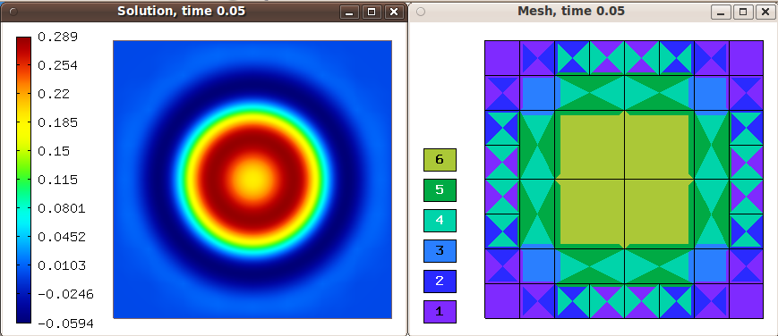
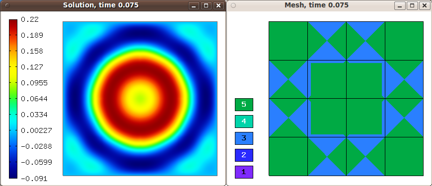

Gross-Pitaevski Equation (24)
-----------------------------

**Git reference:** Tutorial example `24-newton-timedep-gp-adapt 
<http://git.hpfem.org/hermes.git/tree/HEAD:/hermes2d/tutorial/24-newton-timedep-gp-adapt>`_.

Model problem
~~~~~~~~~~~~~

The problem solved here is the same as in `example 21 <http://hpfem.org/hermes/doc/src/hermes2d/tutorial-3/gp.html>`_. The source code of the main.cpp function is an identical copy of the one in 
`example 22 <http://hpfem.org/hermes/doc/src/hermes2d/tutorial-4/parab.html>`_.

Sample results
~~~~~~~~~~~~~~

Initial condition and initial mesh:

.. image:: 24/0.png
   :align: center
   :width: 800
   :alt: Sample screenshot

Solution and mesh at t = 0.025:

.. image:: 24/1.png
   :align: center
   :width: 800
   :alt: Sample screenshot

Solution and mesh at t = 0.05:

Solution and mesh at t = 0.075:

Solution and mesh at t = 0.01:

.. image:: 24/4.png
   :align: center
   :width: 800
   :alt: Sample screenshot

