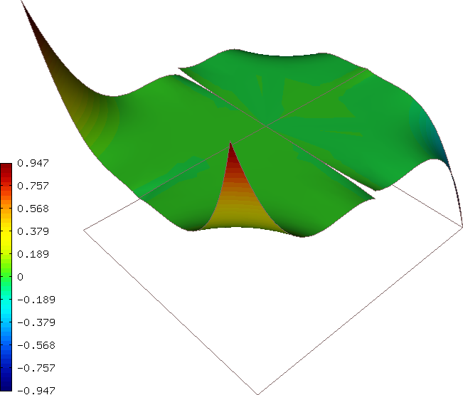
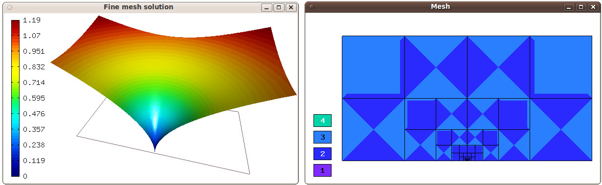

====================================================
Hermes2D Tutorial: Part V (Miscellaneous Techniques)
====================================================

This section is a collection of various examples and techniques 
that are worth showing even though they do not fit exactly into 
the previous sections.  

Space H(curl) (30)
------------------

**Git reference:** Tutorial example `30-space-hcurl <http://git.hpfem.org/hermes.git/tree/HEAD:/hermes2d/tutorial/30-space-hcurl>`_. 

In `example 02-space <http://hpfem.org/hermes/doc/src/hermes2d/tutorial-1.html#setting-up-finite-element-space-02>`_ we first saw how a finite element space over a mesh is created. That was an $H^1$ space suitable for continuous approximations. Another widely used Sobolev space, H(curl), is typically present in Maxwell's problems of electromagnetics. H(curl) approximations are discontinuous, elementwise polynomial vector fields that behave like gradients of $H^1$ functions. (Recall that in electrostatics $E = - \nabla \varphi$.) In particular, H(curl) functions have continuous tangential components along all mesh edges. For the application of the H(curl) space check examples related to Maxwell's equations in the previous sections. Below is a simple code that shows how to set up an H(curl) space and visualize its finite element basis functions:

::

    int INIT_REF_NUM = 2;      // Initial uniform mesh refinement.
    int P_INIT = 3;            // Polynomial degree of mesh elements.

    int main(int argc, char* argv[])
    {
      // Load the mesh.
      Mesh mesh;
      H2DReader mloader;
      mloader.load("square.mesh", &mesh);

      // Initial mesh refinement.
      for (int i = 0; i < INIT_REF_NUM; i++) mesh.refine_all_elements();

      // Create an Hcurl space with default shapeset.
      // (BC types and essential BC values not relevant.)
      HcurlSpace space(&mesh, NULL, NULL, P_INIT);

      // Visualize FE basis.
      VectorBaseView bview("BaseView", 0, 0, 700, 600);
      bview.show(&space);

      // Wait for all views to be closed.
      View::wait();
      return 0;
    }

The class VectorBaseView allows the user to browse through 
the finite element basis functions using the left and right 
arrows. A few 
sample basis functions (higher-order bubble functions) are 
shown below. The color shows magnitude of the vector field, 
arrows show its direction.

.. image:: img/tutorial-30/fn0.png
   :align: center
   :width: 300
   :alt: Sample basis function

.. image:: img/tutorial-30/fn1.png
   :align: center
   :width: 300
   :alt: Sample basis function

.. image:: img/tutorial-30/fn2.png
   :align: center
   :width: 300
   :alt: Sample basis function

.. image:: img/tutorial-30/fn3.png
   :align: center
   :width: 300
   :alt: Sample basis function

The space H(curl) is implemented for both quadrilateral and triangular 
elements, and both elements types can be combined in one mesh. 

Space H(div) (31)
-----------------

**Git reference:** Tutorial example `31-space-hdiv <http://git.hpfem.org/hermes.git/tree/HEAD:/hermes2d/tutorial/31-space-hdiv>`_. 

The space H(div) in 2D is very similar in nature to the space H(curl), except its functions 
behave like (vector-valued) divergences of $H^1$ functions. Finite element basis functions 
in the space H(div) are discontinuous across element interfaces but their normal components 
are continuous. The following code shows how to set up an H(div) space and visualize
its basis functions: 

::

    int INIT_REF_NUM = 2;      // Initial uniform mesh refinement.
    int P_INIT = 3;            // Polynomial degree of mesh elements.

    int main(int argc, char* argv[])
    {
      // Load the mesh.
      Mesh mesh;
      H2DReader mloader;
      mloader.load("square.mesh", &mesh);

      // Initial mesh refinement.
      for (int i = 0; i < INIT_REF_NUM; i++) mesh.refine_all_elements();

      // Create an Hdiv space with default shapeset.
      // (BC types and essential BC values not relevant.)
      HdivSpace space(&mesh, NULL, NULL, P_INIT);

      // Visualise the FE basis.
      VectorBaseView bview("BaseView", 0, 0, 700, 600);
      bview.show(&space);

      // Wait for all views to be closed.
      View::wait();
      return 0;
    }

Sample edge functions of polynomial degrees 1, 2, 3, and 4 
corresponding to a boundary edge are shown below:

.. image:: img/tutorial-31/fn0.png
   :align: center
   :width: 300
   :alt: Sample basis function

.. image:: img/tutorial-31/fn1.png
   :align: center
   :width: 300
   :alt: Sample basis function

.. image:: img/tutorial-31/fn2.png
   :align: center
   :width: 300
   :alt: Sample basis function

.. image:: img/tutorial-31/fn3.png
   :align: center
   :width: 300
   :alt: Sample basis function

So far the space H(div) only can be used with quadrilateral elements.

Space L2 (32)
-------------

**Git reference:** Tutorial example `32-space-l2 <http://git.hpfem.org/hermes.git/tree/HEAD:/hermes2d/tutorial/32-space-l2>`_. 

We already saw the $L^2$ space in the `Navier-Stokes example 
<http://hpfem.org/hermes/doc/src/hermes2d/tutorial-3.html#navier-stokes-equations-20>`_ where 
it was used for pressure to keep the velocity discreetely divergence-free. This example 
shows how to create an $L^2$ space, visualize 
finite element basis functions, and perform an orthogonal $L^2$-projection of a continuous 
function onto the FE space::

    const int INIT_REF_NUM = 1;    // Number of initial uniform mesh refinements.
    const int P_INIT = 3;          // Polynomial degree of mesh elements.

    // Projected function.
    scalar F(double x, double y, double& dx, double& dy)
    {
      return - pow(x, 4) * pow(y, 5); 
      dx = 0; // not needed for L2-projection
      dy = 0; // not needed for L2-projection
    }

    int main(int argc, char* argv[])
    {
      // Load the mesh.
      Mesh mesh;
      H2DReader mloader;
      mloader.load("square.mesh", &mesh);

      // Perform uniform mesh refinements.
      for (int i=0; i<INIT_REF_NUM; i++) mesh.refine_all_elements();

      // Create an L2 space with default shapeset.
      L2Space space(&mesh, P_INIT);

      // View basis functions.
      BaseView bview("BaseView", 0, 0, 600, 500);
      bview.show(&space);
      View::wait(H2DV_WAIT_KEYPRESS);

      // Assemble and solve the finite element problem.
      WeakForm wf_dummy;
      LinearProblem ls(&wf_dummy, &space);
      Solution* sln_tmp = new Solution(&mesh, F);
      Solution sln;
      project_global(&space, H2D_L2_NORM, sln_tmp, &sln);
      delete sln_tmp;

      // Visualize the solution.
      ScalarView view1("Projection", 610, 0, 600, 500);
      view1.show(&sln);

      // Wait for all views to be closed.
      View::wait();
      return 0;
    }

Sample basis functions:

.. image:: img/tutorial-32/fn0.png
   :align: center
   :width: 400
   :alt: Sample basis function

.. image:: img/tutorial-32/fn1.png
   :align: center
   :width: 400
   :alt: Sample basis function

.. image:: img/tutorial-32/fn2.png
   :align: center
   :width: 400
   :alt: Sample basis function

.. image:: img/tutorial-32/fn3.png
   :align: center
   :width: 400
   :alt: Sample basis function

The projection (note that this is a discontinuous function):

Adapting Mesh to an Exact Function (33)
---------------------------------------

**Git reference:** Tutorial example `33-exact-adapt <http://git.hpfem.org/hermes.git/tree/HEAD:/hermes2d/tutorial/33-exact-adapt>`_. 

This technique can be useful, for example, when a time-dependent proces
starts from a complicated initial condition that would not be represented
with sufficient accuracy on a coarse initial mesh. 

As usual, the adaptivity algorithm expects a pair of solutions on the 
coarse and globally refined meshes. So the adaptivity loop begins with 
refining the coarse mesh::

    // Construct globally refined reference mesh
    // and setup reference space.
    Mesh *ref_mesh = new Mesh();
    ref_mesh->copy(space.get_mesh());
    ref_mesh->refine_all_elements();
    Space* ref_space = space.dup(ref_mesh);
    int order_increase = 1;
    ref_space->copy_orders(&space, order_increase);

Instead of calculating a solution on the fine mesh, we set the exact 
function::

    // Assign the function f() to the fine mesh.
    sln_fine.set_exact(ref_mesh, f);

The coarse mesh solution is obtained by projecting 'sln_fine'::

    // Project the function f() on the coarse mesh.
    project_global(&space, H2D_H1_NORM, &sln_file, &sln_coarse);

Error estimates are calculated as usual::

    // Calculate element errors and total error estimate.
    info("Calculating error.");
    Adapt hp(&space, H2D_H1_NORM);
    hp.set_solutions(&sln_coarse, &sln_fine);
    double err_est_rel = hp.calc_elem_errors(H2D_TOTAL_ERROR_REL | H2D_ELEMENT_ERROR_REL) * 100;

Mesh adaptation is standard as well::

    // If err_est too large, adapt the mesh.
    if (err_est_rel < ERR_STOP) done = true;
    else {
      info("Adapting coarse mesh.");
      done = hp.adapt(&selector, THRESHOLD, STRATEGY, MESH_REGULARITY);

      if (get_num_dofs(&space) >= NDOF_STOP) done = true;
    }

Sample solution and mesh are shown below:

Remote Computing (34)
---------------------------------------

**Git reference:** Tutorial example `34-remote-computing <http://git.hpfem.org/hermes.git/tree/HEAD:/hermes2d/tutorial/34-remote-computing>`_. 

This example shows how to save visualization data if you are working 
on a distant computer and cannot use ScalarView, OrderView, or 
related classes directly. There are two basic options:

  * Use the method Solution::save() that saves a complete 
    Solution including Mesh and element orders. Then you can fetch the 
    file and use Solution::load() to restore the Solution
    on your local machine. 
  * Use Linearizer::save_data() that only saves linearized data for direct 
    OpenGL processing. After fetching the file, you can use the methods
    ScalarView::Linearizer::load_data() and ScalarView::show_linearizer_data()
    on your local machine.

The underlying model for computation is the tutorial example 09-timedep. The 
part of the code that is relevant for this example is::

    if (ts % OUTPUT_FREQUENCY == 0) {
      Linearizer lin;
      int item = H2D_FN_VAL_0;
      double eps = H2D_EPS_NORMAL;
      double max_abs = -1.0;
      MeshFunction* xdisp = NULL; 
      MeshFunction* ydisp = NULL;
      double dmult = 1.0;
      lin.process_solution(&tsln, item, eps, max_abs, xdisp, ydisp, dmult);
      char* filename = new char[100];
      sprintf(filename, "tsln_%d.lin", ts);

      // Save Linearizer data.
      lin.save_data(filename);
      info("Linearizer data saved to file %s.", filename);

      // Save complete Solution.
      sprintf(filename, "tsln_%d.dat", ts);
      bool compress = false;   // Gzip compression not used as it only works on Linux.
      tsln.save(filename, compress);
      info("Complete Solution saved to file %s.", filename);
    }

In the code above, do not worry about the parameters 'xdisp', 'ydisp' and 'dmult'
as these are only used to deform the domain (in linear elasticity problems and such,
see example 08-system).
