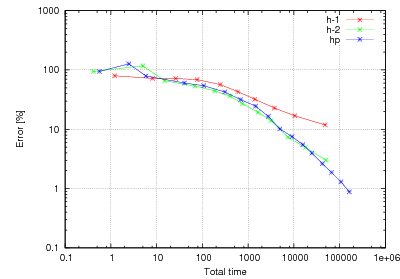

Interior Layer (Elliptic)
=========================

**Git reference:** Benchmark 
`layer-interior <http://git.hpfem.org/hermes.git/tree/HEAD:/hermes3d/benchmarks/layer-interior>`_.

This example has a smooth solution that exhibits a steep interior layer 
inside the domain. 

.. index::
    single: mesh; dynamical
    single: problem; elliptic

Partial Differential Equation solved: Poisson equation

.. math::
    :nowrap:
    :label: layer

    \begin{eqnarray*}
    - \Delta u &= f &\hbox{ in }\Omega \\
             u &= g &\hbox{ on }\partial\Omega
    \end{eqnarray*}

Domain of interest: Unit cube $(0, 1)^3$.

Right-hand side:

.. math::
    :nowrap:
    :label: layer-rhs

    \begin{eqnarray*}
    f(x,y,z) & = & \frac{3}{\sqrt{(x+0.25)^2+(y+0.25)^2+(z+0.25)^2}}\ 
                  \times \ \frac{S}{S^2 \cdot [\sqrt{(x+0.25)^2+(y+0.25)^2+(z+0.25)^2} - \frac{\pi}{3} ]^2 + 1} \\ \nonumber
             &   & -\  [(x+0.25)^2+(y+0.25)^2+(z+0.25)^2] \\ \nonumber
             &   & \times \ \biggl\lbrace \frac{2\ S^3 \cdot [\sqrt{(x+0.25)^2+(y+0.25)^2+(z+0.25)^2} - \frac{\pi}{3}] }
                   {[(x+0.25)^2+(y+0.25)^2+(z+0.25)^2]\ \times\ \bigl[ S^2 \cdot [\sqrt{(x+0.25)^2+(y+0.25)^2+(z+0.25)^2}-\frac{\pi}{3} ]^2 + 1 \bigr]^2} \\ \nonumber
             &   & +\ \frac{S}{[(x+0.25)^2+(y+0.25)^2+(z+0.25)^2]^{\frac{3}{2}}\  \times  \
                   \bigl[ S^2 \cdot [\sqrt{(x+0.25)^2+(y+0.25)^2+(z+0.25)^2} - \frac{\pi}{3} ]^2 + 1\bigr]} \biggr\rbrace \\ \nonumber
    \end{eqnarray*}

Exact solution is:

.. math::
    :nowrap:
    :label: layer-exact

    \begin{eqnarray*}
    u(x, y, z) & = & \mbox{atan}\left(S \cdot \sqrt{(x + 0.25)^2 + (y + 0.25)^2 + (z + 0.25)^2} - \frac{\pi}{3}\right). 
    \end{eqnarray*}

where $S$ is a parameter (slop of the layer). With larger $S$, this problem 
becames difficult for adaptive algorithms, and at the same time the advantage of 
adaptive $hp$-FEM over adaptive low-order FEM becames more significant. We will 
use $S = 200$ in the following. 

Code for the exact solution and the weak forms::

    // Exact solution to the problem
    double fn(double x, double y, double z)
    {
      return atan(SLOPE * (sqrt(sqr(x + 0.25) + sqr(y + 0.25) + sqr(z + 0.25)) - M_PI/3));
    }

    double fndd(double x, double y, double z, double &dx, double &dy, double &dz)
    {
      double t = sqrt(sqr(z + 0.25) + sqr(y + 0.25) + sqr(x + 0.25));
      double u = t * (sqr(SLOPE) * sqr(t - M_PI/3) + 1);

      dx = (SLOPE * (x + 0.25)) / u;
      dy = (SLOPE * (y + 0.25)) / u;
      dz = (SLOPE * (z + 0.25)) / u;

      return fn(x, y, z);
    }

    // Boundary condition types
    BCType bc_types(int marker)
    {
      return BC_ESSENTIAL;
    }

    // Essential (Dirichlet) boundary condition values
    scalar essential_bc_values(int ess_bdy_marker, double x, double y, double z)
    {
      return fn(x, y, z);
    }

    // Weak forms
    template<typename real, typename scalar>
    scalar biform(int n, double *wt, fn_t<scalar> *u_ext[], fn_t<real> *u, fn_t<real> *v, geom_t<real> *e, user_data_t<scalar> *data)
    {
      return int_grad_u_grad_v<real, scalar>(n, wt, u, v, e);
    }

    template<typename real>
    real rhs(real x, real y, real z)
    {
      real t2 = sqr(z + 0.25) + sqr(y + 0.25) + sqr(x + 0.25);
      real t = sqrt(t2);
      real u = sqr(SLOPE) * sqr(t - M_PI/3) + 1;
      real v = 2 * pow(SLOPE, 3) * (t - M_PI/3) / (t2 * sqr(u));
      real w = SLOPE / (pow(t2, 1.5) * u);

      return (3 * SLOPE) / (t * u) - t2 * (v + w);
    }

    template<typename real, typename scalar>
    scalar liform(int n, double *wt, fn_t<scalar> *u_ext[], fn_t<real> *v, geom_t<real> *e, user_data_t<scalar> *data)
    {
      return -int_F_v<real, scalar>(n, wt, rhs, v, e);
    }

Convergence graphs:

.. image:: layer-interior/layer-conv.png

Solution and hp-mesh:

.. image:: layer-interior/layer-sln.png

.. image:: layer-interior/layer-order.png

