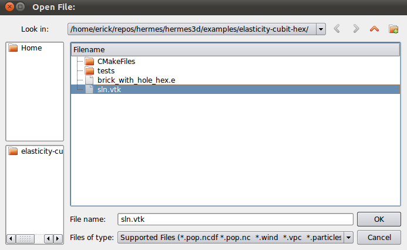
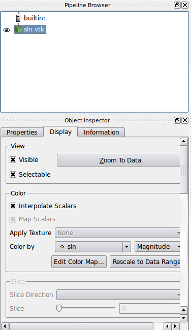
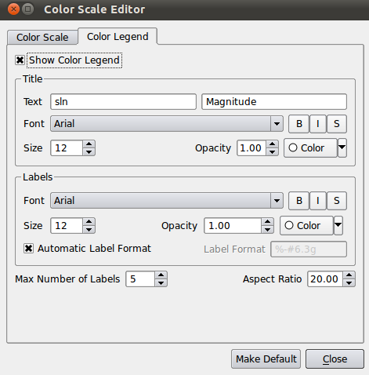

====================
How to Use ParaView
====================

ParaView is an open-source, multi-platform data analysis and visualization application; 
it is used to visualize Hermes3d results.  It provides a comprehensive suite of visualization 
algorithms and supports many different file formats for both loading and exporting datasets. 
Here, we give a brief hands-on tutorial on how to use ParaView to plot the results generated 
by Hermes3D.

Let's get started shall we.  Start by opening up paraview by typing::

     paraview

in your command line terminal.  You should see an image that looks like the following:

.. image:: paraview/pic1.png

Load your solution file into paraview by clicking on "file", "open", and then clicking on your
.vtk file (or whichever file you wish to open) and click "OK".  Your image should look 
similar to the following:

In the left hand side of your main window there is a panel that says "Object Inspector", click on 
the "apply" butoon.  After you click on it it will turn grey and have loaded your solution:

.. image:: paraview/pic3.png

In the same "Object Inspector" panel, click on the "Display" tab.  Look for the section that 
says "Color".  Once you found it, look for a scroll down tab in that section that says
"Color by".  Click on the scroll down button and select "sln".  This will display your 
solution with color corresponding to your solution.  Your image should look similar to the 
following:

In the same section, right next to the "Color by" scroll down tab, there is a button that says
"Edit Color Map...".  Click on it.  A pop-up window should pop-up that looks like the following:

.. image:: paraview/pic5.png

Right now I hope we are all on the same page.  Overall your image should look like the following
(minus that model cube you see in my background, there should be your model):

.. image:: paraview/pic6.png

In the pop-up window that popped up, click on the "Color Legend" tab and select "Show Color Legend"
,if it is not selected already.

You could mess around with the parameters if you'd like (for example, like changing the font "Size"), 
and then close the window.  This concludes our short little hands-on tutorial.

 

