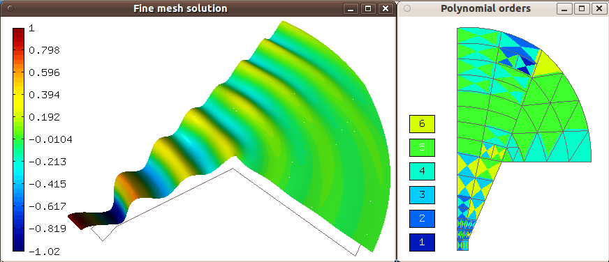
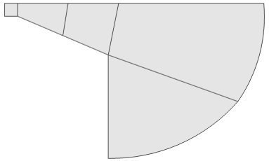
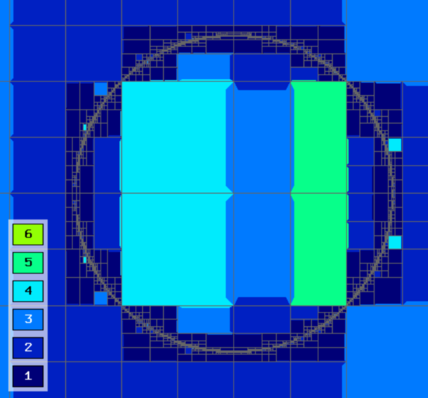
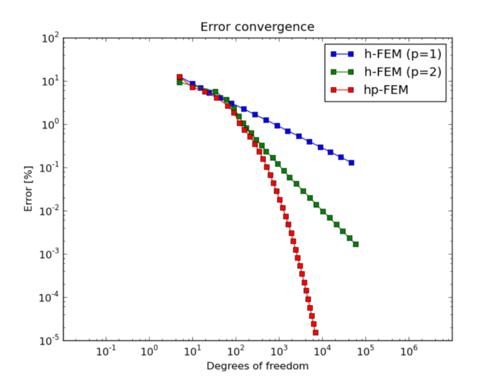
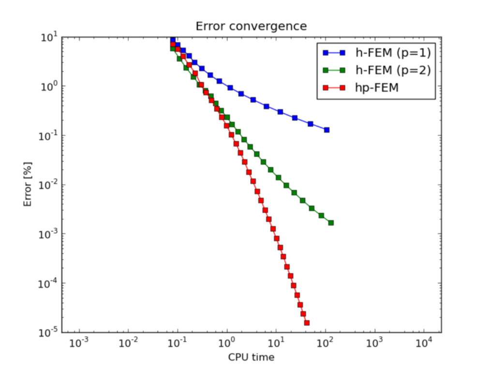
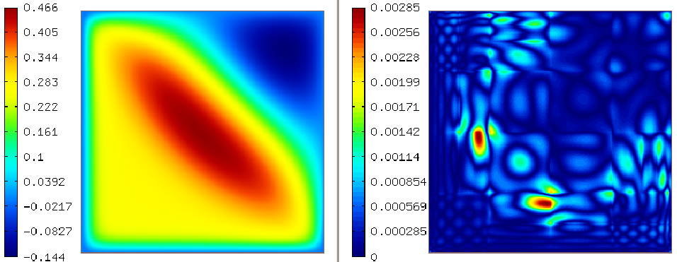
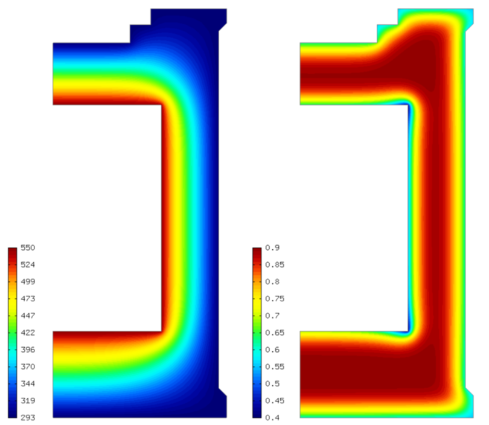
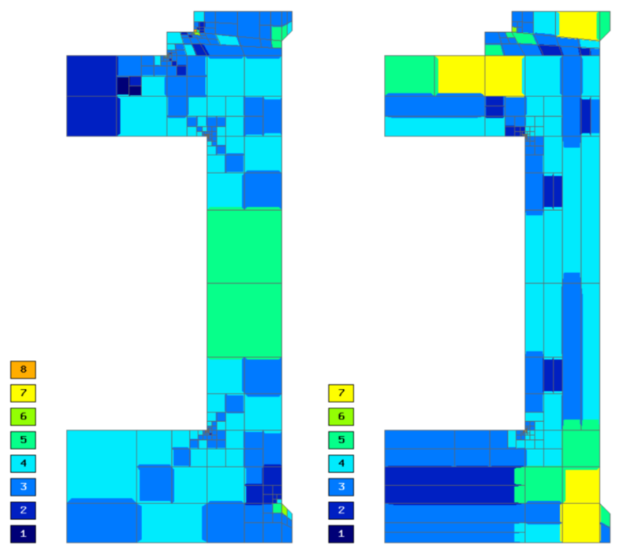
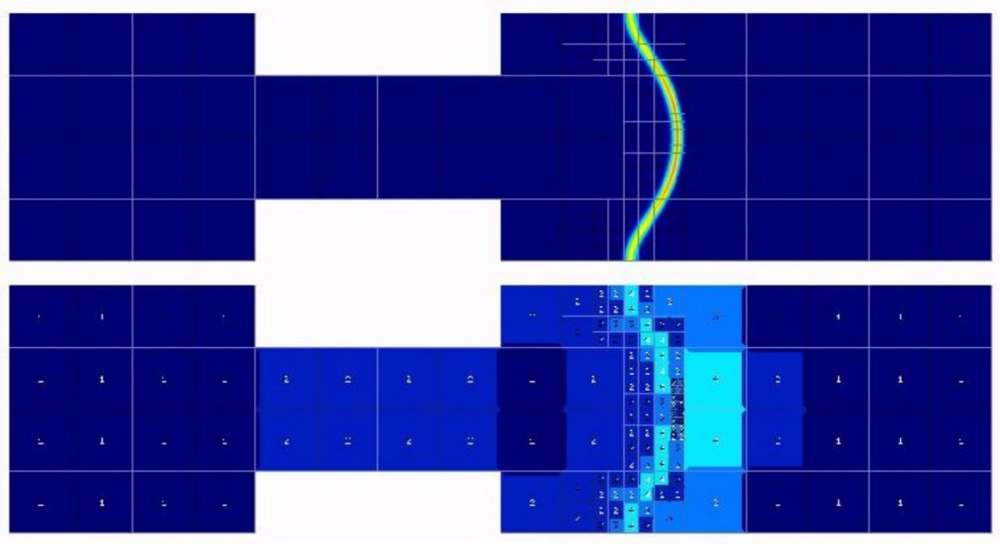
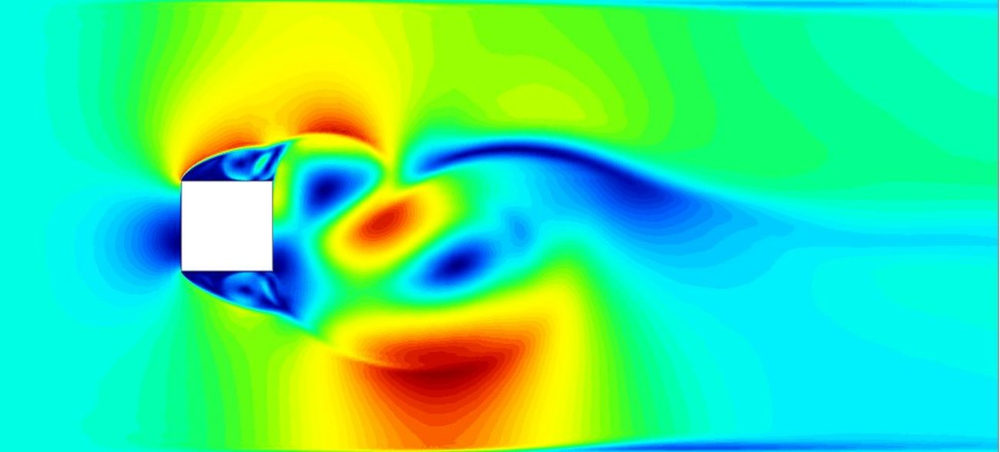

Mathematical Background
-----------------------

The main strength of Hermes is a modern adaptive higher-order 
finite element technology that includes

 * Curvilinear elements.
 * Reduced mesh generation needs.
 * Arbitrary-level hanging nodes.
 * Scalar and vector-valued approximations.
 * Advanced nonlinear solver capabilities.
 * Exponential convergence of adaptive *hp*-FEM.
 * Dozens of time-integration methods. 
 * Adaptivity with dynamical meshes for time-dependent problems.
 * Adaptive multimesh *hp*-FEM for multiphysics coupled problems.
 * Coupled problems solved together with hp-DG and hp-FEM.
 * Calculations with physical quantities defined in different subdomains.

Some the above points are discussed in more detail below:

* **Curvilinear elements**: Approximating curved boundaries or material interfaces via small elements with straight edges belongs to history. It is much more efficient to employ curvilinear elements, such as in the following acoustics problem.

* **Reduced mesh generation needs**: The previous result was obtained with the mesh shown below, but we also provide support for traditional mesh generators including Triangle, CUBIT, GMSH.

.. raw:: latex

   \newpage

* **Arbitrary-level hanging nodes**: Hermes can handle irregular meshes with arbitrary-level hanging nodes. This makes adaptive algorithms much faster compared to algorithms that use regular meshes (without hanging nodes).

* **Exponential convergence of adaptive hp-FEM**: Many practitioners are skeptical about adaptive FEM because it makes computations slow. However, the exponential convergence of adaptive *hp*-FEM is very different from slow, algebraic convergence of standard low-order FEM. A typical comparison of adaptive low-order FEM and *hp*-FEM is shown below. Here *p=1* and *p=2* means linear and quadratic elements, respectively. The vertical axis shows the approximation error, the horizontal one the number of degrees of freedom (problem size).

Same graphs as above but now in terms of CPU time:

* **Dozens of time-integration methods**: Hermes has a unique way of using time-integration methods. More than 30 methods are readily available, including the most advanced adaptive implicit higher-order methods. The sample results below illustrate that it is highly recommended to take the time-discretization error seriously (below on the left). The reason is that it can easily be orders of magnitude larger than the error in space (below on the right). 

* **Multimesh hp-FEM**: Approximating different physical fields on the same mesh belongs to history. For a given solution component, just one finite element mesh can be optimal. Hermes uses an original adaptive multimesh *hp*-FEM technology to discretize any multiphysics problem *on multiple meshes in a monolithic fashion*. No error due to data transfer between various meshes is present. The following figure illustrates this on a coupled problem of heat and moisture transfer in massive concrete walls of a nuclear reactor vessel. 

.. raw:: html

   

.. raw:: latex

   \newpage

* **Dynamical meshes for time-dependent problems**: In time-dependent problems, different physical fields or solution components can be approximated on individual meshes that evolve in time independently of each other.

* **Wide applicability**: Hermes does not employ any error estimate or another technique that would limit its applicability to some particular class of PDE problems. It allows you to tackle an arbitrary PDE or multiphysics PDE system. Visit the `hp-FEM group home page <http://hpfem.org/>`_ and the `gallery <http://hpfem.org/gallery/>`_ to see examples.

