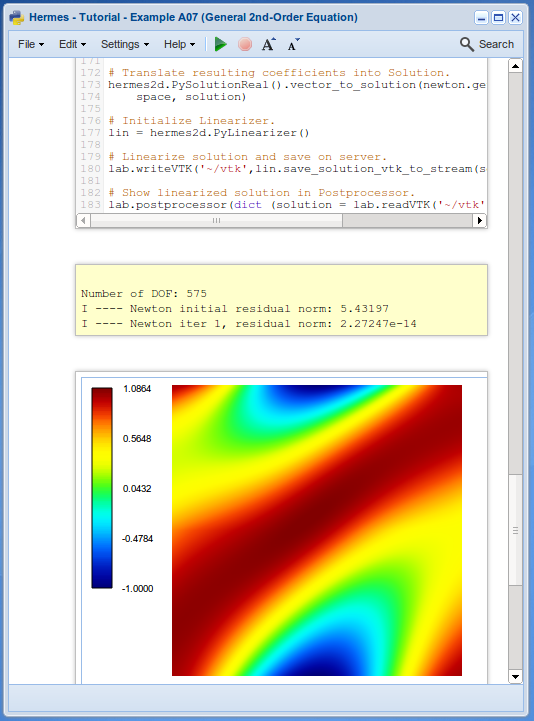

Hermes on the Cloud in NCLab (http://nclab.com)
-----------------------------------------------

Hermes is fully wrapped in Python and available in `NCLab <http://nclab.com/>`_ where it can 
be used to create advanced Python FEM programs in the web browser. Several tutorial examples
have been translated into Python and are available as displayed projects in NCLab. They are
accessible through the File Manager's Clone menu. Look for projects 
"Hermes - Tutorial - Example A01" and similar.

Python wrappers
~~~~~~~~~~~~~~~

The use of the Python wrappers is intuitive as they follow the naming conventions of the 
C++ library closely. More details can be found in this `document <http://femhub.com/docs/hermes_en.pdf>`_

Geometry Editor, Mesh Editor, Postprocessor
~~~~~~~~~~~~~~~~~~~~~~~~~~~~~~~~~~~~~~~~~~~

NCLab also provides integractive graphical applications `Geometry Editor <http://femhub.com/docs/ge_en.pdf>`_, 
`Mesh Editor <http://femhub.com/docs/me_en.pdf>`_ and `Postprocessor <http://femhub.com/docs/pp_en.pdf>`_
that you can use with your Hermes FEM code (and any other Python FEM code for that matter). Their use is 
illustrated in displayed projects whose names start with "GE and ME". 

Illustrative screenshot (tutorial example A-linear/07-general):

