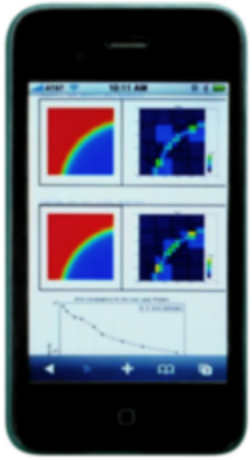

Interactive Web Accessibility
-----------------------------

* **Interactive web usage**. Anyone can use Hermes (and other major open source FEM codes) remotely via any web browser, using the `FEMhub Online Lab <http://lab.femhub.org/>`_. The Online Lab is powered by high-performance computers at the University of Nevada, Reno (UNR). 

See the `Hermes home page <http://hpfem.org/hermes/>`_ for more information. An overview of books, 
journal articles, conference proceedings papers and talks about Hermes and adaptive *hp*-FEM can be 
found in the `publications section <http://hpfem.org/publications/>`_ and/or on 
`Pavel Solin's home page <http://hpfem.org/~pavel/>`_.
