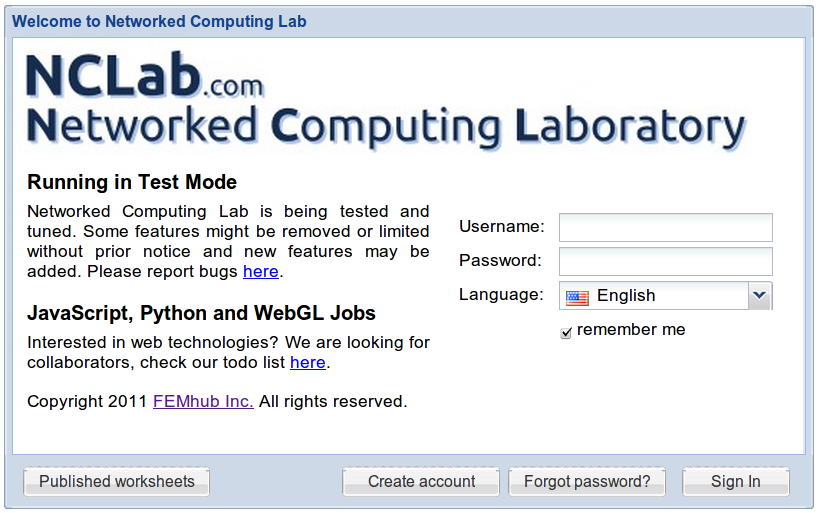
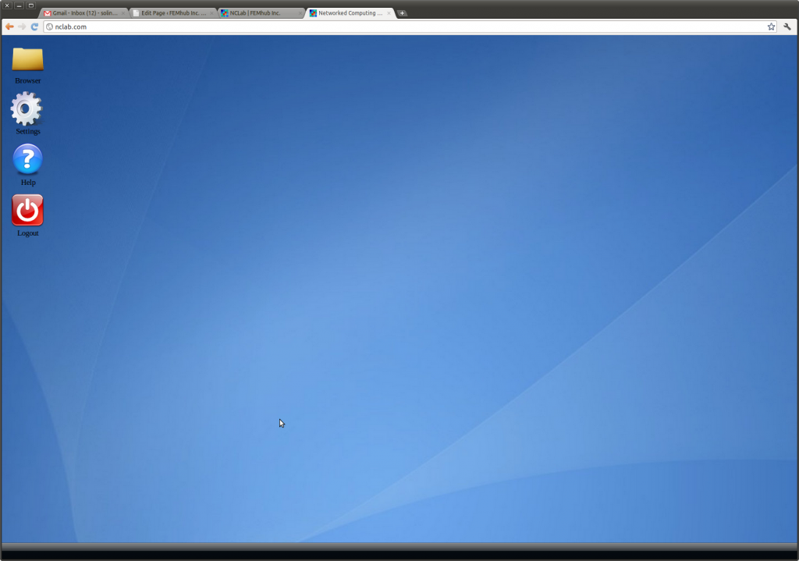
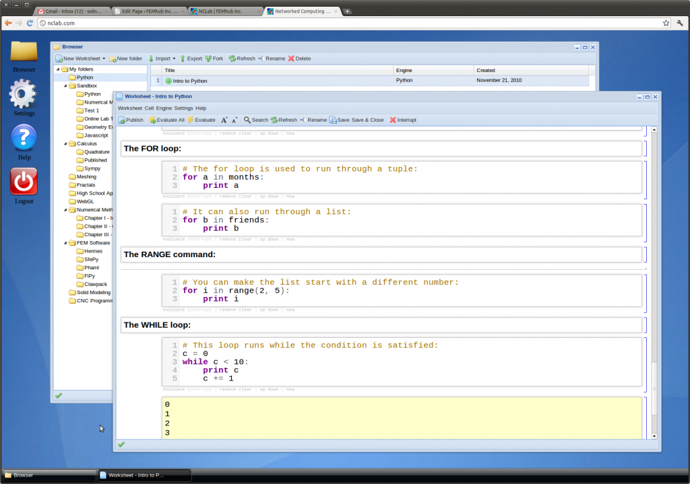
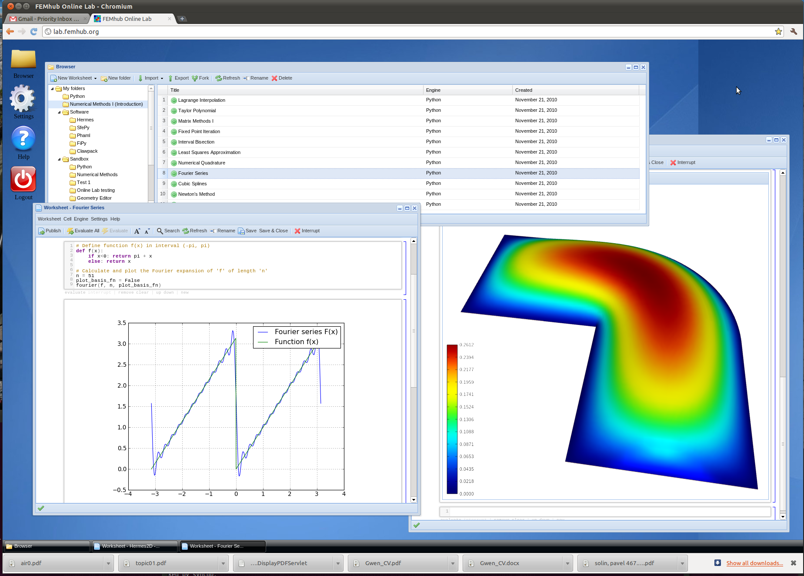

Interactive Web Accessibility
-----------------------------

Anyone can use Hermes (and do many other types of symbolic and numerical computations) in any web browser, using the `Networked Computing Laboratory (NCLab) <http://nclab.com/>`_. 

After login, the user sees a virtual desktop:

Here one can do unrestricted Python programming:

In NCLab one can use the complete Python scientific stack including SciPy, Numpy, Sympy, Pylab and 
other packages. One can work with arbitrary numerical methods and of course also with Hermes:

See the `NCLab's overview page <http://femhub.com/?page_id=813>`_ for more information. 

