Benchmarks with Known Exact Solution
====================================

This section contains the description of selected `benchmarks 
<http://git.hpfem.org/hermes2d.git/tree/HEAD:/benchmarks>`_.
Contrary to regular examples, benchmarks typically do not have 
a significant physical or engineering motivation but they come with 
a known exact solution and thus they are a great resource for 
comparisons of various methods and adaptivity algorithms.

Smooth-iso (Elliptic)
---------------------

**Git reference:** Benchmark `smooth-iso <http://git.hpfem.org/hermes2d.git/tree/HEAD:/benchmarks/smooth-iso>`_.

We show that it is a very bad idea to approximate smooth solutions using low-order 
elements.

Equation solved: Poisson equation 

.. math::
    :label: smooth-iso

       -\Delta u = f.

Domain of interest: Square $(0, \pi)^2$.

Right-hand side:

.. math::
    :label: smooth-iso-rhs
 
    f(x, y) = 2\sin(x)\sin(y).

Boundary conditions: Zero Dirichlet. 

Exact solution:

.. math::
    :label: smooth-iso-exact

    u(x, y) = \sin(x)\sin(y).

Code for the exact solution and the weak forms:

::

    // Exact solution.
    static double fn(double x, double y)
    {
      return sin(x)*sin(y);
    }

    static double fndd(double x, double y, double& dx, double& dy)
    {
      dx = cos(x)*sin(y);
      dy = sin(x)*cos(y);
      return fn(x, y);
    }

    // Boundary condition types.
    BCType bc_types(int marker)
    {
      return BC_ESSENTIAL;
    }

    // Essential (Dirichlet) boundary conditions.
    scalar essential_bc_values(int ess_bdy_marker, double x, double y)
    {
      return 0;
    }

    // Weak forms.
    template<typename Real, typename Scalar>
    Scalar bilinear_form(int n, double *wt, Func<Scalar> *u_ext[], Func<Real> *u, Func<Real> *v, Geom<Real> *e, ExtData<Scalar> *ext)
    {
      return int_grad_u_grad_v<Real, Scalar>(n, wt, u, v);
    }

    template<typename Real>
    Real rhs(Real x, Real y)
    {
      return 2*sin(x)*sin(y);
    }

    template<typename Real, typename Scalar>
    Scalar linear_form(int n, double *wt, Func<Scalar> *u_ext[], Func<Real> *v, Geom<Real> *e, ExtData<Scalar> *ext)
    {
      return int_F_v<Real, Scalar>(n, wt, rhs, v, e);
    }

Solution:

.. image:: img/benchmark-smooth-iso/sol_3d_view.png
   :align: center
   :width: 500
   :height: 300
   :alt: Solution.

Below we show meshes obtained using various types of adaptivity. 
Note the tremendous differences in their performance. The meshes do not correspond to 
the same level of accuracy since the low-order methods could not achieve the same error 
as hp-FEM. Therefore, compare not only the number of DOF but also the error level. 
Convergence graphs for all cases are shown at the end of this section.

Final mesh (h-FEM, p=1): 27469 DOF, error 0.39173795799476 %

.. image:: img/benchmark-smooth-iso/mesh-h1.png
   :align: center
   :width: 500
   :height: 400
   :alt: Final mesh

Final mesh (h-FEM, p=2): 39185 DOF, error 0.0022127484879974 %

.. image:: img/benchmark-smooth-iso/mesh-h2.png
   :align: center
   :width: 500
   :height: 400
   :alt: Final mesh

Final mesh (hp-FEM): 49 DOF, error 4.2775412425017e-05 %

.. image:: img/benchmark-smooth-iso/mesh-hp.png
   :align: center
   :width: 500
   :height: 400
   :alt: Final mesh

DOF convergence graphs:

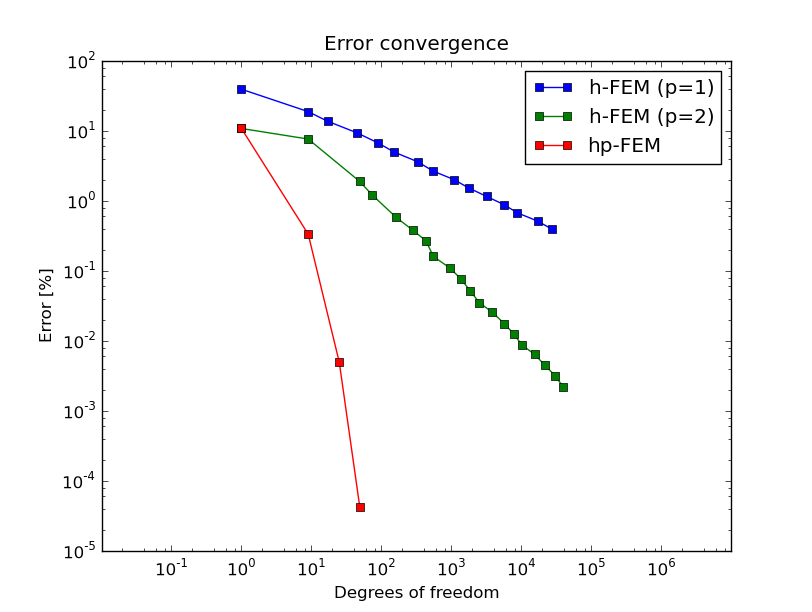

CPU time convergence graphs:

.. image:: img/benchmark-smooth-iso/conv_cpu.png
   :align: center
   :width: 600
   :height: 400
   :alt: CPU convergence graph.

Smooth-aniso-x (Elliptic)
-------------------------

**Git reference:** Benchmark `smooth-aniso-x <http://git.hpfem.org/hermes2d.git/tree/HEAD:/benchmarks/smooth-aniso-x>`_.

We show that one should use (spatially as well as polynomially) anisotropic refinements for solutions 
containing anisotropy. 

Equation solved: Poisson equation 

.. math::
    :label: sin

       -\Delta u = f.

Domain of interest: Square $(0, \pi)^2$.

Right-hand side:

.. math::
    :label: sin-rhs
 
    f(x, y) = \sin(x).

Boundary conditions: Zero Dirichlet on the left and right edges, zero Neumann on the rest of the boundary.

Exact solution:

.. math::
    :label: sin-exact

    u(x, y) = \sin(x).

Solution:

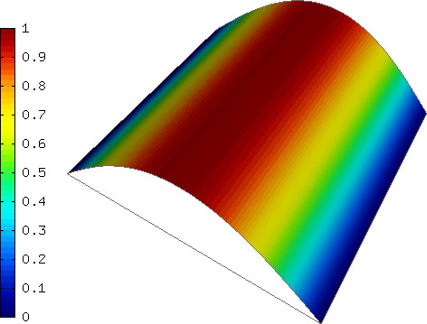

Below we show meshes obtained using various types of adaptivity. 
Note the tremendous differences in their performance. The meshes do not correspond to 
the same level of accuracy since the low-order methods could not achieve the same error 
as hp-FEM. Therefore, compare not only the number of DOF but also the error level. 
Convergence graphs for all cases are shown at the end of this section.

Final mesh (h-FEM, p=1, isotropic refinements): 41033 DOF, error 0.22875054074711 %

.. image:: img/benchmark-smooth-aniso-x/mesh-h1-iso.png
   :align: center
   :width: 500
   :height: 400
   :alt: Final mesh

Final mesh (h-FEM, p=1, anisotropic refinements): 39594 DOF, error 0.0039444224349215 %

.. image:: img/benchmark-smooth-aniso-x/mesh-h1-aniso.png
   :align: center
   :width: 500
   :height: 400
   :alt: Final mesh

Final mesh (h-FEM, p=2, isotropic refinements): 54627 DOF, error 0.0017755772528929 %

.. image:: img/benchmark-smooth-aniso-x/mesh-h2-iso.png
   :align: center
   :width: 500
   :height: 400
   :alt: Final mesh

Final mesh (h-FEM, p=2, anisotropic refinements): 3141 DOF, error 9.3084842840514e-05 %

.. image:: img/benchmark-smooth-aniso-x/mesh-h2-aniso.png
   :align: center
   :width: 500
   :height: 400
   :alt: Final mesh

Final mesh (hp-FEM, isotropic refinements): 63 DOF, error = 3.6797337289125e-05 %

.. image:: img/benchmark-smooth-aniso-x/mesh-hp-iso.png
   :align: center
   :width: 500
   :height: 400
   :alt: Final mesh

Final mesh (hp-FEM, anisotropic refinements): 14 DOF, error 3.6797337292196e-05 %, The 
color pattern means that the polynomial degrees are one and eight in the vertical and 
horizontal directions, respectively.

.. image:: img/benchmark-smooth-aniso-x/mesh-hp-aniso.png
   :align: center
   :width: 500
   :height: 400
   :alt: Final mesh

DOF convergence graphs:

.. image:: img/benchmark-smooth-aniso-x/conv_dof.png
   :align: center
   :width: 600
   :height: 400
   :alt: DOF convergence graph.

CPU time convergence graphs:

.. image:: img/benchmark-smooth-aniso-x/conv_cpu.png
   :align: center
   :width: 600
   :height: 400
   :alt: CPU convergence graph.

Smooth-aniso-y (Elliptic)
-------------------------

**Git reference:** Benchmark `smooth-aniso-y <http://git.hpfem.org/hermes2d.git/tree/HEAD:/benchmarks/smooth-aniso-y>`_.

This example is very similar to the previous one, except now the solution is 
constant in the x-direction. It is good to have both to be able to check that 
anisotropic refinements work correctly. 

L-Shape (Elliptic)
------------------

**Git reference:** Benchmark `lshape <http://git.hpfem.org/hermes2d.git/tree/HEAD:/benchmarks/lshape>`_.

This is a standard adaptivity benchmark whose exact solution is smooth but
contains singular gradient in a re-entrant corner. 

Equation solved: Laplace equation 

.. math::
    :label: lshape

       -\Delta u = 0.

Domain of interest:

.. image:: img/benchmark-lshape/domain.png
   :align: center
   :width: 470
   :height: 470
   :alt: Computational domain.

Exact solution:

.. math::
    :label: lshape-exact

    u(x, y) = r^{2/3}\sin(2a/3 + \pi/3)

where $r(x,y) = \sqrt{x^2 + y^2}$ and $a(x,y) = \mbox{atan}(x/y)$. 

Code for the exact solution, bundary conditions, and weak forms:

::

    // Exact solution.
    static double fn(double x, double y)
    {
      double r = sqrt(x*x + y*y);
      double a = atan2(x, y);
      return pow(r, 2.0/3.0) * sin(2.0*a/3.0 + M_PI/3);
    }

    static double fndd(double x, double y, double& dx, double& dy)
    {
      double t1 = 2.0/3.0*atan2(x, y) + M_PI/3;
      double t2 = pow(x*x + y*y, 1.0/3.0);
      double t3 = x*x * ((y*y)/(x*x) + 1);
      dx = 2.0/3.0*x*sin(t1)/(t2*t2) + 2.0/3.0*y*t2*cos(t1)/t3;
      dy = 2.0/3.0*y*sin(t1)/(t2*t2) - 2.0/3.0*x*t2*cos(t1)/t3;
      return fn(x, y);
    }

    // Boundary condition types.
    BCType bc_types(int marker)
    {
      return BC_ESSENTIAL;
    }

    // Essential (Dirichlet) boundary condition values.
    scalar essential_bc_values(int ess_bdy_marker, double x, double y)
    {
      return fn(x, y);
    }

    // Bilinear form corresponding to the Laplace equation.
    template<typename Real, typename Scalar>
    Scalar bilinear_form(int n, double *wt, Func<Scalar> *u_ext[], Func<Real> *u, Func<Real> *v, Geom<Real> *e, ExtData<Scalar> *ext)
    {
      return int_grad_u_grad_v<Real, Scalar>(n, wt, u, v);
    }

Solution:

.. image:: img/benchmark-lshape/sol_3d_view.png
   :align: center
   :width: 600
   :height: 400
   :alt: Solution.

Final mesh (h-FEM with linear elements):

.. image:: img/benchmark-lshape/mesh-h1.png
   :align: center
   :width: 500
   :height: 400
   :alt: Final mesh (h-FEM with linear elements).

Final mesh (h-FEM with quadratic elements):

.. image:: img/benchmark-lshape/mesh-h2.png
   :align: center
   :width: 500
   :height: 400
   :alt: Final mesh (h-FEM with quadratic elements).

Final mesh (hp-FEM):

.. image:: img/benchmark-lshape/mesh-hp.png
   :align: center
   :width: 500
   :height: 400
   :alt: Final mesh (hp-FEM).

DOF convergence graphs:

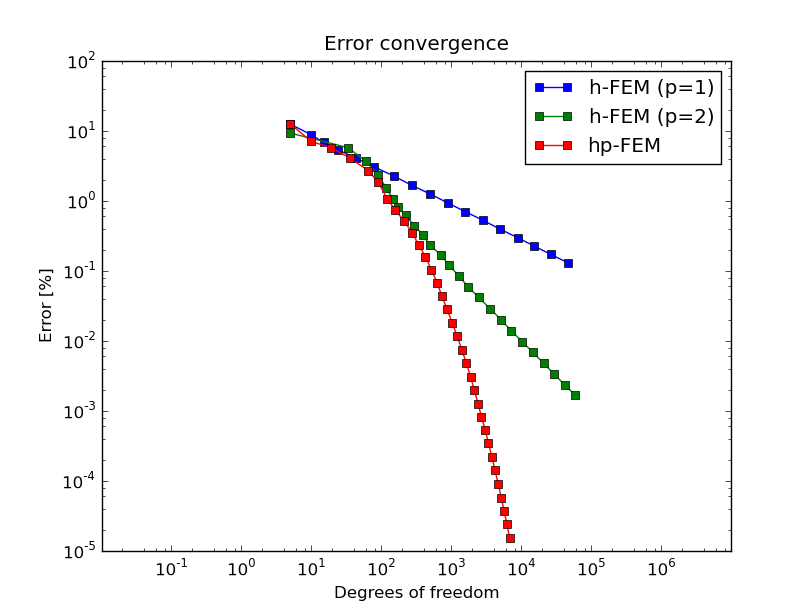

CPU time convergence graphs:

.. image:: img/benchmark-lshape/conv_cpu.png
   :align: center
   :width: 600
   :height: 400
   :alt: CPU convergence graph.

Interior Layer (Elliptic)
-------------------------

**Git reference:** Benchmark `layer-interior <http://git.hpfem.org/hermes2d.git/tree/HEAD:/benchmarks/layer-interior>`_.

This example has a smooth solution that exhibits a steep interior layer.

Equation solved: Poisson equation 

.. math::
    :label: layer-interior

       -\Delta u = f.

Domain of interest: Unit square $(0, 1)^2$.

Right-hand side:

.. math::
    :label: layer-interior-rhs
 
    f(x, y) = \frac{27}{2} (2y + 0.5)^2 (\pi - 3t) \frac{S^3}{u^2 t_2} +
    \frac{27}{2} (2x - 2.5)^2 (\pi - 3t) \frac{S^3}{u^2 t_2}
    - \frac{9}{4} (2y + 0.5)^2 \frac{S}{u t^3} -
    \frac{9}{4} (2x - 2.5)^2 \frac{S}{u t^3} +
    18 \frac{S}{ut}.

Exact solution:

.. math::
    :label: layer-interior-exact

    u(x, y) = \mbox{atan}\left(S \sqrt{(x-1.25)^2 + (y+0.25)^2} - \pi/3\right).

where $S$ is a parameter (slope of the layer). With larger $S$, this problem 
becomes difficult for adaptive algorithms, and at the same time the advantage of 
adaptive $hp$-FEM over adaptive low-order FEM becomes more significant. We will 
use $S = 60$ in the following.

Code for the exact solution and the weak forms:

::

    // Exact solution.
    static double fn(double x, double y)
    {
      return atan(SLOPE * (sqrt(sqr(x-1.25) + sqr(y+0.25)) - M_PI/3));
    }
    
    static double fndd(double x, double y, double& dx, double& dy)
    {
      double t = sqrt(sqr(x-1.25) + sqr(y+0.25));
      double u = t * (sqr(SLOPE) * sqr(t - M_PI/3) + 1);
      dx = SLOPE * (x-1.25) / u;
      dy = SLOPE * (y+0.25) / u;
      return fn(x, y);
    }
    
    // Boundary condition types.
    BCType bc_types(int marker)
    {
      return BC_ESSENTIAL;
    }
    
    // Essential (Dirichlet) boundary condition values.
    scalar essential_bc_values(int ess_bdy_marker, double x, double y)
    {
      return fn(x, y);
    }
    
    // Bilinear form for the Poisson equation.
    template<typename Real, typename Scalar>
    Scalar bilinear_form(int n, double *wt, Func<Scalar> *u_ext[], Func<Real> *u, Func<Real> *v, Geom<Real> *e, ExtData<Scalar> *ext)
    {
      return int_grad_u_grad_v<Real, Scalar>(n, wt, u, v);
    }
    
    template<typename Real>
    Real rhs(Real x, Real y)
    {
      Real t2 = sqr(y + 0.25) + sqr(x - 1.25);
      Real t = sqrt(t2);
      Real u = (sqr(M_PI - 3.0*t)*sqr(SLOPE) + 9.0);
      return 27.0/2.0 * sqr(2.0*y + 0.5) * (M_PI - 3.0*t) * pow(SLOPE,3.0) / (sqr(u) * t2) +
             27.0/2.0 * sqr(2.0*x - 2.5) * (M_PI - 3.0*t) * pow(SLOPE,3.0) / (sqr(u) * t2) -
             9.0/4.0 * sqr(2.0*y + 0.5) * SLOPE / (u * pow(t,3.0)) -
             9.0/4.0 * sqr(2.0*x - 2.5) * SLOPE / (u * pow(t,3.0)) +
             18.0 * SLOPE / (u * t);
    }
     
    template<typename Real, typename Scalar>
    Scalar linear_form(int n, double *wt, Func<Scalar> *u_ext[], Func<Real> *v, Geom<Real> *e, ExtData<Scalar> *ext)
    {
      return -int_F_v<Real, Scalar>(n, wt, rhs, v, e);
    }

Solution:

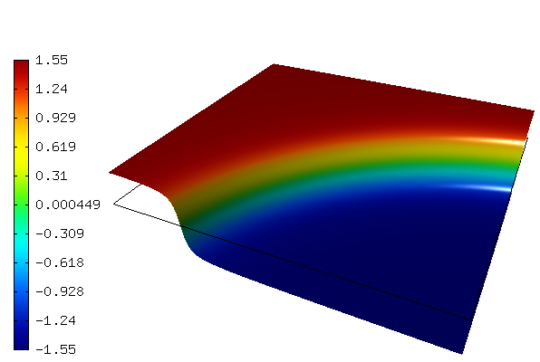

Final mesh (h-FEM with linear elements):

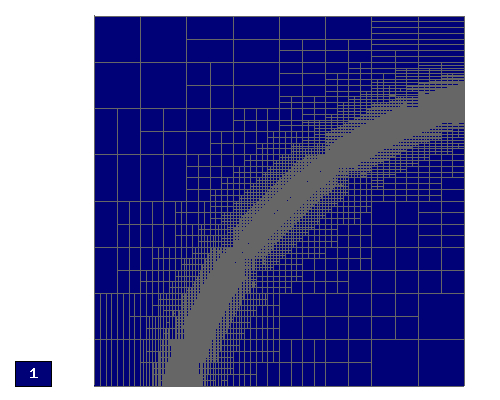

Final mesh (h-FEM with quadratic elements):

.. image:: img/benchmark-layer-interior/mesh-h2.png
   :align: center
   :width: 500
   :height: 400
   :alt: Final mesh (h-FEM with quadratic elements).

Final mesh (hp-FEM):

.. image:: img/benchmark-layer-interior/mesh-hp.png
   :align: center
   :width: 500
   :height: 400
   :alt: Final mesh (hp-FEM).

DOF convergence graphs:

.. image:: img/benchmark-layer-interior/conv_dof.png
   :align: center
   :width: 600
   :height: 400
   :alt: DOF convergence graph.

CPU time convergence graphs:

.. image:: img/benchmark-layer-interior/conv_cpu.png
   :align: center
   :width: 600
   :height: 400
   :alt: CPU convergence graph.

Boundary Layer (Elliptic)
-------------------------

**Git reference:** Benchmark `layer-boundary <http://git.hpfem.org/hermes2d.git/tree/HEAD:/benchmarks/layer-boundary>`_.

This example is a singularly perturbed problem with known exact solution that exhibits a thin boundary layer, that 
the reader can use to perform various experiments with adaptivity for problems with boundary layers. The sample 
numerical results presented below imply that:

* one should always use anisotropically refined meshes for problems with boundary layers,
* hp-FEM is vastly superior to h-FEM with linear and quadratic elements, 
* one should use not only spatially anisotropic elements, but also polynomial anisotropy (different polynomial orders in each direction) for problems in boundary layers. 

Equation solved: Poisson equation 

.. math::
    :label: layer-boundary

       -\Delta u + K^2 u = f.

Domain of interest: Square $(-1, 1)^2$.

Exact solution: 

.. math::

    u(x,y) = \hat u(x) \hat u(y)

where $\hat u$ is the exact solution of the 1D singularly-perturbed problem

.. math::

    -u'' + K^2 u = K^2

in $(-1,1)$ with zero Dirichlet boundary conditions. This solution has the form 

.. math::

    \hat u (x) = 1 - [exp(Kx) + exp(-Kx)] / [exp(K) + exp(-K)];

Right-hand side: Calculated by inserting the exact solution into the equation. Here
is the code snippet with both the exact solution and the right-hand side:

::

    // Solution to the 1D problem -u'' + K*K*u = K*K in (-1,1) with zero Dirichlet BC.
    double uhat(double x) {
      return 1. - (exp(K*x) + exp(-K*x)) / (exp(K) + exp(-K));
    }
    double duhat_dx(double x) {
      return -K * (exp(K*x) - exp(-K*x)) / (exp(K) + exp(-K));
    }
    double dduhat_dxx(double x) {
      return -K*K * (exp(K*x) + exp(-K*x)) / (exp(K) + exp(-K));
    }

    // Exact solution u(x,y) to the 2D problem is defined as the
    // Cartesian product of the 1D solutions.
    static double sol_exact(double x, double y, double& dx, double& dy)
    {
      dx = duhat_dx(x) * uhat(y);
      dy = uhat(x) * duhat_dx(y);
      return uhat(x) * uhat(y);
    }

    // Right-hand side.
    double rhs(double x, double y) {
      return -(dduhat_dxx(x)*uhat(y) + uhat(x)*dduhat_dxx(y)) + K*K*uhat(x)*uhat(y);
    }

The weak forms are very simple and they are defined as follows. The only thing worth mentioning 
here is that we integrate the non-polynomial right-hand side with a very high order for accuracy:

::

    // Weak forms.
    template<typename Real, typename Scalar>
    Scalar bilinear_form(int n, double *wt, Func<Scalar> *u_ext[], Func<Real> *u, Func<Real> *v, Geom<Real> *e, ExtData<Scalar> *ext)
    {
      return int_grad_u_grad_v<Real, Scalar>(n, wt, u, v) + K*K * int_u_v<Real, Scalar>(n, wt, u, v);
    }

    template<typename Real, typename Scalar>
    Scalar linear_form(int n, double *wt, Func<Scalar> *u_ext[], Func<Real> *v, Geom<Real> *e, ExtData<Scalar> *ext)
    {
      return int_F_v<Real, Scalar>(n, wt, rhs, v, e);;
    }

    // Integration order for linear_form_0.
    Ord linear_form_ord(int n, double *wt, Func<Ord> *u_ext[], Func<Ord> *v, Geom<Ord> *e, ExtData<Ord> *ext)
    {
      return 24;
    }

The numerical results follow:

Solution:

.. image:: img/benchmark-layer-boundary/solution.png
   :align: center
   :width: 600
   :height: 400
   :alt: Solution.

Below we present a series of convergence comparisons. Note that the error plotted
is the true approximate error calculated wrt. the exact solution given above.

Isotropic refinements
~~~~~~~~~~~~~~~~~~~~~

Let us first compare the performance of h-FEM (p=1), h-FEM (p=2) and hp-FEM with **isotropic** refinements:

Final mesh (h-FEM, p=1, isotropic refinements):

.. image:: img/benchmark-layer-boundary/mesh_h1_iso.png
   :align: center
   :width: 500
   :height: 400
   :alt: Final mesh.

Final mesh (h-FEM, p=2, isotropic refinements):

.. image:: img/benchmark-layer-boundary/mesh_h2_iso.png
   :align: center
   :width: 500
   :height: 400
   :alt: Final mesh.

Final mesh (hp-FEM, isotropic refinements):

.. image:: img/benchmark-layer-boundary/mesh_hp_iso.png
   :align: center
   :width: 500
   :height: 400
   :alt: Final mesh.

DOF convergence graphs:

.. image:: img/benchmark-layer-boundary/conv_compar_dof_iso.png
   :align: center
   :width: 600
   :height: 400
   :alt: DOF convergence graph.

CPU convergence graphs:

.. image:: img/benchmark-layer-boundary/conv_compar_cpu_iso.png
   :align: center
   :width: 600
   :height: 400
   :alt: CPU convergence graph.

Anisotropic refinements
~~~~~~~~~~~~~~~~~~~~~~~

Next we compare the performance of h-FEM (p=1), h-FEM (p=2) and hp-FEM with **anisotropic** refinements:

Final mesh (h-FEM, p=1, anisotropic refinements):

.. image:: img/benchmark-layer-boundary/mesh_h1_aniso.png
   :align: center
   :width: 500
   :height: 400
   :alt: Final mesh.

Final mesh (h-FEM, p=2, anisotropic refinements):

.. image:: img/benchmark-layer-boundary/mesh_h2_aniso.png
   :align: center
   :width: 500
   :height: 400
   :alt: Final mesh.

Final mesh (hp-FEM, anisotropic refinements):

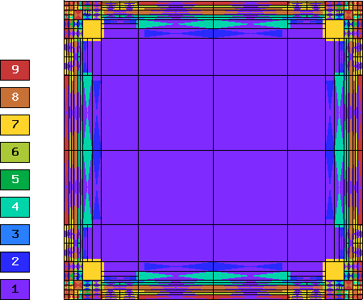

DOF convergence graphs:

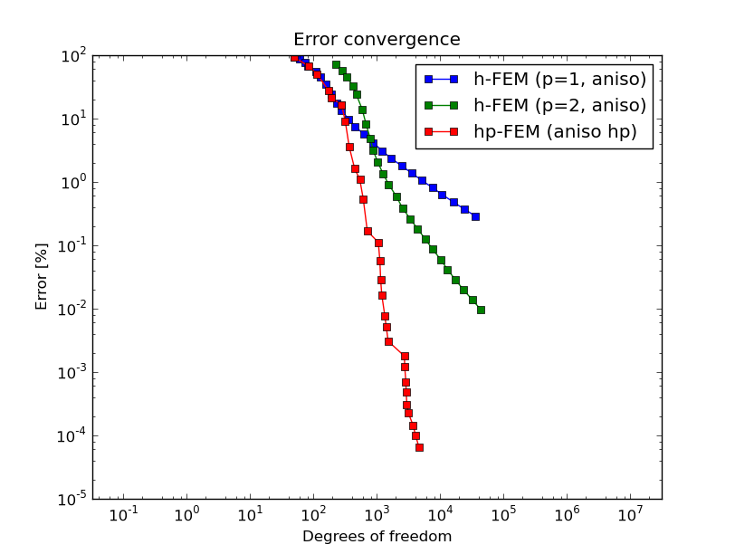

CPU convergence graphs:

.. image:: img/benchmark-layer-boundary/conv_compar_cpu_aniso.png
   :align: center
   :width: 600
   :height: 400
   :alt: CPU convergence graph.

h-FEM (p=1): comparison of isotropic and anisotropic refinements
~~~~~~~~~~~~~~~~~~~~~~~~~~~~~~~~~~~~~~~~~~~~~~~~~~~~~~~~~~~~~~~~

DOF convergence graphs:

.. image:: img/benchmark-layer-boundary/conv_compar_dof_h1.png
   :align: center
   :width: 600
   :height: 400
   :alt: DOF convergence graph.

CPU convergence graphs:

.. image:: img/benchmark-layer-boundary/conv_compar_cpu_h1.png
   :align: center
   :width: 600
   :height: 400
   :alt: CPU convergence graph.

h-FEM (p=2): comparison of isotropic and anisotropic refinements
~~~~~~~~~~~~~~~~~~~~~~~~~~~~~~~~~~~~~~~~~~~~~~~~~~~~~~~~~~~~~~~~

DOF convergence graphs:

.. image:: img/benchmark-layer-boundary/conv_compar_dof_h2.png
   :align: center
   :width: 600
   :height: 400
   :alt: DOF convergence graph.

CPU convergence graphs:

.. image:: img/benchmark-layer-boundary/conv_compar_cpu_h2.png
   :align: center
   :width: 600
   :height: 400
   :alt: CPU convergence graph.

hp-FEM: comparison of isotropic and anisotropic refinements
~~~~~~~~~~~~~~~~~~~~~~~~~~~~~~~~~~~~~~~~~~~~~~~~~~~~~~~~~~~

In the hp-FEM one has two kinds of anisotropy -- spatial and polynomial. In the following,
"iso" means isotropy both in h and p, "aniso h" means anisotropy in h only, and 
"aniso hp" means anisotropy in both h and p. 

DOF convergence graphs (hp-FEM):

.. image:: img/benchmark-layer-boundary/conv_compar_dof_hp.png
   :align: center
   :width: 600
   :height: 400
   :alt: DOF convergence graph.

CPU convergence graphs (hp-FEM):

.. image:: img/benchmark-layer-boundary/conv_compar_cpu_hp.png
   :align: center
   :width: 600
   :height: 400
   :alt: CPU convergence graph.

The reader can see that enabling polynomially anisotropic refinements in the hp-FEM is 
equally important as allowing spatially anisotropic ones. 

Line Singularity (Elliptic)
---------------------------

**Git reference:** Benchmark `line-singularity <http://git.hpfem.org/hermes2d.git/tree/HEAD:/benchmarks/line-singularity>`_.

The is another example with anisotropic solution that is suitable for testing 
anisotropic element refinements.

Equation solved: Poisson equation 

.. math::
    :label: line-sing

       -\Delta u = f.

Domain of interest: Square $(-1, 1)^2$.

Boundary conditions: Zero Neumann on left edge, Dirichlet given by the 
exact solution on the rest of the boundary.

Exact solution: 

.. math::

    u(x,y) = \cos(Ky)\ \ \ \mbox{for}\ x \le 0,\\
    u(x,y) = \cos(Ky) + x^{\alpha}\ \ \ \mbox{for}\ x > 0,

where $K$ and $\alpha$ are real constants. 

Right-hand side: Obtained by inserting the exact solution into the equation.
The corresponding code snippet is shown below:

::

    scalar rhs(scalar x, scalar y)
    {
      if (x < 0) return fn(x, y)*K*K;
      else return fn(x, y)*K*K-ALPHA*(ALPHA-1)*pow(x, ALPHA - 2.) - K*K*pow(x, ALPHA);
    }

Solution for $K = \pi/2$ and $\alpha = 2.01$:

.. image:: img/benchmark-line-singularity/solution.png
   :align: center
   :width: 600
   :height: 400
   :alt: Solution.

Comparison of h-FEM (p=1), h-FEM (p=2) and hp-FEM with anisotropic refinements
~~~~~~~~~~~~~~~~~~~~~~~~~~~~~~~~~~~~~~~~~~~~~~~~~~~~~~~~~~~~~~~~~~~~~~~~~~~~~~

Final mesh (h-FEM, p=1, anisotropic refinements):

.. image:: img/benchmark-line-singularity/mesh_h1_aniso.png
   :align: center
   :width: 450
   :alt: Final mesh.

Final mesh (h-FEM, p=2, anisotropic refinements):

.. image:: img/benchmark-line-singularity/mesh_h2_aniso.png
   :align: center
   :width: 450
   :alt: Final mesh.

Final mesh (hp-FEM, h-anisotropic refinements):

.. image:: img/benchmark-line-singularity/mesh_hp_anisoh.png
   :align: center
   :width: 450
   :alt: Final mesh.

DOF convergence graphs:

.. image:: img/benchmark-line-singularity/conv_dof_aniso.png
   :align: center
   :width: 600
   :height: 400
   :alt: DOF convergence graph.

CPU convergence graphs:

.. image:: img/benchmark-line-singularity/conv_cpu_aniso.png
   :align: center
   :width: 600
   :height: 400
   :alt: CPU convergence graph.

hp-FEM with iso, h-aniso and hp-aniso refinements
~~~~~~~~~~~~~~~~~~~~~~~~~~~~~~~~~~~~~~~~~~~~~~~~~

Final mesh (hp-FEM, isotropic refinements):

.. image:: img/benchmark-line-singularity/mesh_hp_iso.png
   :align: center
   :width: 450
   :alt: Final mesh.

Final mesh (hp-FEM, h-anisotropic refinements):

.. image:: img/benchmark-line-singularity/mesh_hp_anisoh.png
   :align: center
   :width: 450
   :alt: Final mesh.

Final mesh (hp-FEM, hp-anisotropic refinements):

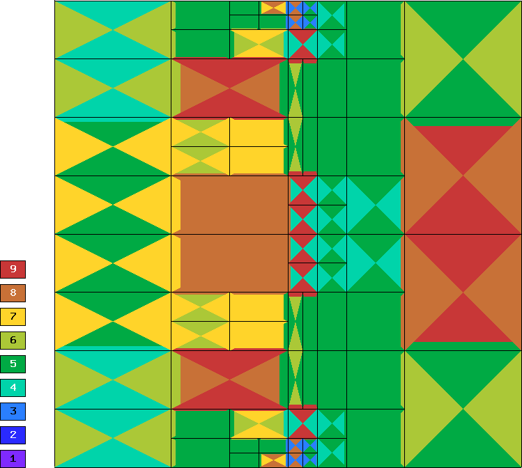

The following convergence comparisons still correspond to an older
version of Hermes2D when we did not have anisotropic hp-refinements. 
With those, the convergence of adaptive hp-FEM has improved a lot. 
These results will be updated soon.

DOF convergence graphs:

.. image:: img/benchmark-line-singularity/conv_dof_hp.png
   :align: center
   :width: 600
   :height: 400
   :alt: DOF convergence graph.

CPU convergence graphs:

.. image:: img/benchmark-line-singularity/conv_cpu_hp.png
   :align: center
   :width: 600
   :height: 400
   :alt: CPU convergence graph.

Kellogg (Elliptic)
------------------

**Git reference:** Benchmark `kellogg <http://git.hpfem.org/hermes2d.git/tree/HEAD:/benchmarks/kellogg>`_.

The solution to this elliptic problems contains a severe singularity that poses a challenge to 
adaptive methods. 

Equation solved:

.. math::

       -\nabla \cdot (a(x,y) \nabla u) = 0,

where the parameter $a$ is piecewise-constant, $a(x,y) = R$ in the first and third quadrants and $a(x,y) = 1$ 
in the remaining two quadrants. 

Domain of interest: Square $(-1, 1)^2$.

Right-hand side: $f(x,y) = 0$.

Boundary conditions: Dirichlet given by exact solution. 

Exact solution: Quite complicated, see the code below.

::

    // Problem constants.
    const double R = 161.4476387975881;      // Equation parameter.
    const double TAU = 0.1;                  // Equation parameter.
    const double RHO = M_PI/4.;              // Equation parameter
    const double SIGMA = -14.92256510455152; // Equation parameter

    // Exact solution.
    static double fn(double x, double y)
    {
      double theta = atan2(y,x);
      if (theta < 0) theta = theta + 2.*M_PI;
      double r = sqrt(x*x + y*y);

      double mu;
      if (theta <= M_PI/2.) {
        mu = cos((M_PI/2. - SIGMA)*TAU) * cos((theta - M_PI/2. + RHO)*TAU);
      }
      else {
        if (theta <= M_PI) {
          mu = cos(RHO*TAU) * cos((theta - M_PI + SIGMA)*TAU);
        }
        else {
          if (theta <= 3.*M_PI/2.) {
            mu = cos(SIGMA*TAU) * cos((theta - M_PI - RHO)*TAU);
          }
          else {
            mu = cos((M_PI/2. - RHO)*TAU) * cos((theta - 3.*M_PI/2. - SIGMA)*TAU);
          }
        }
      }

      return pow(r, TAU) * mu;
    }

The weak forms are as follows:

::

    // Weak forms
    template<typename Real, typename Scalar>
    Scalar bilinear_form_I_III(int n, double *wt, Func<Scalar> *u_ext[], Func<Real> *u, Func<Real> *v, Geom<Real> *e, ExtData<Scalar> *ext)
    {
      return R*int_grad_u_grad_v<Real, Scalar>(n, wt, u, v);
    }

    template<typename Real, typename Scalar>
    Scalar bilinear_form_II_IV(int n, double *wt, Func<Scalar> *u_ext[], Func<Real> *u, Func<Real> *v, Geom<Real> *e, ExtData<Scalar> *ext)
    {
      return 1.*int_grad_u_grad_v<Real, Scalar>(n, wt, u, v);
    }

Solution:

.. image:: img/benchmark-kellogg/solution.png
   :align: center
   :width: 600
   :alt: Solution.

Final mesh (h-FEM with linear elements):

.. image:: img/benchmark-kellogg/mesh-h1.png
   :align: center
   :width: 600
   :alt: Mesh.

Final mesh (h-FEM with quadratic elements):

.. image:: img/benchmark-kellogg/mesh-h2.png
   :align: center
   :width: 600
   :alt: Mesh.

Final mesh (hp-FEM):

.. image:: img/benchmark-kellogg/mesh-hp.png
   :align: center
   :width: 600
   :alt: Mesh.

DOF convergence graphs:

.. image:: img/benchmark-kellogg/conv_dof.png
   :align: center
   :width: 600
   :height: 400
   :alt: DOF convergence graph.

CPU time convergence graphs:

.. image:: img/benchmark-kellogg/conv_cpu.png
   :align: center
   :width: 600
   :height: 400
   :alt: CPU convergence graph.

2-Group Neutronics (Neutronics)
-------------------------------

**Git reference:** Benchmark `neutronics-2-group-adapt <http://git.hpfem.org/hermes2d.git/tree/HEAD:/benchmarks/neutronics-2-group-adapt>`_.

This benchmark uses automatic adaptivity to solve a system of weakly coupled elliptic PDEs describing diffusion of neutrons through given medium.
It employs the simple (yet often used in practice) two-group approximation by which all neutrons are divided into two distinct groups according to their energy (speed). This leads to the system of two equations shown below.

Equations solved:

.. math::
    :label: neutronics-2g

    - \nabla \cdot D_1 \nabla \phi_1 + \Sigma_{r1}\phi_1 - \nu\Sigma_{f1} \phi_1 - \nu\Sigma_{f2} \phi_2 = Q_1,\\
    - \nabla \cdot D_2 \nabla \phi_2 + \Sigma_{r2}\phi_2 - \Sigma_{s,2\leftarrow 1} \phi_1 = Q_2.    

For physical meaning of the various material parameters, see the example `4-Group Neutronics <http://hpfem.org/hermes2d/doc/src/examples.html#group-neutronics>`_. Their numerical values for this benchmark will be given below.

Domain of interest: 

.. image:: img/benchmark-neutronics-2-group-adapt/domain.png
   :align: center
   :width: 400
   :height: 400
   :alt: Computational domain.

Piecewise constant material properties for the four regions of the domain (reactor core) and each energy group are specified by the following code:

::

  const double D[4][2]  = { {1.12, 0.6},
                            {1.2, 0.5},
                            {1.35, 0.8},
                            {1.3, 0.9}	};
  const double Sr[4][2] = { {0.011, 0.13},
                            {0.09, 0.15},
                            {0.035, 0.25},
                            {0.04, 0.35}	};
  const double nSf[4][2]= { {0.0025, 0.15},
                            {0.0, 0.0},
                            {0.0011, 0.1},
                            {0.004, 0.25}	};
  const double chi[4][2]= { {1, 0},
                            {1, 0},
                            {1, 0},
                            {1, 0} };
  const double Ss[4][2][2] = { 
                               { { 0.0, 0.0 },
                                 { 0.05, 0.0 }  },
                               { { 0.0, 0.0 },
                                 { 0.08, 0.0 }  },
                               { { 0.0, 0.0 },
                                 { 0.025, 0.0 } },
                               { { 0.0, 0.0 },
                                 { 0.014, 0.0 } } 
                             };
                             
Boundary conditions: Typical conditions for nuclear reactor core calculations are used:

* zero Neumann on left and top edge (axes of symmetry),
* zero Dirichlet on bottom edge (neutron-inert medium around the reactor core),
* Newton condition on right edge (neutron-reflecting medium around the core):

.. math:: 

    -\frac{\partial D_1\phi_1}{\partial n} = \gamma_1 \phi_1, \quad\quad -\frac{\partial D_2\phi_2}{\partial n} = \gamma_2 \phi_2,
  
where the *reflector albedo* :math:`\gamma` is given by the exact solution and is equal for both groups to 8.

Exact solution: Quite complicated, see the code below.

::

  static double exact_flux1(double x, double y, double& dx, double& dy)
  {
    double em4x2 = exp(-4*sqr(x));
    dx =  2.0*em4x2*x*y*(y-2);
    dy = -0.5*em4x2*(y-1);
    return em4x2*(y/2.-sqr(y/2.));
  }

  static double exact_flux2(double x, double y, double& dx, double& dy)
  {
    double em4x2 = exp(-4*sqr(x));
    dx = 0.1*em4x2*y*(y-2)*(2*x+(2*x*sqr(sin(4*M_PI*x))-M_PI*sin(8*M_PI*x))*sqr(sin(4*M_PI*y)));
    dy = 0.05*em4x2*(1-y+sqr(sin(4*M_PI*x))*(-(y-1)*sqr(sin(4*M_PI*y))-2*M_PI*y*(y-2)*sin(8*M_PI*y)));
    return em4x2*(y/2.-sqr(y/2.)) * (1 + sqr(sin(4*M_PI*x)) * sqr(sin(4*M_PI*y))) / 10.0;
  }

Right-hand side: Obtained by inserting the exact solution into the equation.
The corresponding code snippet is shown below:

::

  double Q1(double x, double y)
  {
    int q = get_material(x,y);

    double exfl1 = exp(-4*sqr(x))*(y/2.-sqr(y/2.));
    double exfl2 = exfl1 * (1 + sqr(sin(4*M_PI*x)) * sqr(sin(4*M_PI*y))) / 10.0;

    double L = 0.5*exp(-4*sqr(x))*(1+4*(8*sqr(x)-1)*y*(y-2))*D[q][0];
    return L + Sr[q][0]*exfl1 - chi[q][0]*nSf[q][0]*exfl1 - chi[q][1]*nSf[q][1]*exfl2;
  }

  double Q2(double x, double y)
  {
    int q = get_material(x,y);

    double yym2 = (y-2)*y;
    double pi2 = sqr(M_PI), x2 = sqr(x), pix = M_PI*x, piy = M_PI*y;
    double cy2 = sqr(cos(4*piy)),
	   sy2 = sqr(sin(4*piy)),
	   sx2 = sqr(sin(4*pix)),
	   em4x2 = exp(-4*x2);

    double exfl1 = em4x2*(y/2.-sqr(y/2.));
    double exfl2 = exfl1 * (1 + sx2 * sy2) / 10.0;

    double L = 1./20.*em4x2*D[q][1]*(
	       1+4*(8*x2-1)*yym2+16*pi2*yym2*cy2*sx2 + 0.5*sy2*(1-4*(1+4*pi2-8*x2)*yym2 +
               (4*(1+12*pi2-8*x2)*yym2-1)*cos(8*pix) - 64*pix*yym2*sin(8*pix)) + 8*M_PI*(y-1)*sx2*sin(8*piy) );
    return L + Sr[q][1]*exfl2 - Ss[q][1][0]*exfl1;
  }

where the function *get_material* is used to obtain the material marker given the physical coordinates (see 
`main.cpp <http://git.hpfem.org/hermes2d.git/blob/HEAD:/benchmarks/neutronics-2-group-adapt/main.cpp>`_). 
The following picture shows the two right-hand side functions (distribution of neutron sources/sinks) - :math:`Q_1` is plotted on the left, :math:`Q_2` on the right.

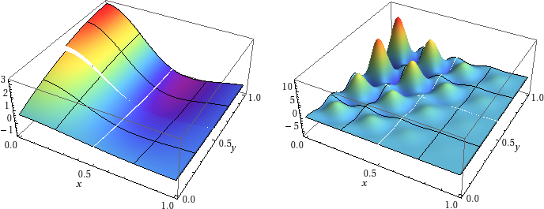
   
Weak formulation of the present two-group neutron diffusion problem with fixed source terms may be derived from the general multigroup formulation shown in the `4-Group Neutronics <http://hpfem.org/hermes2d/doc/src/examples.html#group-neutronics>`_ example. Concerning its implementation (see the file `forms.cpp <http://git.hpfem.org/hermes2d.git/blob/HEAD:/benchmarks/neutronics-2-group-adapt/forms.cpp>`_), it is worth noticing that we manually define a higher integration order for the volumetric linear forms to correctly integrate the non-polynomial source terms, although we may set it lower for the group-1 equations than for the group-2 equations as :math:`Q_1` is much smoother than :math:`Q_2`:

::

  Ord liform_0_ord(int n, double *wt, Func<Ord> *u_ext[], Func<Ord> *v, Geom<Ord> *e, ExtData<Ord> *ext)
  {
    return Ord(20+v->val[0].get_order()); 
  }

  Ord liform_1_ord(int n, double *wt, Func<Ord> *u_ext[], Func<Ord> *v, Geom<Ord> *e, ExtData<Ord> *ext)
  {
    return Ord(30+v->val[0].get_order()); 
  }

The following figures show the computed distributions of neutron flux for both neutron groups.

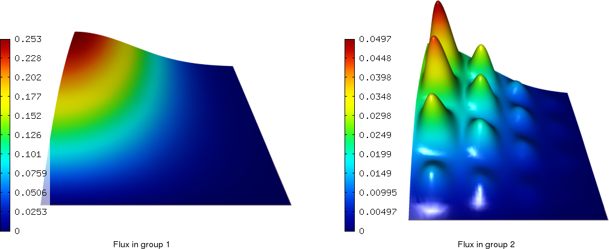

Notice the largely different behavior of the two solution components, where the first one is quite smooth while the other one more oscillating. It reflects the typical behavior observed in real cases, which arises from the different rate of interactions of fast (`1`\ :sup:`st` group) and slow (`2`\ :sup:`nd` group) neutrons with surrounding nuclei. This makes `multimesh <http://hpfem.org/hermes2d/doc/src/tutorial-2.html#multimesh-hp-fem>`_ a preferred choice for automatic adaptivity, as can be clearly seen from the first of the series of convergence comparisons presented below. 

In each convergence comparison, the reported error is the true approximation error calculated wrt. the exact solution given above and measured in a `H`\ :sup:`1` norm. The calculation was ended when the energy error estimate (often used to guide adaptivity in real multiphysics problems where exact solution is not known) became lower than 0.1%.

Comparison of single/multi-mesh hp-FEM 
~~~~~~~~~~~~~~~~~~~~~~~~~~~~~~~~~~~~~~

Final mesh (hp-FEM, single-mesh): 2590 DOF, error = 3.46787%

.. image:: img/benchmark-neutronics-2-group-adapt/mesh_hp_iso_single.png
   :align: center
   :width: 500
   :height: 400
   :alt: Final mesh

Final mesh (hp-FEM, multi-mesh): 1724 DOF, error = 3.46713%

.. image:: img/benchmark-neutronics-2-group-adapt/mesh_hp_iso_multi.png
   :align: center
   :height: 400
   :alt: Final mesh

DOF convergence graphs:

.. image:: img/benchmark-neutronics-2-group-adapt/conv_dof_multimesh.png
   :align: center
   :width: 600
   :height: 400
   :alt: DOF convergence graph.

CPU convergence graphs:

.. image:: img/benchmark-neutronics-2-group-adapt/conv_cpu_multimesh.png
   :align: center
   :width: 600
   :height: 400
   :alt: CPU convergence graph.
   
   
Comparison of h-FEM (p=1), h-FEM (p=2) and hp-FEM with h-anisotropic refinements
~~~~~~~~~~~~~~~~~~~~~~~~~~~~~~~~~~~~~~~~~~~~~~~~~~~~~~~~~~~~~~~~~~~~~~~~~~~~~~~~

Now, with multimesh enabled, we proceed to compare h-adaptivity with fixed order of approximation with hp-adaptivity. Note that in the first case of linear elements, the calculation had to be ended prematurely because of insufficient memory for reference calculation (the energy error estimate was 1.24495%).

Final mesh (h-FEM, p=1): 31441 DOF, error = 3.69096%

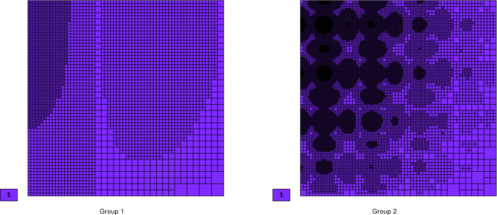
   
Final mesh (h-FEM, p=2): 27824 DOF, error = 3.46712%

.. image:: img/benchmark-neutronics-2-group-adapt/mesh_h2_2_iso_multi.png
   :align: center
   :height: 400
   :alt: Final mesh.

Final mesh (hp-FEM): 1724 DOF, error = 3.46713%

.. image:: img/benchmark-neutronics-2-group-adapt/mesh_hp_iso_multi.png
   :align: center
   :height: 400
   :alt: Final mesh.

DOF convergence graphs:

.. image:: img/benchmark-neutronics-2-group-adapt/conv_dof_iso.png
   :align: center
   :width: 600
   :height: 400
   :alt: DOF convergence graph.

CPU convergence graphs:

.. image:: img/benchmark-neutronics-2-group-adapt/conv_cpu_iso.png
   :align: center
   :width: 600
   :height: 400
   :alt: CPU convergence graph.
    
Comparison of hp-FEM with iso, p-aniso, h-aniso and hp-aniso refinements
~~~~~~~~~~~~~~~~~~~~~~~~~~~~~~~~~~~~~~~~~~~~~~~~~~~~~~~~~~~~~~~~~~~~~~~~

The solution is almost isotropic in this case and using the generally more expensive anisotropic refinements may not neccessarily result in better meshes (and errors). The possible strategies for capturing anisotropy are compared below. Note that only the p-anisotropic refinements produced better mesh (with a lower number of DOF) than the simple isotropic refinements, but took more time than would be justified for the increase in accuracy. 

Final mesh (hp-FEM, isotropic refinements): 1724 DOF, error = 3.46713%

.. image:: img/benchmark-neutronics-2-group-adapt/mesh_hp_iso_multi.png
   :align: center
   :height: 400
   :alt: Final mesh.

Final mesh (hp-FEM, h-anisotropic refinements): 1768 DOF, error = 3.46731%

.. image:: img/benchmark-neutronics-2-group-adapt/mesh_hp_anisoh_multi.png
   :align: center
   :height: 400
   :alt: Final mesh
   
Final mesh (hp-FEM, p-anisotropic refinements): 1584 DOF, error = 3.46668%

.. image:: img/benchmark-neutronics-2-group-adapt/mesh_hp_anisop_multi.png
   :align: center
   :height: 400
   :alt: Final mesh.

Final mesh (hp-FEM, hp-anisotropic refinements): 1926 DOF, error = 3.46626%

.. image:: img/benchmark-neutronics-2-group-adapt/mesh_hp_aniso_multi.png
   :align: center
   :height: 400
   :alt: Final mesh.

DOF convergence graphs:

.. image:: img/benchmark-neutronics-2-group-adapt/conv_dof_hp.png
   :align: center
   :width: 600
   :height: 400
   :alt: DOF convergence graph.

CPU convergence graphs:

.. image:: img/benchmark-neutronics-2-group-adapt/conv_cpu_hp.png
   :align: center
   :width: 600
   :height: 400
   :alt: CPU convergence graph.

Screen (Maxwell's Equations)
----------------------------

**Git reference:** Benchmark `screen <http://git.hpfem.org/hermes2d.git/tree/HEAD:/benchmarks/screen>`_.

This example solves time-harmonic Maxwell's equations. It describes an electromagnetic wave that 
hits a thin screen under the angle of 45 degrees, causing a singularity at the tip of the screen.
The strength of the singularity makes this example rather difficult. 

Equation solved: Time-harmonic Maxwell's equations

.. math::
    :label: screen

    \frac{1}{\mu_r} \nabla \times \nabla \times E - \kappa^2 \epsilon_r E = \Phi.

Domain of interest is the square $(-1,1)^2$ missing the edge that connects the center with 
the midpoint of the left side. It is filled with air:

.. image:: img/benchmark-screen/domain.png
   :align: center
   :width: 490
   :height: 490
   :alt: Computational domain.

Boundary conditions: Tangential component of solution taken from known exact solution 
(essential BC). See the 
`main.cpp <http://git.hpfem.org/hermes2d.git/blob/HEAD:/benchmarks/screen/main.cpp>`_ file.

Exact solution: This is rather complicated in this case - please look into the 
corresponding file 
`exact_sol.cpp <http://git.hpfem.org/hermes2d.git/blob/HEAD:/benchmarks/screen/exact_sol.cpp>`_.

Code for the weak forms:

::

    template<typename Real, typename Scalar>
    Scalar bilinear_form(int n, double *wt, Func<Scalar> *u_ext[], Func<Real> *u, Func<Real> *v, Geom<Real> *e, ExtData<Scalar> *ext)
    {
      return int_curl_e_curl_f<Real, Scalar>(n, wt, u, v) - int_e_f<Real, Scalar>(n, wt, u, v);
    }

Solution (real part of $E_1$):

.. image:: img/benchmark-screen/sol1.png
   :align: center
   :width: 510
   :height: 470
   :alt: Solution.

Solution (real part of $E_2$):

.. image:: img/benchmark-screen/sol2.png
   :align: center
   :width: 510
   :height: 470
   :alt: Solution.

Solution (imaginary part of $E_1$):

.. image:: img/benchmark-screen/sol3.png
   :align: center
   :width: 510
   :height: 470
   :alt: Solution.

Solution (imaginary part of $E_2$):

.. image:: img/benchmark-screen/sol4.png
   :align: center
   :width: 510
   :height: 470
   :alt: Solution.

Final mesh (h-FEM with linear elements):

.. image:: img/benchmark-screen/mesh-h1.png
   :align: center
   :width: 460
   :height: 410
   :alt: Final mesh (h-FEM with linear elements).

Note that the polynomial order indicated corresponds to the tangential components 
of approximation on element interfaces, not to polynomial degrees inside the elements
(those are one higher).

Final mesh (h-FEM with quadratic elements):

.. image:: img/benchmark-screen/mesh-h2.png
   :align: center
   :width: 460
   :height: 410
   :alt: Final mesh (h-FEM with quadratic elements).

Final mesh (hp-FEM):

.. image:: img/benchmark-screen/mesh-hp.png
   :align: center
   :width: 460
   :height: 410
   :alt: Final mesh (hp-FEM).

DOF convergence graphs:

.. image:: img/benchmark-screen/conv_dof.png
   :align: center
   :width: 600
   :height: 400
   :alt: DOF convergence graph.

CPU time convergence graphs:

.. image:: img/benchmark-screen/conv_cpu.png
   :align: center
   :width: 600
   :height: 400
   :alt: CPU convergence graph.
   
   
