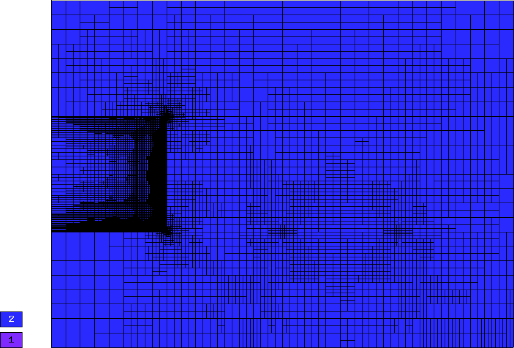

=======================================
Tutorial Part II (Automatic Adaptivity)
=======================================

So far we have not paid any attention to the accuracy of the results. In general, 
a computation on a fixed mesh is not likely to be very accurate. There is a need 
for *adaptive mesh refinement (AMR)* that improves the quality of the approximation 
by refining mesh elements or increases the polynomial degree of approximation 
where the approximation is bad. 

Adaptive h-FEM and hp-FEM
-------------------------

In traditional low-order FEM, refining an element is not algorithmically complicated,
and so the most difficult part is to find out what elements should be
refined. To do this, people employ various techniques ranging from rigorous
guaranteed a-posteriori error estimates to heuristic criteria such as residual
error indicators, error indicators based on steep gradients, etc. Unfortunately,
none of these approaches is suitable for real-life multiphysics coupled problems 
or higher-order finite element methods: Rigorous guaranteed error
estimates only exist for very simple problems (such as linear elliptic PDE),
and moreover only for low-order finite elements (such as piecewise linear 
approximations). Note that virtually no a-posteriori error estimates capable of 
guiding automatic hp-adaptivity are available even for simplest elliptic problems,
this will be discussed in a moment. 
The heuristic techniques listed above are not employed in Hermes since they may fail 
in non-standard situations, and because they lack a transparent relation to the 
true approximation error.

Adaptive low-order FEM is known to be notoriously inefficient, and practitioners
are rightfully skeptical of it. The reason is its extremely slow convergence 
that makes large computations virtually freeze without getting anywhere. 
This is illustrated in the following graph that compares a typical convergence of 
adaptive FEM with linear elements, adaptive FEM with quadratic elements, and 
adaptive hp-FEM:

.. image:: img/benchmark-lshape/conv_dof.png
   :align: center
   :width: 600
   :height: 400
   :alt: Typical convergence curves for adaptive linear FEM, quadratic FEM, and *hp*-FEM.

Note that the linear FEM would need in the order of 1,000,000,000,000,000,000 degrees of freedom 
(DOF) to reach a level of accuracy where the hp-FEM is with less than 10,000 DOF. 
These convergence curves are typical representative examples, confirmed with
many numerical experiments of independent researchers, and supported with
theory. The horizontal axis shows (in linear scale) the number of degrees of freedom
(= size of the stiffness matrix) that increases during automatic adaptivity. The
vertical one shows the approximation error (in logarithmic scale). Note that in all
three cases, the convergence is similar during a short initial phase. However, with 
the hp-FEM the convergence becomes faster and faster as the adaptivity progresses. Note that 
low-order FEM is doomed to such slow convergence by its poor approximation properties -
this cannot be fixed no matter how smart the adaptivity algorithm might be. 

In order to obtain fast, usable adaptivity (the red curve), one
has to resort to adaptive *hp*-FEM. The *hp*-FEM takes advantage of 
the following facts:

* Large high-degree elements approximate smooth parts of solution *much* better than small linear ones. 
  The benchmark `smooth-iso <http://hpfem.org/hermes2d/doc/src/benchmarks.html#smooth-iso-elliptic>`_ 
  illustrates this - spend a few minutes to check it out, the results are truly impressive. In the 
  Hermes2D repository, it can be found in the directory 
  `benchmarks/ <http://git.hpfem.org/hermes2d.git/tree/HEAD:/benchmarks>`_.
* This holds the other way where the solution is not smooth, i.e., singularities,
  steep gradients, oscillations and such are approximated best using locally small 
  low-order elements.
* In order to capture efficiently anisotropic solution behavior, one needs adaptivity algorithms 
  that can refine meshes anisotropically both in $h$ and $p$. Often this is the case with 
  boundary layers (viscous flows, singularly perturbed problems, etc.). This is illustrated 
  in  benchmarks 
  `smooth-aniso-x <http://hpfem.org/hermes2d/doc/src/benchmarks.html#smooth-aniso-x-elliptic>`_ and
  `boundary layer <http://hpfem.org/hermes2d/doc/src/benchmarks.html#boundary-layer-elliptic>`_. However, 
  solutions without boundary layers can have significant anisotropic behavior too, as illustrated
  in benchmark  `line singularity <http://hpfem.org/hermes2d/doc/src/benchmarks.html#line-singularity-elliptic>`_.

Large number of possible element refinements in hp-FEM
~~~~~~~~~~~~~~~~~~~~~~~~~~~~~~~~~~~~~~~~~~~~~~~~~~~~~~

Automatic adaptivity in the *hp*-FEM is substantially different from adaptivity
in low-order FEM, since every element can be refined in many different ways.
The following figure shows several illustrative refinement candidates for a fourth-order element.

.. image:: img/conv-intro/refinements.png
   :align: center
   :width: 650
   :height: 300
   :alt: Examples of *hp*-refinements.

Of course, the number of possible element refinements is implementation-dependent.
In general it is very low in $h$ or $p$ adaptivity, much higher in $hp$ adaptivity, 
and it rises even more when anisotropic refinements are enabled. This is why Hermes 
has eight different adaptivity options P_ISO, P_ANISO, H_ISO, H_ANISO,
HP_ISO, HP_ANISO_P, HP_ANISO_H, HP_ANISO. In this ordering, usually P_ISO yields the 
worst results and HP_ANISO the best. In the most general HP_ANISO 
option, around 100 refinement candidates for each element are considered. 
Naturally, the adaptivity algorithm takes progressively more time as more 
refinement candidates are considered. The difference between the HP_ANISO_H
option (next best to HP_ANISO) and HP_ANISO is quite significant. So, this is 
where the user has to make a choice based on his a-priori knowledge of the 
solution behavior. 

Due to the large number of refinement options, classical error estimators (that
provide a constant error estimate per element) cannot be used to guide automatic 
*hp*-adaptivity. For this, one needs to know the *shape* of the
approximation error.

In analogy to the most successful adaptive ODE solvers,
Hermes uses a pair of approximations with different orders of accuracy to obtain
this information: *coarse mesh solution* and 
*fine mesh solution*. The initial coarse mesh is read from the mesh file,
and the initial fine mesh is created through its global refinement both in
$h$ and $p$.
The fine mesh solution is the approximation of interest both during the adaptive
process and at the end of computation. The coarse mesh solution represents its 
low-order part. In all adaptivity examples in Hermes, the coarse mesh solution
can be turned off and a global orthogonal projection of the fine mesh solution 
on the coarse mesh can be used instead. In most cases, this yields a better 
convergence behavior than using the coarse mesh solve (and the projection 
problem is always linear and better conditioned than solving on the coarse mesh). 

Note that this approach is PDE independent, which is truly great for multiphysics
coupled problems. Currently, Hermes does not use a single analytical error estimate 
or any other technique that would narrow down its applicability to just some 
equations or just low-order FEM. 

The obvious disadvantage of the Hermes approach to automatic adaptivity is its higher 
computational cost, especially in 3D. We are aware of this fact and would not mind 
at all replacing it with some cheaper technique (as long as it also is PDE-independent, 
works for elements of high orders, and can be successfully used to guide *hp*-adaptivity).
So far, however, no alternatives meeting these criteria exist yet to our best knowledge.

Understanding Convergence Rates
-------------------------------

Hermes provides convergence graphs for every adaptive computation. Therefore,
let us spend a short moment explaining their meaning.
The classical notion of $O(h^p)$ convergence rate is related to sequences of 
uniform meshes with a gradually decreasing diameter $h$. In $d$ spatial dimensions, 
the diameter $h$ of a uniform mesh is related to the number of degrees of freedom $N$
through the relation 

.. math::

    h = O(N^{-p/d}).

Therefore a slope of $-p/d$ on the log-log scale means that $err \approx O(N^{-p/d})$
or $err \approx O(h^p)$. When local refinements are enabled, the meaning of $O(h^p)$
convergence rate loses its meaning, and one should switch to convergence in terms of 
the number of degrees of freedom (DOF) or CPU time - Hermes provides both. 

Algebraic convergence of adaptive :math:`h`-FEM
~~~~~~~~~~~~~~~~~~~~~~~~~~~~~~~~~~~~~~~~~~~~~~~

When using elements of degree $p$, the convergence rate of adaptive $h$-FEM will not exceed the 
one predicted for uniformly refined meshes (this can be explained using 
mathematical analysis). Nevertheless, the convergence may be faster due to a different 
constant in front of the $h^p$ term. This is illustrated in the following two figures,
both of which are related to a 2D problem with known exact solution. The first pair of 
graphs corresponds to adaptive $h$-FEM with linear elements. The slope on the log-log
graph is -1/2 which means first-order convergence, as predicted by theory. 

.. image:: img/conv-intro/layer_h1.png
   :align: center
   :width: 600
   :height: 450
   :alt: Convergence graph.

The next pair of convergence graphs corresponds to adaptive $h$-FEM with quadratic elements. 
The slope on the log-log graph is -1, which means that the convergence is quadratic as 
predicted by theory.

.. image:: img/conv-intro/layer_h2.png
   :align: center
   :width: 600
   :height: 450
   :alt: Convergence graph.

Note that one always should look at the end of the convergence curve, not at the 
beginning. The automatic adaptivity in Hermes is guided with the so-called 
*reference solution*, which is an approximation on a globally-refined mesh.
In early stages of adaptivity, the reference solution and in turn also the error 
estimate usually are not sufficiently accurate to deliver the expected convergence 
rates. 

Exponential convergence of adaptive $hp$-FEM
~~~~~~~~~~~~~~~~~~~~~~~~~~~~~~~~~~~~~~~~~~~~~~~~~~

It is predicted by theory that adaptive $hp$-FEM should attain 
exponential convergence rate. This means that the slope of the
convergence graph is steadily increasing, as shown in the 
following figure.

.. image:: img/conv-intro/aniso-hp.png
   :align: center
   :width: 600
   :height: 450
   :alt: Convergence graph.

While this often is the case with adaptive $hp$-FEM, there are 
problems whose difficulty is such that the convergence is not 
exponential. Or at least not during a long pre-asymptotic 
stage of adaptivity. This may happen, for example, when the solution 
contains an extremely strong singularity. Then basically all error 
is concentrated there, and all adaptive methods will do the same, 
which is to throw into the singularity as many small low-order 
elements as possible. Then the convergence of adaptive $h$-FEM 
and $hp$-FEM may be very similar (usually quite poor).


Estimated vs. exact convergence rates
~~~~~~~~~~~~~~~~~~~~~~~~~~~~~~~~~~~~~

Whenever exact solution is available, Hermes provides both 
estimated error (via the reference solution) as well as the 
exact error. Thus the user can see the quality of the 
error estimate. Note that the estimated error usually is 
slightly less than the exact one, but during adaptivity 
they quickly converge together and become virtually identical. 
This is shown in the figure below.

.. image:: img/conv-intro/layer-hp.png
   :align: center
   :width: 600
   :height: 450
   :alt: Convergence graph to the Layer benchmark.

In problems with extremely strong singularities the difference between the 
exact and estimated error can be significant. This is illustrated in the 
following graph that belongs to the benchmark 
`kellogg <http://hpfem.org/hermes2d/doc/src/benchmarks.html#kellogg-elliptic>`_.

 .. image:: img/benchmark-kellogg/kellogg.png
   :align: center
   :width: 600
   :height: 450
   :alt: Convergence graph to the Kellogg benchmark.

Electrostatic Micromotor Problem (10)
-------------------------------------

**Git reference:** Tutorial example `10-adapt <http://git.hpfem.org/hermes2d.git/tree/HEAD:/tutorial/10-adapt>`_. 

Let us demonstrate the use of adaptive h-FEM and hp-FEM on a linear elliptic problem
concerned with the calculation of
the electrostatic potential in the vicinity of the electrodes of an electrostatic
micromotor. This is a MEMS device free of any coils, and thus resistive to
strong electromagnetic waves (as opposed to classical electromotors).
The following figure shows one half of the domain $\Omega$
(dimensions need to be scaled with $10^{-5}$ and are in meters):

.. image:: img/tutorial-10/micromotor.png
   :align: center
   :width: 550
   :height: 400
   :alt: Computational domain for the micromotor problem.

The subdomain $\Omega_2$ represents the moving part of the domain and the area bounded by $\Gamma_2$
represents the electrodes that are fixed. The distribution of the electrostatic potential $\varphi$ is governed by the equation

.. math::

    -\nabla\cdot\left(\epsilon_r\nabla\varphi\right) = 0,

equipped with the Dirichlet boundary conditions

.. math::

    \varphi = 0 V \ \ \ \ \ \mbox{on}\ \Gamma_1,


.. math::

    \varphi = 50 V \ \ \ \ \mbox{on}\ \Gamma_2.

The relative permittivity $\epsilon_r$ is piecewise-constant, $\epsilon_r = 1$ in $\Omega_1$ and
$\epsilon_r = 10$ in $\Omega_2$. The weak formulation reads

.. math::

    \int_\Omega \epsilon_r \nabla u \cdot \nabla v \dx = 0.

The piecewise constant parameter $\epsilon_r$ is handled by defining two bilinear forms in the code, one for
$\Omega_1$ and the other for $\Omega_2$. The two different materials are distinguished by different 
element markers OMEGA_1 = 1 and OMEGA_2 = 2 in the mesh file, and two different weak forms are assigned 
to the corresponding markers during the registration of the forms::

    // Initialize the weak formulation.
    WeakForm wf;
    wf.add_matrix_form(callback(biform1), H2D_SYM, OMEGA_1);
    wf.add_matrix_form(callback(biform2), H2D_SYM, OMEGA_2);

Refinement selector
~~~~~~~~~~~~~~~~~~~

The principal part of the example is the main adaptivity loop. However, before the loop is entered, 
a refinement selector should be initialized::

    H1ProjBasedSelector selector(CAND_LIST, CONV_EXP, H2DRS_DEFAULT_ORDER);

The selector is used by the class H1Adapt to determine how an element should be refined. For that purpose, the selector does following steps:

#. It generates candidates (proposed refinements).
#. It estimates their local errors by projecting the reference solution onto their FE spaces.
#. It calculates the number of degree of freedom (DOF) contributed by each candidate.
#. It calculates a score for each candidate, and sorts them according to their scores.
#. It selects a candidate with the highest score. If the next candidate has almost the same score and symmetric mesh is 
   preferred, it skips both of them. More detailed explanation of this will follow.

By default, the score is

.. math::

    s = \frac{\log_{10} e_0 - \log_{10} e}{(d_0 - d)^\xi},

where $e$ and $d$ are an estimated error and an estimated number of DOF of a candidate respectively, $e_0$ and $d_0$ are an estimated error and an estimated number of DOF of the examined element respectively, and $\xi$ is a convergence exponent.

The first parameter ``CAND_LIST`` specifies which candidates are generated. In a case of quadrilaterals, all possible values and considered candidates are summarized in the following table:

.. image:: img/tutorial-10/cand_list.quads.*
   :align: center
   :alt: Candidates generated for a given candidate list.

The second parameter ``CONV_EXP`` is a convergence exponent used to calculate the score.

The third parameter specifies the the maximum considered order used in the resulting refinement. In this case, a constant ``H2DRS_DEFAULT_ORDER`` is used. The constant is defined by Hermes2D library and it corresponds to the maximum order supported by the selector. In this case, this is 9.

Furthermore, the selector allows you to weight errors though a method set_error_weights(). Error weights are applied before the error of a candidate is passed to the calculation of the score. Through this method it is possible to set a preference for a given type of a candidate, i.e., H-candidate, P-candidate, and ANISO-candidate. The error weights can be set anytime and setting error weights to appropriate values can lead to a lower number of DOF. However, the best values of weights depend on a solved problem.

In this particular case, a default error weights are used. The default weights prefer the P-candidate and they are defined as:

- H-candidate weight: $2.0$ (see a constant ``H2DRS_DEFAULT_ERR_WEIGHT_H``)
- P-candidate weight: $1.0$ (see a constant ``H2DRS_DEFAULT_ERR_WEIGHT_P``)
- ANISO-candidate weight: $\sqrt{2.0}$ (see a constant ``H2DRS_DEFAULT_ERR_WEIGHT_ANISO``)

Since these weights are default, it is not necessary to express them explicitly. Nevertheless, if expressed, a particular line of the code would be:
::

    selector.set_error_weights(2.0, 1.0, sqrt(2.0));

Besides the error weights, the selector allows you to modify a default behaviour through the method set_option(). The behavior can be modified anytime. Currently, the method accepts following options:

- ``H2D_PREFER_SYMMETRIC_MESH``: Prefer symmetric mesh when selection of the best candidate is done. If set and if two or more candidates has the same score, they are skipped. This option is set by default.
- ``H2D_APPLY_CONV_EXP_DOF``: Use $d^c - d_0^c$, where $c$ is the convergence exponent, instead of $(d - d_0)^c$ to evaluate the score. This options is *not* set by default.

In this case, default settings are used. If expressed explicitly, the code would be:
::

    selector.set_option(H2D_PREFER_SYMMETRIC_MESH, true);
    selector.set_option(H2D_APPLY_CONV_EXP_DOF, false);

Computing the coarse and fine mesh approximations
~~~~~~~~~~~~~~~~~~~~~~~~~~~~~~~~~~~~~~~~~~~~~~~~~

After the selector has been created, the adaptivity can begin. The adaptivity loop is an ordinary while-loop 
or a for-loop that (for linear problems) usually starts like this::

    // Adaptivity loop:
    Solution sln_coarse, sln_fine;
    int as = 1; bool done = false;
    do
    {
      info("---- Adaptivity step %d:", as);

      // Assemble and solve the fine mesh problem.
      info("Solving on fine mesh.");
      RefSystem rs(&ls);
      rs.assemble();
      rs.solve(&sln_fine);    

      // Either solve on coarse mesh or project the fine mesh solution 
      // on the coarse mesh.
      if (SOLVE_ON_COARSE_MESH) {
        info("Solving on coarse mesh.");
        ls.assemble();
        ls.solve(&sln_coarse);
      }
      else {
        info("Projecting fine mesh solution on coarse mesh.");
        ls.project_global(&sln_fine, &sln_coarse);
      }

The code above creates the pair of coarse and fine mesh approximations, 
either by solving on both meshes or by just solving on the fine mesh and projecting 
the fine mesh solution on the coarse mesh. We prefer the latter approach as for us it has 
worked better in many situations.

The reference (fine mesh) solution is computed on a globally refined copy of the mesh
using the class RefSystem. The constructor of the class RefSystem allows the  user
to choose a different polynomial degree increment (default value 1)
and another element refinement (default value 1) - see the file 
`src/refsystem.h <http://git.hpfem.org/hermes2d.git/blob/HEAD:/src/refsystem.h>`_::

    RefSystem(LinSystem* base, int order_increase = 1, int refinement = 1);

In particular, sometimes one may want to use order_increase = 2 or 3 at the very beginning 
of computation when the reference mesh is still very coarse and thus the reference solution 
with order_increase = 1 does not give a meaningful error estimate. 
 
Adapting the mesh
~~~~~~~~~~~~~~~~~

In the third and last step of each iteration, we use the class H1Dadpt to adjust the coarse mesh and polynomial degrees 
of finite elements stored in the corresponding Space. (Classes HcurlAdapt, HdivAdapt and L2Adapt will be discussed later.)
The H1Adapt class has two main functionalities:

* It estimates the overall error of the coarse solution in the $H^1$ norm (user-defined norms for 
  error calculation will be discussed later),
* It selects elements with the highest error and uses the user-supplied refinement selector to find a refinement for each of them.

The class H1Adapt is initialized with a pointer to the underlying LinSystem (or NonlinSystem - this will be discussed
later). Then the user sets the coarse solution and the fine solution and evaluates the error. By default, the error is calculated as

.. math::

    e = \frac{|| u - u_{ref} ||_{H^1}}{|| u_{ref} ||_{H^1}}.

In the code this looks as follows::

    // Calculate element errors and total error estimate.
    info("Calculating error.");
    H1Adapt hp(&ls);
    hp.set_solutions(&sln_coarse, &sln_fine);
    double err_est = hp.calc_error() * 100;

Finally, if ``err_est`` is still above the threshold ``ERR_STOP``, we perform one
adaptivity step:

::

    // If err_est too large, adapt the mesh.
    if (err_est < ERR_STOP) done = true;
    else {
      info("Adapting coarse mesh.");
      done = hp.adapt(&selector, THRESHOLD, STRATEGY, MESH_REGULARITY);

      if (ls.get_num_dofs() >= NDOF_STOP) done = true;
    }

The constants ``THRESHOLD``, ``STRATEGY`` and ``MESH_REGULARITY`` have the following meaning:

The constant ``STRATEGY`` indicates which adaptive strategy is used. In all cases, the strategy is applied to elements in an order defined through the error. If the user request to process an element outside this order, the element is processed regardless the strategy. Currently, Hermes2D supportes following strategies:

* ``STRATEGY == 0``: Refine elements until sqrt(``THRESHOLD``) times total error is processed. If more elements have similar error refine all to keep the mesh symmetric.
* ``STRATEGY == 1``: Refine all elements whose error is bigger than ``THRESHOLD`` times the error of the first processed element, i.e., the maximum error of an element.
* ``STRATEGY == 2``: Refine all elements whose error is bigger than ``THRESHOLD``.

The constant ``MESH_REGULARITY``
specifies maximum allowed level of hanging nodes: -1 means arbitrary-level
hanging nodes (default), and 1, 2, 3, ... means 1-irregular mesh,
2-irregular mesh, etc. Hermes does not support adaptivity on regular meshes
because of its extremely poor performance.

It is a good idea to spend some time playing with these parameters to
get a feeling for adaptive *hp*-FEM. Also look at other adaptivity examples in
the examples/ directory: layer, lshape deal with elliptic problems and have
known exact solutions. So do examples screen, bessel for time-harmonic
Maxwell's equations. These examples allow you to compare the error estimates
computed by Hermes with the true error. Examples crack, singpert show
how to handle cracks and singularly perturbed problems, respectively. There
are also more advanced examples illustrating automatic adaptivity for nonlinear
problems solved via the Newton's method, adaptive multimesh *hp*-FEM,
adaptivity for time-dependent problems on dynamical meshes, etc.

But let's return to the micromotor example for a moment again: The computation
starts with a very coarse mesh consisting of a few quadrilaterals, some
of which are moreover very ill-shaped. Thanks to the anisotropic refinement
capabilities of the selector, the mesh quickly adapts to the solution
and elements of reasonable shape are created near singularities, which occur
at the corners of the electrode. Initially, all elements of the mesh
are of a low degree, but as the *hp*-adaptive process progresses, the elements
receive different polynomial degrees, depending on the local smoothness of the
solution.

The gradient was visualized using the class VectorView. We have
seen this in the previous section. We plug in the same solution for both vector
components, but specify that its derivatives should be used:

::

    gview.show(&sln, &sln, H2D_EPS_NORMAL, H2D_FN_DX_0, H2D_FN_DY_0);

.. image:: img/tutorial-10/motor-sln.png
   :align: left
   :width: 300
   :height: 300
   :alt: Solution - electrostatic potential $\varphi$ (zoomed).

.. image:: img/tutorial-10/motor-grad.png
   :align: right
   :width: 300
   :height: 300
   :alt: Gradient of the solution $E = -\nabla\varphi$ and its magnitude (zoomed).

.. raw:: html

   <hr style="clear: both; visibility: hidden;">

.. image:: img/tutorial-10/motor-orders.png
   :align: center
   :width: 300
   :height: 300
   :alt: Polynomial orders of elements near singularities (zoomed).

Convergence graphs of adaptive h-FEM with linear elements, h-FEM with quadratic elements
and hp-FEM are shown below.

.. image:: img/tutorial-10/conv_dof.png
   :align: center
   :width: 600
   :height: 400
   :alt: DOF convergence graph for tutorial example 10-adapt.

The following graph shows convergence in terms of CPU time. 

.. image:: img/tutorial-10/conv_cpu.png
   :align: center
   :width: 600
   :height: 400
   :alt: CPU convergence graph for tutorial example 10-adapt.

Multimesh hp-FEM
----------------

In multiphysics PDE systems (or just PDE systems) it can happen that one
physical field (solution component) has a singularity or a boundary layer 
where other fields are smooth. If one approximates all fields on the 
same mesh, then the necessity to refine the mesh at the singularity
or boundary layer implies new degrees of freedom for the smooth fields 
as well. This can be very wasteful indeed, as we will see in the next
example that deals with a simplified Fitzhugh-Nagumo system. But let us 
first explain briefly the main idea of the multimesh discretization 
method that we developed to circumvent this problem.

Hermes makes it possible to approximate them 
on individual meshes. These meshes are not completely independent
of each other -- they have a common coarse mesh that we call *master mesh*.
The master mesh is there for algorithmic purposes only, it may not 
even be used for discretization purposes: Every mesh in the system 
is obtained from it via an arbitrary sequence of elementary refinements.
This is illustrated in the following figure, where (A) is the master mesh,
(B) - (D) three different meshes (say, for a coupled problem with three
equations), and (E) is the virtual *union mesh* that is used for assembling.

.. image:: img/tutorial-11/multimesh.png
   :align: center
   :width: 750
   :alt: Multimesh

The union mesh is not constructed physically in the computer memory -- 
merely it serves as a hint to correctly transform integration points
while integrating over sub-elements of the elements of the existing meshes. 
The following figure shows the integration over an element $Q_k$ of the 
virtual union mesh, and what are the appropriate subelements of the 
existing elements where this integration is performed:

.. image:: img/tutorial-11/multimesh2.png
   :align: center
   :width: 600
   :alt: Multimesh

As a result, the multimesh discretization of the PDE system is *monolithic*
in the sense that *no physics is lost* -- all integrals in the 
discrete weak formulations are evaluated exactly up to the error in the 
numerical quadrature. In particular, we do not perform operator splitting 
or commit errors while transferring solution data between different meshes.
The multimesh assembling in Hermes works with all meshes at the same time, 
there is no such thing as interpolating or projecting functions between 
different meshes. More details about this method can be found in the 
corresponding `research article <http://science.atmoshome.net/science?_ob=MImg&_imagekey=B6TYH-4X1J73B-V-8Y&_cdi=5619&_user=10&_pii=S0377042709005731&_orig=browse&_coverDate=08%2F18%2F2009&_sk=999999999&view=c&wchp=dGLbVzz-zSkWz&md5=6552d3390232dcffc9ca97e9bb626fb0&ie=/sdarticle.pdf>`_. 

Adaptivity in the Multimesh hp-FEM
~~~~~~~~~~~~~~~~~~~~~~~~~~~~~~~~~~

In principle, the adaptivity procedure for single PDE could be extended 
directly to systems of PDEs. In other words, two spaces can be passed into a constructor of the class H1Adapt,
two coarse and two fine solutions can be passed into set_solutions(),
and finally, calc_error() and adapt() can be called as before. In this way, error estimates in
$H^1$ norm are calculated for elements in both spaces independently and the
worst ones are refined. However, this approach is not optimal if the PDEs are
coupled, since an error caused in one solution component influences the errors
in other components and vice versa.

Recall that in elliptic problems the bilinear form $a(u,v)$ defines the energetic inner product,

.. math::

    (u,v)_e = a(u,v).

The norm induced by this product,

.. math::

    ||u||_e = \sqrt{(u,u)_e},

is called the *energy norm*. When measuring the error in the energy norm
of the entire system, one can reduce the above-mentioned difficulties dramatically.
When calculating the error on an element, the energy norm accounts
also for the error caused by other solution components. 

It is also worth mentioning that the adaptivity algorithm does not make distinctions 
between various meshes. The elements of *all meshes in the system* are put into one
single array, sorted according to their estimated errors, and then the ones with the 
largest error are refined. In other words, it may happen that all elements marked for refinement 
will belong just to one mesh.

If norms of components are substantially different, it is more beneficial to use a relative error of an element rather than an absolute error. The relative error of an element is an absolute error divided by a norm of a component. This behavior can be requested while calling the method calc_error()::

    hp.calc_error(H2D_TOTAL_ERROR_REL | H2D_ELEMENT_ERROR_REL)

The input parameter of the method calc_error() is a combination that is a pair: one member of the pair has to be a constant ```H2D_TOTAL_ERROR_*```, the other member has to be a constant ```H2D_ELEMENT_ERROR_*```. If not specified, the default pair is ```H2D_TOTAL_ERROR_REL | H2D_ELEMENT_ERROR_ABS```. Currently available contants are:

- ```H2D_TOTAL_ERROR_REL```: Returned total error will be the absolute error divided by the total norm.
- ```H2D_TOTAL_ERROR_ABS```: Returned total error will be the absolute error.
- ```H2D_TOTAL_ERROR_REL```: Element error which is used to select elements for refinement will be an absolute error divided by the norm of the corresponding solution component.
- ```H2D_TOTAL_ERROR_ABS```: Element error which is used to select elements for refinement will be the absolute error.


Simplified Fitzhugh-Nagumo System (11)
--------------------------------------

**Git reference:** Tutorial example `11-system-adapt <http://git.hpfem.org/hermes2d.git/tree/HEAD:/tutorial/11-system-adapt>`_. 

We consider a simplified version of the Fitzhugh-Nagumo equation.
This equation is a~prominent example of activator-inhibitor systems in two-component reaction-diffusion 
equations, It describes a prototype of an excitable system (e.g., a neuron) and its stationary form 
is

.. math::

    -d^2_u \Delta u - f(u) + \sigma v = g_1,\\
    -d^2_v \Delta v - u + v = g_2.

Here the unknowns $u, v$ are the voltage and $v$-gate, respectively, 
The nonlinear function 

.. math::

    f(u) = \lambda u - u^3 - \kappa
 
describes how an action potential travels through a nerve. Obviously this system is nonlinear.
In order to make it simpler for this tutorial, we replace the function $f(u)$ with just $u$:

.. math::

    f(u) = u.

The original nonlinear version of this example is planned for inclusion in benchmarks. 

Our computational domain is the square $(-1,1)^2$ and we consider zero Dirichlet conditions 
for both $u$ and $v$. In order to enable fair convergence comparisons, we will use the following 
functions as the exact solution:

.. math::

    u(x,y) = \cos\left(\frac{\pi}{2}x\right) \cos\left(\frac{\pi}{2}y\right),\\
    v(x,y) = \hat u(x) \hat u(y)

where

.. math::

    \hat u(x) = 1 - \frac{e^{kx} + e^{-kx}}{e^k + e^{-k}}

is the exact solution of the one-dimensional singularly perturbed 
problem 

.. math::

    -u'' + k^2 u - k^2 = 0

in $(-1,1)$, equipped with zero Dirichlet boundary conditions. The functions $u$ 
and $v$ defined above evidently satisfy the given boundary conditions, and 
they also satisfy the equation, since we inserted them into the PDE system 
and calculated the source functions $g_1$ and $g_2$ from there. These functions 
are not extremely pretty, but they are not too bad either:

::

    // Functions g_1 and g_2.
    double g_1(double x, double y) 
    {
      return (-cos(M_PI*x/2.)*cos(M_PI*y/2.) + SIGMA*(1. - (exp(K*x) + exp(-K*x))/(exp(K) + exp(-K))) 
             * (1. - (exp(K*y) + exp(-K*y))/(exp(K) + exp(-K))) + pow(M_PI,2.)*pow(D_u,2.)*cos(M_PI*x/2.)
             *cos(M_PI*y/2.)/2.);
    }

    double g_2(double x, double y) 
    {
      return ((1. - (exp(K*x) + exp(-K*x))/(exp(K) + exp(-K)))*(1. - (exp(K*y) + exp(-K*y))/(exp(K) + exp(-K))) 
             - pow(D_v,2.)*(-(1 - (exp(K*x) + exp(-K*x))/(exp(K) + exp(-K)))*(pow(K,2.)*exp(K*y) + pow(K,2.)*exp(-K*y))/(exp(K) + exp(-K)) 
             - (1. - (exp(K*y) + exp(-K*y))/(exp(K) + exp(-K)))*(pow(K,2.)*exp(K*x) + pow(K,2.)*exp(-K*x))/(exp(K) + exp(-K))) - 
             cos(M_PI*x/2.)*cos(M_PI*y/2.));

    }

The weak forms can be found in the 
file `forms.cpp <http://git.hpfem.org/hermes2d.git/blob/HEAD:/tutorial/11-system-adapt/forms.cpp>`_ and 
they are registered as follows::

    // Initialize the weak formulation.
    WeakForm wf(2);
    wf.add_matrix_form(0, 0, callback(bilinear_form_0_0));
    wf.add_matrix_form(0, 1, callback(bilinear_form_0_1));
    wf.add_matrix_form(1, 0, callback(bilinear_form_1_0));
    wf.add_matrix_form(1, 1, callback(bilinear_form_1_1));
    wf.add_vector_form(0, linear_form_0, linear_form_0_ord);
    wf.add_vector_form(1, linear_form_1, linear_form_1_ord);

Beware that although each of the forms is actually symmetric, one cannot use the H2D_SYM flag as in the 
elasticity equations, since it has a slightly different 
meaning (see example `08-system <http://hpfem.org/hermes2d/doc/src/tutorial-1.html#systems-of-equations-08>`_).

At the beginning of the adaptivity loop, a coarse and fine mesh approximation on both 
meshes is obtained as follows::

    // Assemble and solve the fine mesh problem.
    info("Solving on fine meshes.");
    RefSystem rs(&ls);
    rs.assemble();
    rs.solve(Tuple<Solution*>(&u_sln_fine, &v_sln_fine));

    // Either solve on coarse mesh or project the fine mesh solution 
    // on the coarse mesh.
    if (SOLVE_ON_COARSE_MESH) {
      info("Solving on coarse meshes.");
      ls.assemble();
      ls.solve(Tuple<Solution*>(&u_sln_coarse, &v_sln_coarse));
    }
    else {
      info("Projecting fine mesh solutions on coarse meshes.");
      ls.project_global(Tuple<MeshFunction*>(&u_sln_fine, &v_sln_fine), 
                        Tuple<Solution*>(&u_sln_coarse, &v_sln_coarse));
    }

Error estimate for adaptivity is now calculated using an energetic norm
that employs the original weak forms of the problem::

    // Calculate element errors and total error estimate.
    info("Calculating error (est).");
    H1Adapt hp(&ls);
    hp.set_solutions(Tuple<Solution*>(&u_sln_coarse, &v_sln_coarse), 
                     Tuple<Solution*>(&u_sln_fine, &v_sln_fine));
    hp.set_error_form(0, 0, bilinear_form_0_0<scalar, scalar>, bilinear_form_0_0<Ord, Ord>);
    hp.set_error_form(0, 1, bilinear_form_0_1<scalar, scalar>, bilinear_form_0_1<Ord, Ord>);
    hp.set_error_form(1, 0, bilinear_form_1_0<scalar, scalar>, bilinear_form_1_0<Ord, Ord>);
    hp.set_error_form(1, 1, bilinear_form_1_1<scalar, scalar>, bilinear_form_1_1<Ord, Ord>);
    double err_est = hp.calc_error(H2D_TOTAL_ERROR_REL | H2D_ELEMENT_ERROR_ABS) * 100;

We also calculate error wrt. exact solution for comparison purposes::

    // Calculate error wrt. exact solution.
    info("Calculating error (exact).");
    ExactSolution uexact(&umesh, u_exact);
    ExactSolution vexact(&vmesh, v_exact);
    double u_error = h1_error(&u_sln_coarse, &uexact) * 100;
    double v_error = h1_error(&v_sln_coarse, &vexact) * 100;
    double error = std::max(u_error, v_error);

The following two figures show the solutions $u$ and $v$. Notice their 
large qualitative differences: While $u$ is smooth in the entire domain, 
$v$ has a thin boundary layer along the boundary:

.. image:: img/tutorial-11/solution_u.png
   :align: center
   :width: 465
   :height: 400
   :alt: Solution

.. image:: img/tutorial-11/solution_v.png
   :align: center
   :width: 465
   :height: 400
   :alt: Solution

Resulting mesh for $u$ and $v$ obtained using conventional (single-mesh) hp-FEM: 12026 DOF
(6013 for each solution). 

.. image:: img/tutorial-11/mesh_single.png
   :align: center
   :width: 465
   :height: 400
   :alt: Mesh

Resulting mesh for $u$ obtained using the multimesh hp-FEM: 169 DOF

.. image:: img/tutorial-11/mesh_multi_u.png
   :align: center
   :width: 465
   :height: 400
   :alt: Mesh

Resulting mesh for $v$ obtained using the multimesh hp-FEM: 3565 DOF

.. image:: img/tutorial-11/mesh_multi_v.png
   :align: center
   :width: 465
   :height: 400
   :alt: Mesh

DOF convergence graphs:

.. image:: img/tutorial-11/conv_dof.png
   :align: center
   :width: 600
   :height: 400
   :alt: DOF convergence graph.

CPU time convergence graphs:

.. image:: img/tutorial-11/conv_cpu.png
   :align: center
   :width: 600
   :height: 400
   :alt: CPU convergence graph.

Adaptivity for General 2nd-Order Linear Equation (12)
-----------------------------------------------------

**Git reference:** Tutorial example `12-general-adapt <http://git.hpfem.org/hermes2d.git/tree/HEAD:/tutorial/12-general-adapt>`_. 

This example does not bring anything substantially new and its purpose is solely to 
save you work adding adaptivity to the tutorial example 
`07-general <http://git.hpfem.org/hermes2d.git/tree/HEAD:/tutorial/07-general>`_. 
Feel free to adjust the 
`main.cpp <http://git.hpfem.org/hermes2d.git/blob/HEAD:/tutorial/12-general-adapt/main.cpp>`_ 
file for your own applications.

Solution:

.. image:: img/tutorial-12/12-solution.png
   :align: center
   :width: 465
   :height: 400
   :alt: Solution to the general 2nd-order linear equation example.

Final hp-mesh:

.. image:: img/tutorial-12/12-mesh.png
   :align: center
   :width: 450
   :height: 400
   :alt: Final finite element mesh for the general 2nd-order linear equation example.

Convergence graphs of adaptive h-FEM with linear elements, h-FEM with quadratic elements
and hp-FEM.

.. image:: img/tutorial-12/conv_dof.png
   :align: center
   :width: 600
   :height: 400
   :alt: DOF convergence graph for tutorial example 12-general-adapt.

Convergence comparison in terms of CPU time. 

.. image:: img/tutorial-12/conv_cpu.png
   :align: center
   :width: 600
   :height: 400
   :alt: CPU convergence graph for tutorial example 12-general-adapt.

Complex-Valued Problem (13)
---------------------------

**Git reference:** Tutorial example `13-complex-adapt <http://git.hpfem.org/hermes2d.git/tree/HEAD:/tutorial/13-complex-adapt>`_. 

This example solves a complex-valued vector potential problem

.. math::

    -\Delta A + j \omega \gamma \mu A = \mu J_{ext}

in a two-dimensional cross-section containing a conductor and an iron object as
shown in the following schematic picture:

.. image:: img/tutorial-13/domain.png
   :align: center
   :height: 500
   :alt: Domain.

The computational domain is a rectangle of height 0.003 and width 0.004. 
Different material markers are used for the wire, air, and iron 
(see mesh file `domain2.mesh <http://git.hpfem.org/hermes2d.git/blob/HEAD:/tutorial/13-complex-adapt/domain2.mesh>`_).

Boundary conditions are zero Dirichlet on the top and right edges, and zero Neumann
elsewhere.

Solution:

.. image:: img/tutorial-13/solution.png
   :align: center
   :height: 400
   :alt: Solution.

Complex-valued weak forms:

::

    template<typename Real, typename Scalar>
    Scalar bilinear_form_iron(int n, double *wt, Func<Scalar> *u_ext[], Func<Real> *u, Func<Real> *v, Geom<Real> *e, ExtData<Scalar> *ext)
    {
      scalar ii = cplx(0.0, 1.0);
      return 1./mu_iron * int_grad_u_grad_v<Real, Scalar>(n, wt, u, v) + ii*omega*gamma_iron*int_u_v<Real, Scalar>(n, wt, u, v);
    }

    template<typename Real, typename Scalar>
    Scalar bilinear_form_wire(int n, double *wt, Func<Scalar> *u_ext[], Func<Real> *u, Func<Real> *v, Geom<Real> *e, ExtData<Scalar> *ext)
    {
      return 1./mu_0 * int_grad_u_grad_v<Real, Scalar>(n, wt, u, v);
    }

    template<typename Real, typename Scalar>
    Scalar bilinear_form_air(int n, double *wt, Func<Scalar> *u_ext[], Func<Real> *u, Func<Real> *v, Geom<Real> *e, ExtData<Scalar> *ext)
    {
      return 1./mu_0 * int_grad_u_grad_v<Real, Scalar>(n, wt, u, v); // conductivity gamma is zero
    }

    template<typename Real, typename Scalar>
    Scalar linear_form_wire(int n, double *wt, Func<Scalar> *u_ext[], Func<Real> *v, Geom<Real> *e, ExtData<Scalar> *ext)
    {
      return J_wire * int_v<Real, Scalar>(n, wt, v);
    }

After loading the mesh and performing initial mesh refinements, we create an H1 space:

::

    // Create an H1 space with default shapeset.
    H1Space space(&mesh, bc_types, essential_bc_values, P_INIT);


The weak forms are registered as follows:

::

    // Initialize the weak formulation.
    WeakForm wf;
    wf.add_matrix_form(callback(bilinear_form_iron), H2D_SYM, 3);
    wf.add_matrix_form(callback(bilinear_form_wire), H2D_SYM, 2);
    wf.add_matrix_form(callback(bilinear_form_air), H2D_SYM, 1);
    wf.add_vector_form(callback(linear_form_wire), 2);

Let us compare adaptive $h$-FEM with linear and quadratic elements and the $hp$-FEM.

Final mesh for $h$-FEM with linear elements: 18694 DOF, error = 1.02 \%


.. image:: img/tutorial-13/mesh-h1.png
   :align: center
   :height: 400
   :alt: Mesh.

Final mesh for $h$-FEM with quadratic elements: 46038 DOF, error = 0.018 \%



Final mesh for $hp$-FEM: 4787 DOF, error = 0.00918 \%

.. image:: img/tutorial-13/mesh-hp.png
   :align: center
   :height: 400
   :alt: Mesh.

Convergence graphs of adaptive h-FEM with linear elements, h-FEM with quadratic elements
and hp-FEM are shown below.

.. image:: img/tutorial-13/conv_compar_dof.png
   :align: center
   :width: 600
   :height: 400
   :alt: DOF convergence graph.

Time-Harmonic Maxwell's Equations (14)
--------------------------------------

**Git reference:** Tutorial example `14-hcurl-adapt <http://git.hpfem.org/hermes2d.git/tree/HEAD:/tutorial/14-hcurl-adapt>`_. 

This example solves time-harmonic Maxwell's equations in an L-shaped domain and it 
describes the diffraction of an electromagnetic wave from a re-entrant corner. It comes with an 
exact solution that contains singularity.

Equation solved: Time-harmonic Maxwell's equations

.. math::
    :label: example-14

    \frac{1}{\mu_r} \nabla \times \nabla \times E - \kappa^2 \epsilon_r E = \Phi.

Domain of interest is the square $(-10, 10)^2$ missing the quarter lying in the 
fourth quadrant. It is filled with air:

.. image:: img/tutorial-14/domain.png
   :align: center
   :width: 490
   :height: 490
   :alt: Computational domain.

Boundary conditions: Combined essential and natural, see the 
`main.cpp <http://git.hpfem.org/hermes2d.git/blob/HEAD:/tutorial/14-hcurl-adapt/main.cpp>`_ file.

Exact solution:

.. math::
    :label: example-14-exact

    E(x, y) = \nabla \times J_{\alpha} (r) \cos(\alpha \theta)

where $J_{\alpha}$ is the Bessel function of the first kind, 
$(r, \theta)$ the polar coordinates and $\alpha = 2/3$. In 
computer code, this reads:

::

    void exact_sol(double x, double y, scalar& e0, scalar& e1)
    {
      double t1 = x*x;
      double t2 = y*y;
      double t4 = sqrt(t1+t2);
      double t5 = jv(-1.0/3.0,t4);
      double t6 = 1/t4;
      double t7 = jv(2.0/3.0,t4);
      double t11 = (t5-2.0/3.0*t6*t7)*t6;
      double t12 = atan2(y,x);
      if (t12 < 0) t12 += 2.0*M_PI;
      double t13 = 2.0/3.0*t12;
      double t14 = cos(t13);
      double t17 = sin(t13);
      double t18 = t7*t17;
      double t20 = 1/t1;
      double t23 = 1/(1.0+t2*t20);
      e0 = t11*y*t14-2.0/3.0*t18/x*t23;
      e1 = -t11*x*t14-2.0/3.0*t18*y*t20*t23;
    }  

Here jv() is the Bessel function $\bfJ_{\alpha}$. For its source code see the 
`forms.cpp <http://git.hpfem.org/hermes2d.git/blob/HEAD:/tutorial/14-hcurl-adapt/forms.cpp>`_ file.

Code for the weak forms:

::

    template<typename Real, typename Scalar>
    Scalar bilinear_form(int n, double *wt, Func<Scalar> *u_ext[], Func<Real> *u, Func<Real> *v, Geom<Real> *e, ExtData<Scalar> *ext)
    {
    return 1.0/mu_r * int_curl_e_curl_f<Real, Scalar>(n, wt, u, v) -
           sqr(kappa) * int_e_f<Real, Scalar>(n, wt, u, v);
    }
   
    template<typename Real, typename Scalar>
    Scalar bilinear_form_surf(int n, double *wt, Func<Scalar> *u_ext[], Func<Real> *u, Func<Real> *v, Geom<Real> *e, ExtData<Scalar> *ext)
    {
      cplx ii = cplx(0.0, 1.0);
      return ii * (-kappa) * int_e_tau_f_tau<Real, Scalar>(n, wt, u, v, e);
    }
   
    scalar linear_form_surf(int n, double *wt, Func<scalar> *u_ext[], Func<double> *v, Geom<double> *e, ExtData<scalar> *ext)
    {
      scalar result = 0;
      for (int i = 0; i < n; i++)
      {
        double r = sqrt(e->x[i] * e->x[i] + e->y[i] * e->y[i]);
        double theta = atan2(e->y[i], e->x[i]);
        if (theta < 0) theta += 2.0*M_PI;
        double j13    = jv(-1.0/3.0, r),    j23    = jv(+2.0/3.0, r);
        double cost   = cos(theta),         sint   = sin(theta);
        double cos23t = cos(2.0/3.0*theta), sin23t = sin(2.0/3.0*theta);
   
        double Etau = e->tx[i] * (cos23t*sint*j13 - 2.0/(3.0*r)*j23*(cos23t*sint + sin23t*cost)) +
                      e->ty[i] * (-cos23t*cost*j13 + 2.0/(3.0*r)*j23*(cos23t*cost - sin23t*sint));
  
        result += wt[i] * cplx(cos23t*j23, -Etau) * ((v->val0[i] * e->tx[i] + v->val1[i] * e->ty[i]));
      }
      return result;
    }

    // Maximal polynomial order to integrate surface linear form.
    Ord linear_form_surf_ord(int n, double *wt, Func<Ord> *u_ext[], Func<Ord> *v, Geom<Ord> *e, ExtData<Ord> *ext)
    {  return Ord(v->val[0].get_max_order());  }

Solution:

.. image:: img/tutorial-14/solution.png
   :align: center
   :width: 500
   :height: 420
   :alt: Solution.

Final mesh (h-FEM with linear elements):

.. image:: img/tutorial-14/mesh-h1.png
   :align: center
   :width: 460
   :height: 390
   :alt: Final mesh (h-FEM with linear elements).

Note that the polynomial order indicated corresponds to the tangential components 
of approximation on element interfaces, not to polynomial degrees inside the elements
(those are one higher).

Final mesh (h-FEM with quadratic elements):

.. image:: img/tutorial-14/mesh-h2.png
   :align: center
   :width: 460
   :height: 390
   :alt: Final mesh (h-FEM with quadratic elements).

Final mesh (hp-FEM):

.. image:: img/tutorial-14/mesh-hp.png
   :align: center
   :width: 460
   :height: 390
   :alt: Final mesh (hp-FEM).

DOF convergence graphs:

.. image:: img/tutorial-14/conv_dof.png
   :align: center
   :width: 600
   :height: 400
   :alt: DOF convergence graph.

CPU time convergence graphs:

.. image:: img/tutorial-14/conv_cpu.png
   :align: center
   :width: 600
   :height: 400
   :alt: CPU convergence graph.
