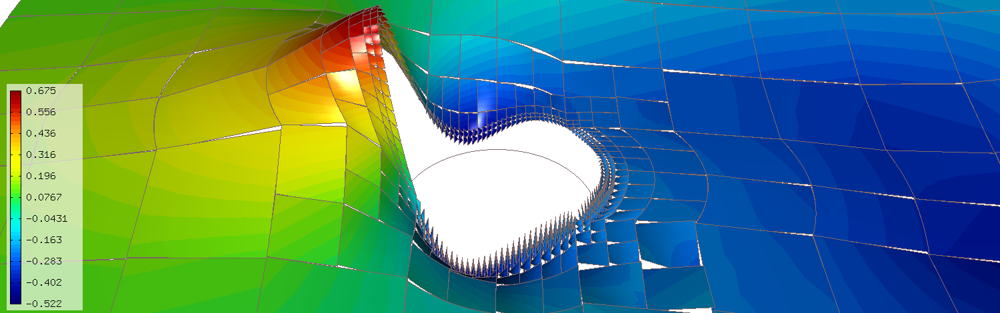

======================================
Tutorial Part III (Nonlinear Problems)
======================================

This part of the tutorial assumes that the reader is familiar with the solution of 
linear problems (Part I). We will begin with explaining the basics of the Newton's 
method for nonlinear PDE problems, and then illustrate it on examples with gradually 
increasing complexity. At the end of Part III the reader will be able to solve time-dependent 
nonlinear multiphysics PDE systems. 

The Newton's Method
-------------------

Consider a simple model problem of the form 

.. math::
    :label: newton0

    -\nabla \cdot (\lambda(u)\nabla u) - f(\bfx) = 0, \ \ \ u = 0 \ \mbox{on}\ \partial \Omega.

Note that when using the Newton's method, it is customary to have 
everything on the left-hand side. The corresponding discrete problem has the form 

.. math::

    \int_{\Omega} \lambda(u)\nabla u(\bfx) \cdot \nabla v_i(\bfx)\, \mbox{d}\bfx 
    - \int_{\Omega} f(\bfx)v_i(\bfx) \, \mbox{d}\bfx\ \ \ \mbox{for all} \ i = 1, 2, \ldots, N, 

where $v_i$ are the standard test functions and

.. math::

    u(\bfY) = \sum_{j=1}^N y_j v_j.

Here $\bfY = (y_1, y_2, \ldots, y_N)^T$ is the vector of unknown coefficients.
The nonlinear discrete problem can be written in the compact form

.. math::

    \bfF(\bfY) = {\bf 0},
 
where $\bfF = (F_1, F_2, \ldots, F_N)^T$ is the residual vector defined by

.. math::

    F_i(\bfY) =  \int_{\Omega} \lambda(u)\nabla u \cdot \nabla v_i 
    - f v_i \, \mbox{d}\bfx.

The Jacobi matrix $\bfJ(\bfY) = D\bfF/D\bfY$ has the same sparsity structure as the 
standard stiffness matrix that we know from linear problems. In fact, when the 
problem is linear then the Jacobi matrix and the stiffness matrix are the same 
thing. Using the chain rule of differentiation, we calculate that on the 
position $ij$, the Jacobi matrix has the value

.. math::

    J_{ij}(\bfY) =  \frac{\partial F_i}{\partial y_j} = 
    \int_{\Omega} \left[ \frac{\partial \lambda}{\partial u} \frac{\partial u}{\partial y_j} 
    \nabla u + \lambda(u)\frac{\partial \nabla u}{\partial y_j} \right] \cdot \nabla v_i \, \mbox{d}\bfx.

To this end, note that 

.. math::

    \frac{\partial u}{\partial y_k} = \frac{\partial}{\partial y_k}\sum_{j=1}^N y_j v_j = v_k

and 

.. math::

    \frac{\partial \nabla u}{\partial y_k} = \frac{\partial}{\partial y_k}\sum_{j=1}^N y_j \nabla v_j = \nabla v_k.

Using these relations, we obtain

.. math::

    J_{ij}(\bfY) =
    \int_{\Omega} \left[ \frac{\partial \lambda}{\partial u}(u) v_j 
    \nabla u + \lambda(u)\nabla v_j \right] \cdot \nabla v_i \, \mbox{d}\bfx.

Let's assume that the Jacobi matrix has been assembled. 
The Newton's method is written formally as 

.. math::

    \bfY_{\!\!n+1} = \bfY_{\!\!n} - \bfJ^{-1}(\bfY_{\!\!n}) \bfF(\bfY_{\!\!n}),

but a more practical formula to work with is 

.. math::

    \bfJ(\bfY_{\!\!n})\delta \bfY_{\!\!n+1} =  - \bfF(\bfY_{\!\!n}).

This is a system of linear algebraic equations that needs to be solved in every Newton's 
iteration. The Newton's method will stop when $\bfF(\bfY_{\!\!n+1})$ is sufficiently close 
to the zero vector.

A remark on the linear case
~~~~~~~~~~~~~~~~~~~~~~~~~~~

In the linear case we have 

.. math::

    \bfF(\bfY) = \bfJ(\bfY)\bfY - \bfb,

where $\bfS = \bfJ(\bfY)$ is a constant stiffness matrix and $\bfb$ a load vector. 
The Newton's method is now

.. math::

    \bfS\bfY_{\!\!n+1} = \bfJ(\bfY_{\!\!n})\bfY_{\!\!n} 
    - \bfJ(\bfY_{\!\!n})\bfY_{\!\!n} + \bfb = \bfb.

Therefore, the Newton's method will converge in one iteration.

Constant Initial Condition (15)
-------------------------------

**Git reference:** Tutorial example `15-newton-elliptic-1 
<http://git.hpfem.org/hermes2d.git/tree/HEAD:/tutorial/15-newton-elliptic-1>`_.

Let us solve the nonlinear model problem from the previous section,

.. math::

    -\nabla \cdot (\lambda(u)\nabla u) - f(x,y) = 0, \ \ \ u = 0 \ \mbox{on}\ \partial \Omega.

One possible interpretation of this equation is stationary heat transfer where the thermal
conductivity $\lambda$ depends on the temperature $u$.
Our domain is a square $\Omega = (-10,10)^2$, $f(x,y) = 1$, and the nonlinearity $\lambda$ has the form 

.. math::

    \lambda(u) = 1 + u^\alpha.

Recall that $\lambda$ must be entirely positive or entirely negative for the problem to be solvable, so it is safe 
to restrict $\alpha$ to be an even nonnegative integer. Recall from the previous section that 

.. math::

    F_i(\bfY) =  \int_{\Omega} \lambda(u)\nabla u \cdot \nabla v_i 
    - f v_i \, \mbox{d}x\mbox{d}y.

and

.. math::

    J_{ij}(\bfY) =
    \int_{\Omega} \left[ \frac{\partial \lambda}{\partial u}(u) v_j 
    \nabla u + \lambda(u)\nabla v_j \right] \cdot \nabla v_i \, \mbox{d}x\mbox{d}y.

In the code, this becomes

::

    // Heat sources (can be a general function of 'x' and 'y').
    template<typename Real>
    Real heat_src(Real x, Real y)
    {
      return 1.0;
    }

    // Jacobian matrix.
    template<typename Real, typename Scalar>
    Scalar jac(int n, double *wt, Func<Scalar> *u_ext[], Func<Real> *u, Func<Real> *v, Geom<Real> *e, ExtData<Scalar> *ext)
    {
      Scalar result = 0;
      Func<Scalar>* u_prev = ext->fn[0];
      for (int i = 0; i < n; i++)
        result += wt[i] * (dlam_du(u_prev->val[i]) * u->val[i] * (u_prev->dx[i] * v->dx[i] + u_prev->dy[i] * v->dy[i])
                           + lam(u_prev->val[i]) * (u->dx[i] * v->dx[i] + u->dy[i] * v->dy[i]));
                       
      return result;
    }

    // Residual vector.
    template<typename Real, typename Scalar>
    Scalar res(int n, double *wt, Func<Scalar> *u_ext[], Func<Real> *v, Geom<Real> *e, ExtData<Scalar> *ext)
    {
      Scalar result = 0;
      Func<Scalar>* u_prev = ext->fn[0];
      for (int i = 0; i < n; i++)
        result += wt[i] * (lam(u_prev->val[i]) * (u_prev->dx[i] * v->dx[i] + u_prev->dy[i] * v->dy[i])
	    	           - heat_src(e->x[i], e->y[i]) * v->val[i]);
      return result;
    }

Notice that the basis function $v_j$ and the test function 
$v_i$ are entering the weak forms via the parameters u and v, respectively (same as for linear 
problems). The user does not have to 
take care about their indices $i$ and $j$, this is handled by Hermes outside the weak forms. 

The code snippet above also shows how values and derivatives of the solution $u$ can be accessed via 
the ExtData structure, and the coordinates of the integration points via the Geom structure. 
The contents of ExtData is user-defined and the Geom structure contains geometrical information 
including the unit normal and tangential vectors to the boundary at the integration points 
(also for curved boundaries). See the file 
`src/forms.h <http://git.hpfem.org/hermes2d.git/blob/HEAD:/src/forms.h>`_ for more details. 

The Newton's method always has to start from an initial condition, and in this example 
this is 

::

    // Initial condition. It will be projected on the FE mesh 
    // to obtain initial coefficient vector for the Newton's method.
    scalar init_cond(double x, double y, double& dx, double& dy)
    {
      dx = 0;
      dy = 0;
      return INIT_COND_CONST;
    }

The weak forms are registered as usual, except that the previous solution u_prev 
is passed into the form as an extra argument::

    // Previous solution for the Newton's iteration.
    Solution u_prev;

    // Initialize the weak formulation.
    WeakForm wf;
    wf.add_matrix_form(callback(jac), H2D_UNSYM, H2D_ANY, &u_prev);
    wf.add_vector_form(callback(res), H2D_ANY, &u_prev);

Recall that by H2D_UNSYM we declare that the Jacobian bilinear form is not symmetric,
and by H2D_ANY that the form should be used for elements with any material marker.

The NonlinSystem class is initialized in the same way as LinSystem::

    // Initialize the linear system.
    NonlinSystem nls(&wf, &space);

An important step in the Newton's method that cannot be skipped is the projection 
of the initial condition on the FE space. This is where the initial coefficient 
vector $\bfY_0$ for the Newton's iteration is created::

    // Project the function init_cond() on the FE space
    // to obtain initial coefficient vector for the Newton's method.
    info("Projecting initial condition to obtain initial vector for the Newton'w method.");
    nls.project_global(init_cond, &u_prev);  

The method project_global() has an optional third argument which is the projection 
norm. Its default value is H2D_DEFAULT_PROJ_NORM = 1 ($H^1$ norm). Other 
admissible values are 0 ($L^2$ norm), 2 ($Hcurl$ norm) and 3 ($Hdiv$ norm) whose 
use will be shown later. Later we'll also see how to handle the projection for PDE systems.

The Newton's iteration is done using the method solve_newton()::

  // Perform Newton's iteration.
  info("Performing Newton's iteration.");
  bool verbose = true; // Default is false.
  if (!nls.solve_newton(&u_prev, NEWTON_TOL, NEWTON_MAX_ITER, verbose)) 
    error("Newton's method did not converge.");

If the optional parameter "verbose" is set to "true", convergence 
information is printed. 

Note that arbitrary Filters can be passed as additional optional parameters. 
This will be shown in the tutorial example 
`19-timedep-flame <http://hpfem.org/hermes2d/doc/src/tutorial-3.html#flame-propagation-problem-19>`_.
Results for this example are shown below.

Approximate solution $u$ for $\alpha = 2$: 

.. image:: img/tutorial-15/newton-ellipt-1-2.png
   :align: center
   :width: 600
   :height: 400
   :alt: result for alpha = 2

Approximate solution $u$ for $\alpha = 4$: 

.. image:: img/tutorial-15/newton-ellipt-1-4.png
   :align: center
   :width: 600
   :height: 400
   :alt: result for alpha = 4

General Initial Condition (16)
------------------------------

**Git reference:** Tutorial example `16-newton-elliptic-2 
<http://git.hpfem.org/hermes2d.git/tree/HEAD:/tutorial/16-newton-elliptic-2>`_.

We will solve the nonlinear model problem from the previous section again,

.. math::

    -\nabla \cdot (\lambda(u)\nabla u) - f(x,y) = 0 \ \ \ \mbox{in } \Omega = (-10,10)^2

but now with nonhomogeneous Dirichlet boundary conditions 

.. math::

    u(x, y) = (x+10)(y+10)/100 \ \ \ \mbox{on } \partial \Omega

and with a general initial guess init_guess(x,y).

The treatment of the Dirichlet boundary conditions in the code looks as follows:

::

    // This function is used to define Dirichlet boundary conditions.
    double dir_lift(double x, double y, double& dx, double& dy) {
      dx = (y+10)/10.;
      dy = (x+10)/10.;
      return (x+10)*(y+10)/100.;
    }

    // Boundary condition types.
    BCType bc_types(int marker)
    {
      return BC_ESSENTIAL;
    }

    // Essential (Dirichlet) boundary condition values.
    scalar essential_bc_values(int ess_bdy_marker, double x, double y)
    {
      double dx, dy;
      return dir_lift(x, y, dx, dy);
    }

The initial condition has the form::

    // Initial condition. It will be projected on the FE mesh 
    // to obtain initial coefficient vector for the Newton's method.
    scalar init_cond(double x, double y, double& dx, double& dy)
    {
      // Using the Dirichlet lift elevated by two
      double val = dir_lift(x, y, dx, dy) + 2;
      return val;
    }

The initial condition must be projected on the finite element space 
in order to obtain the initial coefficient vector $\bfY_0$ for the Newton's
iteration::

    // Project the function init_cond() on the FE space
    // to obtain initial coefficient vector for the Newton's method.
    info("Projecting initial condition to obtain initial vector for the Newton'w method.");
    nls.project_global(init_cond, &u_prev);

Recall that the vector $\bfY_0$ can be retrieved from the NonLinSystem
class using the method get_solution_vector(). 

The following figure shows the $H^1$-projection of the initial condition init_cond():

.. image:: img/tutorial-16/proj-h1.png
   :align: center
   :width: 600
   :height: 350
   :alt: H1 projection

The Newton's iteration is again performed using

::

  // Perform Newton's iteration.
  info("Performing Newton's iteration.");
  bool verbose = true; // Default is false.
  if (!nls.solve_newton(&u_prev, NEWTON_TOL, NEWTON_MAX_ITER, verbose)) 
    error("Newton's method did not converge.");

The converged solution looks as follows:

.. image:: img/tutorial-16/solution.png
   :align: center
   :width: 600
   :height: 350
   :alt: approximate solution

Newton's Method and Adaptivity (17)
-----------------------------------

**Git reference:** Tutorial example `17-newton-elliptic-adapt 
<http://git.hpfem.org/hermes2d.git/tree/HEAD:/tutorial/17-newton-elliptic-adapt>`_.

We will still keep the simple model problem

.. math::

    -\nabla \cdot (\lambda(u)\nabla u) - f(x,y) = 0 \ \ \ \mbox{in } \Omega = (-10,10)^2,

equipped with nonhomogeneous Dirichlet boundary conditions 

.. math::

    u(x, y) = (x+10)(y+10)/100 \ \ \ \mbox{on } \partial \Omega,

but this time it will be solved using automatic adaptivity. As usual in Hermes, adaptivity
will be guided by the difference between a coarse and fine mesh approximations. At the beginning,
the initial condition is projected on the coarse mesh:

::

    // Project the function init_cond() on the FE space
    // to obtain initial coefficient vector for the Newton's method.
    info("Projecting initial condition to obtain initial vector on coarse mesh.");
    nls.project_global(init_cond, &u_prev);

Then we solve the nonlinear problem on the coarse mesh and store
the coarse mesh solution:

::

    // Newton's loop on the coarse mesh.
    info("Solving on coarse mesh.");
    bool verbose = true; // Default is false.
    if (!nls.solve_newton(&u_prev, NEWTON_TOL_COARSE, NEWTON_MAX_ITER, verbose)) 
      error("Newton's method did not converge.");

    // Store the result in sln_coarse.
    sln_coarse.copy(&u_prev);

Note that storing the solution u_prev in sln_coarse is equivalent to storing the 
converged coefficient vector $\bfY$, but the Solution can be passed into weak 
forms. 

Next a refinement selector is initialized::

    // Initialize a refinement selector.
    H1ProjBasedSelector selector(CAND_LIST, CONV_EXP, H2DRS_DEFAULT_ORDER);

Then the nonlinear problem on the fine mesh is initialized and the initial
coefficient vector $\bfY_0$ on the fine mesh is calculated::

    // Initialize the fine mesh problem.
    RefSystem rnls(&nls);

    // Set initial condition for the Newton's method on the fine mesh.
    if (as == 1) {
      info("Projecting coarse mesh solution to obtain initial vector on new fine mesh.");
      rnls.project_global(&sln_coarse, &u_prev);
    }
    else {
      info("Projecting fine mesh solution to obtain initial vector on new fine mesh.");
      rnls.project_global(&sln_fine, &u_prev);
    }

Notice that we only use sln_coarse as the initial guess on the fine mesh 
in the first adaptivity step when we do not have any fine mesh solution yet,
otherwise a projection of the last fine mesh solution is used. 

Note that the procedure explained here is what we typically do and the reader 
does not have to follow it. It is possible to start the Newton's method on the 
fine mesh using zero or any other initial condition. 

Next we perform the Newton's loop on the fine mesh and store the result in 
sln_fine::

    // Newton's loop on the fine mesh.
    info("Solving on fine mesh.");
    if (!rnls.solve_newton(&u_prev, NEWTON_TOL_FINE, NEWTON_MAX_ITER, verbose)) 
      error("Newton's method did not converge.");

    // Store the fine mesh solution in sln_fine.
    sln_fine.copy(&u_prev);

Now we have the solution pair to guide automatic adaptivity, and we can calculate 
the error estimate:

::

    // Calculate element errors and total error estimate.
    info("Calculating error.");
    H1Adapt hp(&nls);
    hp.set_solutions(&sln_coarse, &sln_fine);
    err_est = hp.calc_error() * 100;

After adapting the mesh, we must not forget to calculate a new initial coefficient 
vector $\bfY_0$ on the new coarse mesh. This can be done either by just projecting 
the fine mesh solution onto the new coarse mesh, or by solving (in addition to that) 
the nonlinear problem on the new coarse mesh:

::

    // If err_est too large, adapt the mesh.
    if (err_est < ERR_STOP) done = true;
    else {
      info("Adapting coarse mesh.");
      done = hp.adapt(&selector, THRESHOLD, STRATEGY, MESH_REGULARITY);
      if (nls.get_num_dofs() >= NDOF_STOP) {
        done = true;
        break;
      }

      // Project the fine mesh solution on the new coarse mesh.
      if (SOLVE_ON_COARSE_MESH) 
        info("Projecting fine mesh solution to obtain initial vector on new coarse mesh.");
      else 
        info("Projecting fine mesh solution on coarse mesh for error calculation.");
      nls.project_global(&sln_fine, &u_prev);

      if (SOLVE_ON_COARSE_MESH) {
        // Newton's loop on the new coarse mesh.
        info("Solving on coarse mesh.");
        if (!nls.solve_newton(&u_prev, NEWTON_TOL_COARSE, NEWTON_MAX_ITER, verbose)) 
          error("Newton's method did not converge.");
      }

      // Store the result in sln_coarse.
      sln_coarse.copy(&u_prev);

In our experience, the Newton's loop on the new coarse mesh can be skipped since this 
does not affect convergence and one saves some CPU time. This is illustrated in the 
following convergence comparison:

Convergence in the number of DOF (with and without Newton solve on the new coarse mesh):

.. image:: img/tutorial-17/conv_dof_compar.png
   :align: center
   :width: 600
   :height: 400
   :alt: DOF convergence graph for tutorial example 17.

Convergence in CPU time (with and without Newton solve on coarse mesh):

.. image:: img/tutorial-17/conv_cpu_compar.png
   :align: center
   :width: 600
   :height: 400
   :alt: CPU convergence graph for tutorial example 17.

In the following we show the resulting meshes (corresponding to 
SOLVE_ON_COARSE_MESH = false). The solution itself is not 
shown since the reader knows it from the previous example.

Resulting coarse mesh.

.. image:: img/tutorial-17/mesh_coarse.png
   :align: center
   :width: 500
   :height: 400
   :alt: coarse mesh

Resulting fine mesh.

.. image:: img/tutorial-17/mesh_fine.png
   :align: center
   :width: 500
   :height: 400
   :alt: fine mesh

Nonlinear Parabolic Problem (18)
--------------------------------

**Git reference:** Tutorial example `18-newton-timedep-heat 
<http://git.hpfem.org/hermes2d.git/tree/HEAD:/tutorial/18-newton-timedep-heat>`_.

We will employ the Newton's method to solve a nonlinear parabolic PDE discretized 
in time by the implicit Euler method. To keep things simple, our model problem is 
a time-dependent version of the nonlinear equation used in the previous three sections,

.. math::

    \frac{\partial u}{\partial t} -\nabla \cdot (\lambda(u)\nabla u) - f(x,y) = 0.

We prescribe nonhomogeneous Dirichlet boundary conditions 

.. math::

    u(x, y) = (x+10)(y+10)/100 \ \ \ \mbox{on } \partial \Omega,

and the same function is used to define the initial condition. The 
problem will be solved in the square $\Omega = (-10,10)^2$ and time interval $(0, T)$.

The weak formulation of the time-discretized problem reads

.. math::

    \int_{\Omega} \frac{u^{n+1} - u^n}{\tau}v + \lambda(u^{n+1})\nabla u^{n+1}\cdot \nabla v - fv\, \mbox{d}x\mbox{d}y = 0,

where the indices $n$ and $n+1$ indicate the previous and new time level, respectively. Hence in each 
time step we need to solve a *time-independent* nonlinear problem, and this is something we learned 
in the previous sections. The weak forms for the Newton's method from the previous sections only 
need to be enhanced with a simple term containing the time step $\tau$ (called TAU):

::

    // Jacobian matrix.
    template<typename Real, typename Scalar>
    Scalar jac(int n, double *wt, Func<Scalar> *u_ext[], Func<Real> *u, Func<Real> *v, Geom<Real> *e, ExtData<Scalar> *ext)
    {
      Scalar result = 0;
      Func<Scalar>* u_prev_newton = ext->fn[0];
      for (int i = 0; i < n; i++)
        result += wt[i] * (u->val[i] * v->val[i] / TAU + dlam_du(u_prev_newton->val[i]) * u->val[i] * 
                           (u_prev_newton->dx[i] * v->dx[i] + u_prev_newton->dy[i] * v->dy[i])
                           + lam(u_prev_newton->val[i]) * (u->dx[i] * v->dx[i] + u->dy[i] * v->dy[i]));                    
      return result;
    }

Here the function u_prev_newton plays the role of u_prev from the previous sections - this is the 
previous solution inside the Newton's iteration. Note that the previous time level solution 
$u^n$ that we call u_prev_time is not present in the Jacobian matrix. It is used in the residual only::

    // Fesidual vector.
    template<typename Real, typename Scalar>
    Scalar res(int n, double *wt, Func<Scalar> *u_ext[], Func<Real> *v, Geom<Real> *e, ExtData<Scalar> *ext)
    {
      Scalar result = 0;
      Func<Scalar>* u_prev_newton = ext->fn[0];
      Func<Scalar>* u_prev_time = ext->fn[1];
      for (int i = 0; i < n; i++)
        result += wt[i] * ((u_prev_newton->val[i] - u_prev_time->val[i]) * v->val[i] / TAU +
                          lam(u_prev_newton->val[i]) * (u_prev_newton->dx[i] * v->dx[i] + u_prev_newton->dy[i] * v->dy[i])
		           - heat_src(e->x[i], e->y[i]) * v->val[i]);
      return result;
    }

Note that the function u_prev_newton evolves during the Newton's iteration
but the previous time level solution u_prev_time only is updated after the time step
is finished. The weak forms are registered as usual::

  // Initialize the weak formulation.
  WeakForm wf;
  wf.add_matrix_form(callback(jac), H2D_UNSYM, H2D_ANY, &u_prev_newton);
  wf.add_vector_form(callback(res), H2D_ANY, Tuple<MeshFunction*>(&u_prev_newton, &u_prev_time));

The entire time-stepping loop (minus visualization) looks as follows::

  // Time stepping loop:
  double current_time = 0.0;
  int t_step = 1;
  do {
    info("---- Time step %d, t = %g s.", t_step, current_time); t_step++;

    // Newton's method.
    info("Performing Newton's method.");
    bool verbose = true; // Default is false.
    if (!nls.solve_newton(&u_prev_newton, NEWTON_TOL, NEWTON_MAX_ITER, verbose)) 
      error("Newton's method did not converge.");

    // Update previous time level solution.
    u_prev_time.copy(&u_prev_newton);

    // Update time.
    current_time += TAU;

  } while (current_time < T_FINAL);

The stationary solution is not shown here since we already saw it 
in the previous sections.

Flame Propagation Problem (19)
------------------------------

**Git reference:** Tutorial example `19-newton-timedep-flame 
<http://git.hpfem.org/hermes2d.git/tree/HEAD:/tutorial/19-newton-timedep-flame>`_.

We will employ the Newton's method to solve a nonlinear system of two parabolic equations 
describing a very simple flame propagation model (laminar flame, no fluid mechanics involved).
The computational domain shown below contains in the middle a narrow portion (cooling rods) 
whose purpose is to slow down the chemical reaction:

.. image:: img/tutorial-19/domain.png
   :align: center
   :width: 760
   :alt: computational domain

The equations for the temperature $T$ and species concentration $Y$ have the form

.. math::

    \frac{\partial T}{\partial t} - \Delta T = \omega(T, Y),\\
    \frac{\partial Y}{\partial t} - \frac{1}{Le}\Delta Y = -\omega(T, Y).

Boundary conditions are Dirichlet $T = 1$ and $Y = 0$ on the inlet, 
Newton $\partial T/\partial n = - \kappa T$ on the cooling rods, 
and Neumann $\partial T/\partial n = 0$, $\partial Y/\partial n = 0$ elsewhere.
The objective of the computation is to obtain the *reaction rate* defined
by the Arrhenius law,

.. math::

    \omega(T, Y) = \frac{\beta^2}{2{\rm Le}} Y e^{\frac{\beta(T - 1)}{1 + \alpha(T-1)}}.

Here $\alpha$ is the gas expansion coefficient in a flow with nonconstant density,
$\beta$ the non-dimensional activation energy, and  
$\rm Le$ the Lewis number (ratio of diffusivity of heat and diffusivity 
of mass). Both $\theta$, $0 \le \theta \le 1$ and 
$Y$, $0 \le Y \le 1$ are dimensionless and so is the time $t$. 

Time integration is performed using a second-order implicit BDF formula

.. math::

    T^{n+1} = -\frac{1}{2} T_1^{n+1} + \frac{3}{2} T_2^{n+1},\\
    Y^{n+1} = -\frac{1}{2} Y_1^{n+1} + \frac{3}{2} Y_2^{n+1},

that is obtained using a combination of the following two first-order methods:

.. math::

    \frac{T_1^{n+1} - T^{n}}{\tau} = \Delta T_1^{n+1} + \omega(T_1^{n+1}, Y_1^{n+1}),\\
    \frac{Y_1^{n+1} - Y^{n}}{\tau} = \frac{1}{\rm Le} \ \Delta Y_1^{n+1} - \omega(\theta_1^{n+1}, Y_1^{n+1}),

and 

.. math::

    \frac{T_2^{n+1} - T^{n}}{\tau} = \frac{2}{3}\left(\Delta T_2^{n+1} + \omega(T_2^{n+1}, Y_2^{n+1})\right) +                                            \frac{1}{3}\left(\Delta T_2^{n} + \omega(T_2^{n}, Y_2^{n})\right),\\
    \frac{Y_2^{n+1} - Y^{n}}{\tau} = \frac{2}{3}\left(\frac{1}{\rm Le}\ \Delta Y_2^{n+1} - \omega(T_2^{n+1}, Y_2^{n+1})\right) +
                                        \frac{1}{3}\left(\frac{1}{\rm Le}\ \Delta Y_2^{n} - \omega(T_2^{n}, Y_2^{n})\right).
   
Problem parameters are chosen as

::

    // Problem constants
    const double Le    = 1.0;
    const double alpha = 0.8;
    const double beta  = 10.0;
    const double kappa = 0.1;
    const double x1 = 9.0;

It is worth mentioning that the initial conditions for $T$ and $Y$,

::

    // Initial conditions.
    scalar temp_ic(double x, double y, scalar& dx, scalar& dy)
      { return (x <= x1) ? 1.0 : exp(x1 - x); }

    scalar conc_ic(double x, double y, scalar& dx, scalar& dy)
      { return (x <= x1) ? 0.0 : 1.0 - exp(Le*(x1 - x)); }

are defined as exact functions::

    // Set initial conditions.
    t_prev_time_1.set_exact(&mesh, temp_ic); c_prev_time_1.set_exact(&mesh, conc_ic);
    t_prev_time_2.set_exact(&mesh, temp_ic); c_prev_time_2.set_exact(&mesh, conc_ic);
    t_prev_newton.set_exact(&mesh, temp_ic);  c_prev_newton.set_exact(&mesh, conc_ic);

Here the pairs of solutions (t_prev_time_1, y_prev_time_1) and (t_prev_time_2, y_prev_time_2)
correspond to the two first-order time-stepping methods described above. and 
(t_prev_newton, y_prev_newton) are used to store the previous step approximation
in the Newton's method. The reaction rate $\omega$ and its derivatives are handled
via Filters::

    // Define filters for the reaction rate omega.
    DXDYFilter omega(omega_fn, &t_prev_newton, &y_prev_newton);
    DXDYFilter omega_dt(omega_dt_fn, &t_prev_newton, &y_prev_newton);
    DXDYFilter omega_dy(omega_dy_fn, &t_prev_newton, &y_prev_newton);

Details on the functions omega_fn, omega_dt_fn, omega_dy_fn and the weak 
forms can be found in the file `forms.cpp 
<http://git.hpfem.org/hermes2d.git/blob/HEAD:/tutorial/19-newton-timedep-flame/forms.cpp>`_
Here is how we register the weak forms,

::

    // Initialize the weak formulation.
    WeakForm wf(2);
    wf.add_matrix_form(0, 0, callback(newton_bilinear_form_0_0), H2D_UNSYM, H2D_ANY, &omega_dt);
    wf.add_matrix_form_surf(0, 0, callback(newton_bilinear_form_0_0_surf), 3);
    wf.add_matrix_form(0, 1, callback(newton_bilinear_form_0_1), H2D_UNSYM, H2D_ANY, &omega_dc);
    wf.add_matrix_form(1, 0, callback(newton_bilinear_form_1_0), H2D_UNSYM, H2D_ANY, &omega_dt);
    wf.add_matrix_form(1, 1, callback(newton_bilinear_form_1_1), H2D_UNSYM, H2D_ANY, &omega_dc);
    wf.add_vector_form(0, callback(newton_linear_form_0), H2D_ANY, 
                       Tuple<MeshFunction*>(&t_prev_newton, &t_prev_time_1, &t_prev_time_2, &omega));
    wf.add_vector_form_surf(0, callback(newton_linear_form_0_surf), 3, &t_prev_newton);
    wf.add_vector_form(1, callback(newton_linear_form_1), H2D_ANY, 
                       Tuple<MeshFunction*>(&c_prev_newton, &c_prev_time_1, &c_prev_time_2, &omega));

The nonlinear system is initialized as follows::

    // Initialize the nonlinear system.
    NonlinSystem nls(&wf, Tuple<Space*>(&tspace, &cspace));

The initial coefficient vector $\bfY_0$ for the Newton's method is calculated 
by projecting the initial conditions on the FE spaces::

    // Project temp_ic() and conc_ic() onto the FE spaces to obtain initial 
    // coefficient vector for the Newton's method.   
    info("Projecting initial conditions to obtain initial vector for the Newton'w method.");
    nls.project_global(Tuple<MeshFunction*>(&t_prev_newton, &c_prev_newton), 
                       Tuple<Solution*>(&t_prev_newton, &c_prev_newton));

The time stepping loop looks as follows, notice the visualization of $\omega$
through a DXDYFilter::

    // Time stepping loop:
    double current_time = 0.0; int ts = 1;
    do {
      info("---- Time step %d, t = %g s.", ts, current_time);

      // Newton's method.
      info("Performing Newton's iteration.");
      bool verbose = true; // Default is false.
      if (!nls.solve_newton(Tuple<Solution*>(&t_prev_newton, &c_prev_newton), NEWTON_TOL, NEWTON_MAX_ITER, verbose,
	  		    Tuple<MeshFunction*>(&omega, &omega_dt, &omega_dc))) error("Newton's method did not converge.");

      // Visualization.
      DXDYFilter omega_view(omega_fn, &t_prev_newton, &c_prev_newton);
      rview.set_min_max_range(0.0,2.0);
      char title[100];
      sprintf(title, "Reaction rate, t = %g", current_time);
      rview.set_title(title);
      rview.show(&omega_view);

      // Update current time.
      current_time += TAU;

      // Store two time levels of previous solutions.
      t_prev_time_2.copy(&t_prev_time_1);
      c_prev_time_2.copy(&c_prev_time_1);
      t_prev_time_1.copy(&t_prev_newton);
      c_prev_time_1.copy(&c_prev_newton);

      ts++;
    } while (current_time <= T_FINAL);

A few snapshots of the reaction rate $\omega$ at various times are shown below:

.. image:: img/tutorial-19/sol1.png
   :align: center
   :width: 800
   :alt: solution

.. image:: img/tutorial-19/sol2.png
   :align: center
   :width: 800
   :alt: solution

.. image:: img/tutorial-19/sol3.png
   :align: center
   :width: 800
   :alt: solution

.. image:: img/tutorial-19/sol4.png
   :align: center
   :width: 800
   :alt: solution

Navier-Stokes Equations (20)
----------------------------

**Git reference:** Tutorial example `20-newton-timedep-ns 
<http://git.hpfem.org/hermes2d.git/tree/HEAD:/tutorial/20-newton-timedep-ns>`_.

In this example, the time-dependent laminar incompressible Navier-Stokes equations are
discretized in time via the implicit Euler method. If NEWTON == true,
the Newton's method is used to solve the nonlinear problem at each time 
step. If NEWTON == false, the convective term only is linearized using the 
velocities from the previous time step. Obviously the latter approach is wrong, 
but people do this frequently because it is faster and simpler to implement. 
Therefore we include this case for comparison purposes. We also show how 
to use discontinuous ($L^2$) elements for pressure and thus make the 
velocity discreetely divergence free. Comparison to approximating the 
pressure with the standard (continuous) Taylor-Hood elements is shown.  

The computational domain is a rectangular channel containing a 
circular obstacle: 

.. image:: img/tutorial-20/domain.png
   :align: center
   :width: 760
   :alt: computational domain

The circle is defined via NURBS. Its radius and position, as well as some additional 
geometry parameters can be changed in the mesh file "domain.mesh":

::

    L = 15            # domain length (should be a multiple of 3)
    H = 5             # domain height
    S1 = 5/2          # x-center of circle
    S2 = 5/2          # y-center of circle
    R = 1             # circle radius
    A = 1/(2*sqrt(2)) # helper length
    EPS = 0.10        # vertical shift of the circle

The Navier-Stokes equations are assumed in the standard form

.. math::

    \frac{\partial \bfv}{\partial t} - \frac{1}{Re}\Delta \bfv + (\bfv \cdot \nabla) \bfv + \nabla p = 0,\\
    \mbox{div} \bfv = 0,

where $\bfv = (u, v)$ is the velocity vector, $Re$ the Reynolds number, $p$ the pressure,
and $(\bfv \cdot \nabla) \bfv$ the nonlinear convective term. We prescribe a parabolic 
velocity profile at inlet (the left-most edge). The inlet velocity is time-dependent, it 
increases linearly in time from zero to a user-defined value during an initial time period, 
and then it stays constant. Standard no-slip velocity boundary conditions are prescribed 
on the rest of the boundary with the exception of the outlet (right-most edge) where the 
standard "do nothing" boundary conditions are prescribed. No boundary conditions are 
prescribed for pressure - being an $L^2$-function, the pressure does not 
admit any boundary conditions. 

The role of the pressure in the Navier-Stokes equations 
is interesting and worth a brief discussion. Since the equations only contain its gradient, 
it is determined up to a constant. This does not mean that the problem is ill-conditioned 
though, since the pressure only plays the role of a Lagrange multiplier that keeps 
the velocity divergence-free. More precisely, the better the pressure is resolved, 
the closer the approximate velocity to being divergence free. The best one can do
is to approximate the pressure in $L^2$ (using discontinuous elements). Not only because
it is more meaningful from the point of view of the weak formulation, but also because
the approximate velocity automatically becomes discreetely divergence-free (integral 
of its divergence over every element in the mesh is zero). The standard Taylor-Hood 
elements approximating both the velocity and pressure with $H^1$-conforming (continuous)
elements do not have this property and thus are less accurate. We will compare these
two approaches below. Last, the pressure needs to be approximated by elements of 
a lower polynomial degree than the velocity in order to satisfy the inf-sup condition.

The time derivative is approximated using the implicit Euler method:

.. math::

    \frac{\bfv^{n+1}}{\tau} - \frac{\bfv^n}{\tau} - \frac{1}{Re}\Delta \bfv^{n+1} + (\bfv^{n+1} \cdot \nabla) \bfv^{n+1} + \nabla p^{n+1} = 0,\\
    \mbox{div} \bfv^{n+1} = 0,

where $\tau$ is the time step. This is a nonlinear problem that involves three equations (two 
for velocity components and the continuity equation). Accordingly, we define three spaces::

      // Spaces for velocity components and pressure.
      H1Space xvel_space(&mesh, xvel_bc_type, essential_bc_values_xvel, P_INIT_VEL);
      H1Space yvel_space(&mesh, yvel_bc_type, NULL, P_INIT_VEL);
    #ifdef PRESSURE_IN_L2
      L2Space p_space(&mesh, P_INIT_PRESSURE);
    #else
      H1Space p_space(&mesh, NULL, NULL, P_INIT_PRESSURE);
    #endif

We also need to define the proper projection norms in these spaces::

      // Define projection norms.
      int vel_proj_norm = 1;
    #ifdef PRESSURE_IN_L2
      int p_proj_norm = 0;
    #else
      int p_proj_norm = 1;
    #endif

After registering weak forms and initializing the LinSystem and NonlinSystem, if NEWTON == true 
we calculate the initial coefficient vector $\bfY_0$ for the Newton's method::

  // Project initial conditions on FE spaces to obtain initial coefficient 
  // vector for the Newton's method.
  if (NEWTON) {
    info("Projecting initial conditions to obtain initial vector for the Newton'w method.");
    nls.project_global(Tuple<MeshFunction*>(&xvel_prev_time, &yvel_prev_time, &p_prev_time),
                       Tuple<Solution*>(&xvel_prev_newton, &yvel_prev_newton, &p_prev_newton),
                       Tuple<int>(vel_proj_norm, vel_proj_norm, p_proj_norm));  
  }

Note that when projecting multiple functions, we can use different projection 
norms for each. 

The time stepping loop looks as follows:

::

    // Time-stepping loop:
    char title[100];
    int num_time_steps = T_FINAL / TAU;
    for (int ts = 1; ts <= num_time_steps; ts++)
    {
      TIME += TAU;
      info("---- Time step %d, time = %g:", ts, TIME);

      if (NEWTON) {
        if (TIME <= STARTUP_TIME) {
          info("Updating time-dependent essential BC.");
          nls.update_essential_bc_values();
        }
        // Newton's method.
        info("Performing Newton's method.");
        bool verbose = true; // Default is false.
        if (!nls.solve_newton(Tuple<Solution*>(&xvel_prev_newton, &yvel_prev_newton, &p_prev_newton), 
                              NEWTON_TOL, NEWTON_MAX_ITER, verbose)) {
          error("Newton's method did not converge.");
        }
      }
      else {
        // Needed if time-dependent essential BC are used.
        if (TIME <= STARTUP_TIME) {
          info("Updating time-dependent essential BC.");
          ls.update_essential_bc_values();
        }
        // Assemble and solve.
        info("Assembling and solving linear problem.");
        ls.assemble();
        ls.solve(Tuple<Solution*>(&xvel_prev_newton, &yvel_prev_newton, &p_prev_newton));
      }

The following comparisons demonstrate the effect of using the Newton's method, and of using 
continuous vs. discontinuous 
elements for the pressure. There are three triplets of velocity snapshots. In each one, the images 
were obtained with (1) NEWTON == false && PRESSURE_IN_L2 undefined, (2) NEWTON == true && PRESSURE_IN_L2 
undefined, and (3) NEWTON == true && PRESSURE_IN_L2 defined. It follows from these comparisons that one 
should definitely use the option (3).

Time t = 10 s:

.. image:: img/tutorial-20/sol_no_newton_10.png
   :align: center
   :width: 840
   :alt: solution

.. image:: img/tutorial-20/sol_newton_10.png
   :align: center
   :width: 840
   :alt: solution

.. image:: img/tutorial-20/sol_l2_newton_10.png
   :align: center
   :width: 840
   :alt: solution

Time t = 15 s:

.. image:: img/tutorial-20/sol_no_newton_15.png
   :align: center
   :width: 840
   :alt: solution

.. image:: img/tutorial-20/sol_newton_15.png
   :align: center
   :width: 840
   :alt: solution

.. image:: img/tutorial-20/sol_l2_newton_15.png
   :align: center
   :width: 840
   :alt: solution

Time t = 20 s:

.. image:: img/tutorial-20/sol_no_newton_20.png
   :align: center
   :width: 840
   :alt: solution

.. image:: img/tutorial-20/sol_newton_20.png
   :align: center
   :width: 840
   :alt: solution

.. image:: img/tutorial-20/sol_l2_newton_20.png
   :align: center
   :width: 840
   :alt: solution

Snapshot of a continuous pressure approximation (t = 20 s):

.. image:: img/tutorial-20/p_no_newton_20.png
   :align: center
   :width: 840
   :alt: solution

Snapshot of a discontinuous pressure approximation (t = 20 s):

Gross-Pitaevski Equation (21)
-----------------------------

**Git reference:** Tutorial example `21-newton-timedep-gp 
<http://git.hpfem.org/hermes2d.git/tree/HEAD:/tutorial/21-newton-timedep-gp>`_.

In this example we use the Newton's method to solve the nonlinear complex-valued 
time-dependent Gross-Pitaevski equation. This equation describes the ground state of 
a quantum system of identical bosons using the Hartree–Fock approximation and the 
pseudopotential interaction model. For time-discretization one can use either
the first-order implicit Euler method or the second-order Crank-Nicolson
method. 

The computational domain is the square $(-1,1)^2$ and boundary conditions are zero Dirichlet. The equation has the form 

.. math::

    i\hbar \frac{\partial \psi}{\partial t} = -\frac{\hbar^2}{2m} \Delta \psi + g \psi |\psi|^2 + \frac{m}{2} \omega^2 (x^2 + y^2) \psi

where $\psi(x,y)$ is the unknown solution (wave function), $i$ the complex unit, 
$\hbar$ the Planck constant, $m$ the mass of the boson, 
$g$ the coupling constant (proportional to the scattering length of two interacting bosons) and 
$\omega$ the frequency.

From the implementation point of view, the only detail worth mentioning is the 
use of the complex version of Hermes in the file `CMakeLists.txt <http://git.hpfem.org/hermes2d.git/blob/HEAD:/tutorial/19-newton-timedep-gp/CMakeLists.txt>`_:

::

    # use the complex version of the library:
    set(HERMES ${HERMES_CPLX_BIN})

The weak forms can be found in the file `forms.cpp <http://git.hpfem.org/hermes2d.git/blob/HEAD:/tutorial/19-newton-timedep-gp/forms.cpp>`_:

::

    // Residuum for the implicit Euler time discretization
    template<typename Real, typename Scalar>
    Scalar F_euler(int n, double *wt, Func<Scalar> *u_ext[], Func<Real> *v, Geom<Real> *e, ExtData<Scalar> *ext)
    {
      scalar ii = cplx(0.0, 1.0);  // imaginary unit, ii^2 = -1

      Scalar result = 0;
      Func<Scalar>* psi_prev_newton = ext->fn[0];
      Func<Scalar>* psi_prev_time = ext->fn[1];
      for (int i = 0; i < n; i++)
        result += wt[i] * (ii * H * (psi_prev_newton->val[i] - psi_prev_time->val[i]) * v->val[i] / TAU
                - H*H/(2*M) * (psi_prev_newton->dx[i] * v->dx[i] + psi_prev_newton->dy[i] * v->dy[i])
                - G * psi_prev_newton->val[i] *  psi_prev_newton->val[i] * conj(psi_prev_newton->val[i]) * v->val[i]
                - .5*M*OMEGA*OMEGA * (e->x[i] * e->x[i] + e->y[i] * e->y[i]) * psi_prev_newton->val[i] * v->val[i]);

      return result;
    }

    // Jacobian for the implicit Euler time discretization
    template<typename Real, typename Scalar>
    Scalar J_euler(int n, double *wt, Func<Scalar> *u_ext[], Func<Real> *u, Func<Real> *v, Geom<Real> *e, ExtData<Scalar> *ext)
    {
      scalar ii = cplx(0.0, 1.0);  // imaginary unit, ii^2 = -1

      Scalar result = 0;
      Func<Scalar>* psi_prev_newton = ext->fn[0];
      for (int i = 0; i < n; i++)
        result += wt[i] * (ii * H * u->val[i] * v->val[i] / TAU
                         - H*H/(2*M) * (u->dx[i] * v->dx[i] + u->dy[i] * v->dy[i])
                         - 2* G * u->val[i] *  psi_prev_newton->val[i] * conj(psi_prev_newton->val[i]) * v->val[i]
                         - G * psi_prev_newton->val[i] * psi_prev_newton->val[i] * u->val[i] * v->val[i]
                         - .5*M*OMEGA*OMEGA * (e->x[i] * e->x[i] + e->y[i] * e->y[i]) * u->val[i] * v->val[i]);
      return result;
    }

    // Residuum for the Crank-Nicolson method
    template<typename Real, typename Scalar>
    Scalar F_cranic(int n, double *wt, Func<Scalar> *u_ext[], Func<Real> *v, Geom<Real> *e, ExtData<Scalar> *ext)
    {
      scalar ii = cplx(0.0, 1.0);  // imaginary unit, ii^2 = -1

      Scalar result = 0;
      Func<Scalar>* psi_prev_newton = ext->fn[0];
      Func<Scalar>* psi_prev_time = ext->fn[1];
      for (int i = 0; i < n; i++)
        result += wt[i] * (ii * H * (psi_prev_newton->val[i] - psi_prev_time->val[i]) * v->val[i] / TAU
                - 0.5*H*H/(2*M) * (psi_prev_newton->dx[i] * v->dx[i] + psi_prev_newton->dy[i] * v->dy[i])
                - 0.5*H*H/(2*M) * (psi_prev_time->dx[i] * v->dx[i] + psi_prev_time->dy[i] * v->dy[i])
                - 0.5*G * psi_prev_newton->val[i] *  psi_prev_newton->val[i] * conj(psi_prev_newton->val[i]) * v->val[i]
                - 0.5*G * psi_prev_time->val[i] *  psi_prev_time->val[i] * conj(psi_prev_time->val[i]) * v->val[i]
                - 0.5*0.5*M*OMEGA*OMEGA * (e->x[i] * e->x[i] + e->y[i] * e->y[i]) * (psi_prev_newton->val[i] + psi_prev_time->val[i]) * v->val[i]);

      return result;
    }

    // Jacobian for the Crank-Nicolson method
    template<typename Real, typename Scalar>
    Scalar J_cranic(int n, double *wt, Func<Scalar> *u_ext[], Func<Real> *u, Func<Real> *v, Geom<Real> *e, ExtData<Scalar> *ext)
    {
      scalar ii = cplx(0.0, 1.0);  // imaginary unit, ii^2 = -1

      Scalar result = 0;
      Func<Scalar>* psi_prev_newton = ext->fn[0];
      for (int i = 0; i < n; i++)
        result += wt[i] * (ii * H * u->val[i] * v->val[i] / TAU
                         - 0.5*H*H/(2*M) * (u->dx[i] * v->dx[i] + u->dy[i] * v->dy[i])
                         - 0.5*2* G * u->val[i] *  psi_prev_newton->val[i] * conj(psi_prev_newton->val[i]) * v->val[i]
                         - 0.5*G * psi_prev_newton->val[i] *  psi_prev_newton->val[i] * u->val[i] * v->val[i]
                         - 0.5*.5*M*OMEGA*OMEGA * (e->x[i] * e->x[i] + e->y[i] * e->y[i]) * u->val[i] * v->val[i]);
      return result; 
    }

The way the weak forms are registered is standard::

    // Initialize the weak formulation.
    WeakForm wf;
    if(TIME_DISCR == 1) {
      wf.add_matrix_form(callback(jacobian_euler), H2D_UNSYM, H2D_ANY, &Psi_prev_newton);
      wf.add_vector_form(callback(residual_euler), H2D_ANY, Tuple<MeshFunction*>(&Psi_prev_newton, &Psi_prev_time));
    }
    else {
      wf.add_matrix_form(callback(jacobian_cranic), H2D_UNSYM, H2D_ANY, &Psi_prev_newton);
      wf.add_vector_form(callback(residual_cranic), H2D_ANY, Tuple<MeshFunction*>(&Psi_prev_newton, &Psi_prev_time));
    }

Also the time stepping loop and the call to the Newton's method 
will not surprize a reader who made it this far in the tutorial::

    // Time stepping loop:
    int nstep = (int)(T_FINAL/TAU + 0.5);
    for(int ts = 1; ts <= nstep; ts++)
    {

      info("---- Time step %d:", ts);

      // Newton's method.
      info("Performing Newton's method.");
      bool verbose = true; // Default is false.
      if (!nls.solve_newton(&Psi_prev_newton, NEWTON_TOL, NEWTON_MAX_ITER, verbose)) 
        error("Newton's method did not converge.");

      // Copy result of the Newton's iteration into Psi_prev_time.
      Psi_prev_time.copy(&Psi_prev_newton);
    }

Sample solution snapshots are shown below:

Snapshot 1:

.. image:: img/tutorial-21/sol_1.png
   :align: center
   :width: 600
   :alt: solution

Snapshot 2:

.. image:: img/tutorial-21/sol_2.png
   :align: center
   :width: 600
   :alt: solution

Snapshot 3:

.. image:: img/tutorial-21/sol_3.png
   :align: center
   :width: 600
   :alt: solution

