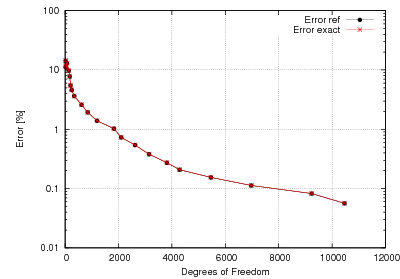

.. _benchmark-fichera-corner:

Fichera Corner (Elliptic)
=========================

**Git reference:** Benchmark
`fichera <http://git.hpfem.org/hermes3d.git/tree/HEAD:/benchmarks/fichera>`_.

.. index::
   single: mesh; dynamical
   single: problem; elliptic

This example solves the Poisson equation with an exact solution from 
Fichera corner. 

Partial Differential Equation solved: Poisson equation

.. math::
   :nowrap:
   :label: fichera

   \begin{eqnarray*}
   - \Delta u &= f &\hbox{ in }\Omega \\
            u &= g &\hbox{ on }\partial\Omega
   \end{eqnarray*}

Domain of Interest: Unit cube $(0, 1)^3$ with missing corner. 

Right-hand side:

.. math:: 
   :nowrap:
   :label: fichera-rhs

   \begin{eqnarray*}
   f(x, y, z)  & = &  \frac{3}{4}\ \times \ (x^2 + y^2 + z^2)^{-\frac{3}{4}}
   \end{eqnarray*}

Exact solution is:

.. math:: 
   :nowrap:
   :label: fichera-exact

   \begin{eqnarray*}
   u(x, y, z)  & = &  (x^2 + y^2 + z^2)^{\frac{1}{4}}
   \end{eqnarray*}

The exact solution from Fichera corner has a singular gradient(an 
analogy of infinite stress) at the center, due to the missing corner. 

Code for the exact solution and the weak forms:
.. code-block:: c++

::

    adouble fn(double x, double y, double z)
    {
      return pow(x*x + y*y + z*z, .25);
    }

    double fndd(double x, double y, double z, double &dx, double &dy, double &dz) {
      dx = 0.5 * x * pow(x*x + y*y + z*z, -.75);
      dy = 0.5 * y * pow(x*x + y*y + z*z, -.75);
      dz = 0.5 * z * pow(x*x + y*y + z*z, -.75);

      return fn(x, y, z);
    }

    emplate<typename real, typename scalar>
    scalar bilinear_form(int n, double *wt, fn_t<scalar> *u_ext[], fn_t<real> *u, fn_t<real> *v, geom_t<real> *e, user_data_t<scalar> *data) 
    {
      return int_grad_u_grad_v<real, scalar>(n, wt, u, v, e);
    }

    template<typename real>
    real rhs(real x, real y, real z)
    {
      return 0.75 * pow(x*x + y*y + z*z, -0.75);
    }

    template<typename real, typename scalar>
    scalar linear_form(int n, double *wt, fn_t<scalar> *u_ext[], fn_t<real> *u, geom_t<real> *e, user_data_t<scalar> *data) 
    {
      return -int_F_v<real, scalar>(n, wt, rhs, u, e);
    }

Convergence graphs:

.. image:: fichera-conv-time.png

Solution and hp-mesh:

.. image:: fichera-sln.png

.. image:: fichera-order.png

.. seealso::

   :ref:`benchmark-bessel`
